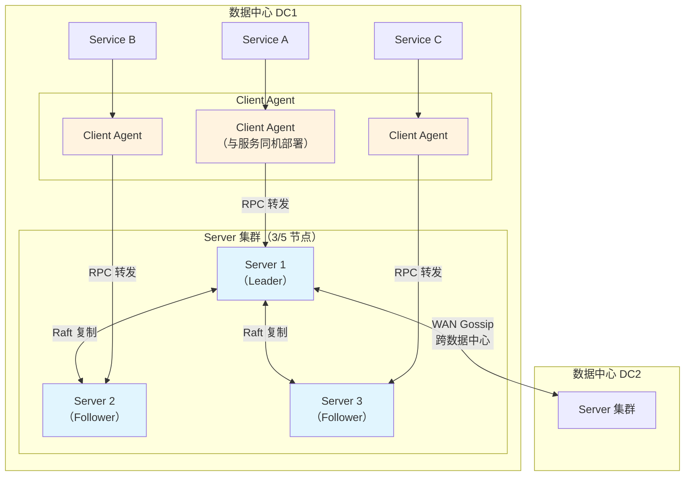
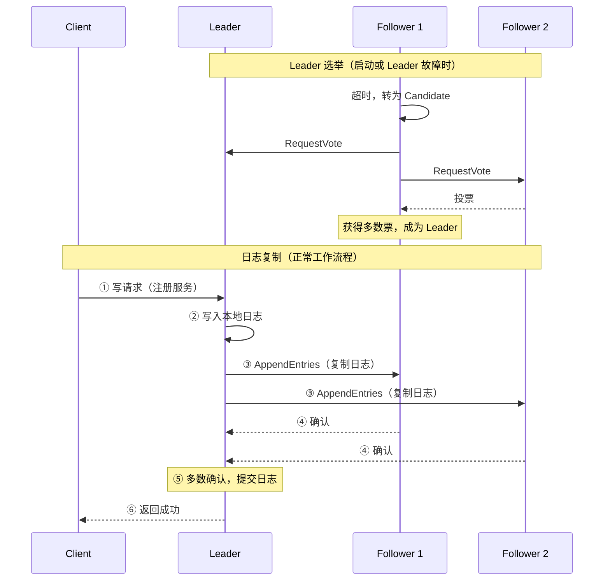
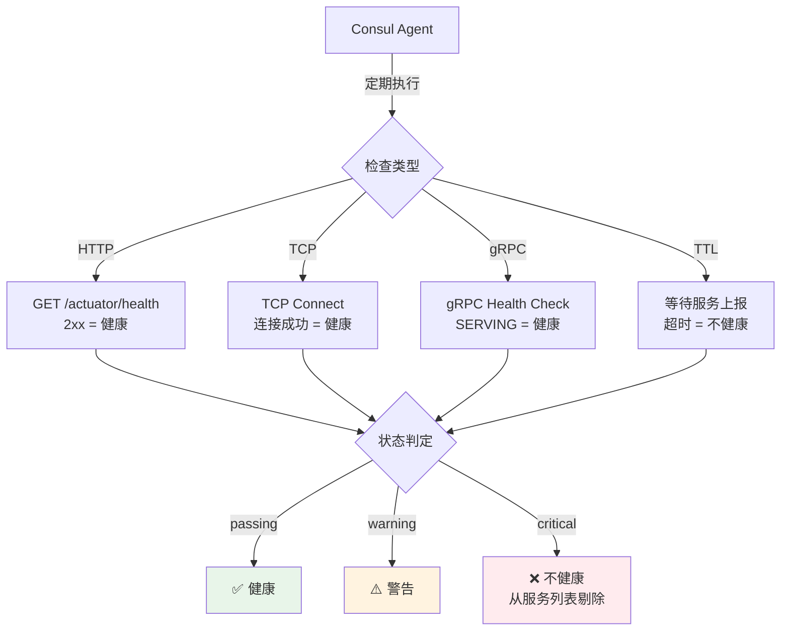
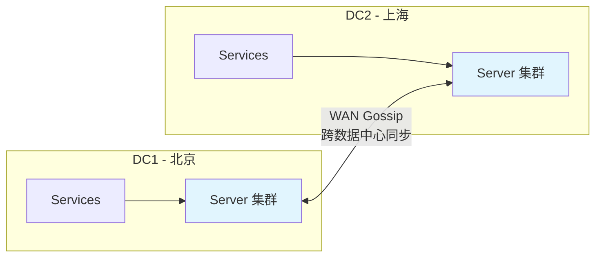

# Consul 架构与核心特性

## 概念说明

Consul 是 HashiCorp 开源的分布式服务网格解决方案，提供**服务发现、健康检查、KV 存储、多数据中心**等核心功能。它采用 **Raft 一致性协议**保证数据强一致性（CP 模型），是 Spring Cloud 官方推荐的注册中心方案之一。

## 核心原理

### 一、Consul 整体架构



### 二、Agent 架构

Consul 的每个节点都运行一个 Agent 进程，分为 **Server** 和 **Client** 两种模式：

| 角色 | 说明 | 部署数量 |
|------|------|----------|
| **Server** | 参与 Raft 共识、存储数据、处理查询 | 3 或 5 个（奇数） |
| **Client** | 转发请求到 Server、本地健康检查、缓存 | 每台服务器一个 |

**通信协议**：

| 协议 | 用途 | 说明 |
|------|------|------|
| **LAN Gossip** | 数据中心内节点发现和故障检测 | 基于 Serf（SWIM 协议），端口 8301 |
| **WAN Gossip** | 跨数据中心 Server 间通信 | 端口 8302 |
| **RPC** | Client 到 Server 的请求转发 | 端口 8300 |

### 三、Raft 一致性协议

Consul 使用 Raft 协议保证 Server 集群的数据一致性。



**Raft 三种角色**：

| 角色 | 说明 |
|------|------|
| **Leader** | 处理所有写请求，向 Follower 复制日志 |
| **Follower** | 接收 Leader 的日志复制，响应读请求 |
| **Candidate** | Leader 故障时的临时角色，发起选举 |

**关键参数**：
- 选举超时（Election Timeout）：150ms ~ 300ms 随机
- 心跳间隔（Heartbeat Interval）：通常为选举超时的 1/10
- 多数派（Quorum）：N/2 + 1（3 节点需要 2 个确认，5 节点需要 3 个）

### 四、服务发现

#### 注册服务

```json
{
  "service": {
    "name": "order-service",
    "id": "order-service-1",
    "port": 8080,
    "tags": ["v2.0", "production"],
    "meta": {
      "version": "2.0.0",
      "region": "east"
    },
    "check": {
      "http": "http://localhost:8080/actuator/health",
      "interval": "10s",
      "timeout": "5s"
    }
  }
}
```

#### 查询服务

```bash
# HTTP API 查询健康的服务实例
curl http://localhost:8500/v1/health/service/order-service?passing=true

# DNS 查询
dig @127.0.0.1 -p 8600 order-service.service.consul
```

### 五、健康检查

Consul 支持多种健康检查方式：

| 方式 | 说明 | 适用场景 |
|------|------|----------|
| **HTTP** | 定期 GET 请求，2xx 为健康 | Web 服务（最常用） |
| **TCP** | 尝试 TCP 连接 | 数据库、非 HTTP 服务 |
| **gRPC** | gRPC 健康检查协议 | gRPC 服务 |
| **Script** | 执行脚本，退出码 0 为健康 | 自定义检查逻辑 |
| **TTL** | 服务主动上报，超时未上报则不健康 | 批处理任务 |



### 六、KV 存储

Consul 内置分布式 KV 存储，可用于配置管理、Leader 选举、分布式锁等场景。

```bash
# 写入 KV
curl -X PUT -d 'value123' http://localhost:8500/v1/kv/config/database/url

# 读取 KV
curl http://localhost:8500/v1/kv/config/database/url

# 删除 KV
curl -X DELETE http://localhost:8500/v1/kv/config/database/url

# 列出前缀下所有 Key
curl http://localhost:8500/v1/kv/config/?recurse
```

### 七、ACL 安全管理

Consul ACL（Access Control List）提供基于 Token 的访问控制：

```hcl
# ACL 策略示例
service "order-*" {
  policy = "write"    # 允许注册 order- 前缀的服务
}

service_prefix "" {
  policy = "read"     # 允许读取所有服务
}

key_prefix "config/" {
  policy = "read"     # 允许读取 config/ 前缀的 KV
}
```

**ACL 核心概念**：

| 概念 | 说明 |
|------|------|
| **Token** | 访问凭证，关联一个或多个 Policy |
| **Policy** | 权限策略，定义对资源的访问规则 |
| **Role** | 角色，关联多个 Policy，方便批量管理 |
| **Bootstrap Token** | 初始管理 Token，拥有所有权限 |

### 八、与 Spring Cloud 集成

```yaml
# application.yml
spring:
  application:
    name: order-service
  cloud:
    consul:
      host: localhost
      port: 8500
      discovery:
        service-name: ${spring.application.name}
        health-check-path: /actuator/health
        health-check-interval: 10s
        instance-id: ${spring.application.name}-${random.value}
        prefer-ip-address: true
        tags:
          - version=2.0
          - env=production
      config:
        enabled: true
        prefix: config
        default-context: application
        format: YAML
```

```xml
<!-- Maven 依赖 -->
<dependency>
    <groupId>org.springframework.cloud</groupId>
    <artifactId>spring-cloud-starter-consul-discovery</artifactId>
</dependency>
<dependency>
    <groupId>org.springframework.cloud</groupId>
    <artifactId>spring-cloud-starter-consul-config</artifactId>
</dependency>
```

### 九、多数据中心



**跨数据中心查询**：
```bash
# 查询其他数据中心的服务
curl http://localhost:8500/v1/health/service/order-service?dc=dc2

# DNS 查询指定数据中心
dig @127.0.0.1 -p 8600 order-service.service.dc2.consul
```

## 代码示例

```java
/**
 * Consul 服务注册/发现/KV 操作演示
 * 
 * 演示 Consul 的三大核心功能：
 * 1. 服务注册与发现
 * 2. 健康检查配置
 * 3. KV 存储操作
 */
public class ConsulDemo {
    
    // Spring Cloud Consul 自动注册配置
    // application.yml 中配置 spring.cloud.consul 即可自动注册
    
    // 使用 DiscoveryClient 发现服务
    @Autowired
    private DiscoveryClient discoveryClient;
    
    public List<ServiceInstance> getInstances(String serviceName) {
        return discoveryClient.getInstances(serviceName);
    }
}
```

> 💻 完整可运行代码：[ConsulDemo.java](https://github.com/skyhe58/guide-java/tree/main/code-examples/04-middleware/registry-examples/src/main/java/com/example/middleware/registry/consul/ConsulDemo.java)
> <!-- 本地路径：code-examples/04-middleware/registry-examples/src/main/java/com/example/middleware/registry/consul/ConsulDemo.java -->
>
> ⚠️ 运行前请启动 Consul：`docker compose -f docker/docker-compose.consul.yml up -d`

## 常见面试题

### Q1: 请介绍 Consul 的架构和核心组件

**难度**：⭐⭐⭐ | **频率**：🔥🔥🔥

**答题思路**：

1. 整体架构：Agent（Server + Client）
2. 通信协议：LAN Gossip、WAN Gossip、RPC
3. 一致性保证：Raft 协议
4. 核心功能：服务发现、健康检查、KV 存储、多数据中心

**标准答案**：

Consul 采用 Agent 架构，每个节点运行一个 Agent 进程，分为 Server 和 Client 两种模式。Server 节点（通常 3 或 5 个）组成集群，通过 Raft 协议选举 Leader 并复制数据，保证强一致性。Client 节点与服务同机部署，负责将请求转发到 Server、执行本地健康检查。数据中心内通过 LAN Gossip（基于 SWIM 协议）进行节点发现和故障检测，跨数据中心通过 WAN Gossip 通信。核心功能包括服务发现（HTTP API + DNS）、多种健康检查（HTTP/TCP/gRPC/Script/TTL）、KV 存储和原生多数据中心支持。

**深入追问**：

- Consul 的 Raft 协议是如何保证数据一致性的？
- Consul Server 节点为什么推荐奇数个？
- Consul 的 LAN Gossip 和 WAN Gossip 有什么区别？

### Q2: Consul 的健康检查机制有哪些？各适用什么场景？

**难度**：⭐⭐⭐ | **频率**：🔥🔥🔥

**答题思路**：

1. 列举五种健康检查方式
2. 说明各自的工作原理
3. 给出适用场景建议

**标准答案**：

Consul 支持五种健康检查方式：①HTTP 检查——定期发送 HTTP GET 请求，2xx 状态码为健康，最常用于 Web 服务；②TCP 检查——尝试建立 TCP 连接，连接成功为健康，适用于数据库等非 HTTP 服务；③gRPC 检查——使用 gRPC 健康检查协议，适用于 gRPC 服务；④Script 检查——执行自定义脚本，退出码 0 为健康，适用于复杂的自定义检查逻辑；⑤TTL 检查——服务主动向 Consul 上报健康状态，超时未上报则标记为不健康，适用于批处理任务等无法被动检查的场景。相比 Eureka 只支持客户端心跳，Consul 的健康检查更加灵活和准确。

**深入追问**：

- HTTP 健康检查的 interval 和 timeout 分别设置多少合适？
- 如果健康检查失败，Consul 会立即剔除实例吗？

### Q3: Consul 的 KV 存储可以用来做什么？

**难度**：⭐⭐ | **频率**：🔥🔥

**答题思路**：

1. KV 存储的基本操作
2. 常见应用场景
3. 与专业配置中心的对比

**标准答案**：

Consul KV 是内置的分布式键值存储，支持 CRUD 操作和前缀查询。常见应用场景包括：①配置管理——存储应用配置，配合 Spring Cloud Consul Config 实现配置热更新；②分布式锁——利用 KV 的 CAS（Check-And-Set）操作实现分布式锁；③Leader 选举——利用 Session + KV 实现服务的 Leader 选举；④Feature Flag——存储功能开关，动态控制功能的启用和禁用。不过对于复杂的配置管理场景（如多环境、灰度发布、权限控制），建议使用专业的配置中心如 Apollo 或 Nacos Config。

**深入追问**：

- Consul KV 的一致性保证是什么级别？
- 如何用 Consul KV 实现分布式锁？

## 参考资料

- [Consul Architecture](https://developer.hashicorp.com/consul/docs/architecture)
- [Consul Raft Protocol](https://developer.hashicorp.com/consul/docs/architecture/consensus)
- [Spring Cloud Consul](https://docs.spring.io/spring-cloud-consul/reference/)
