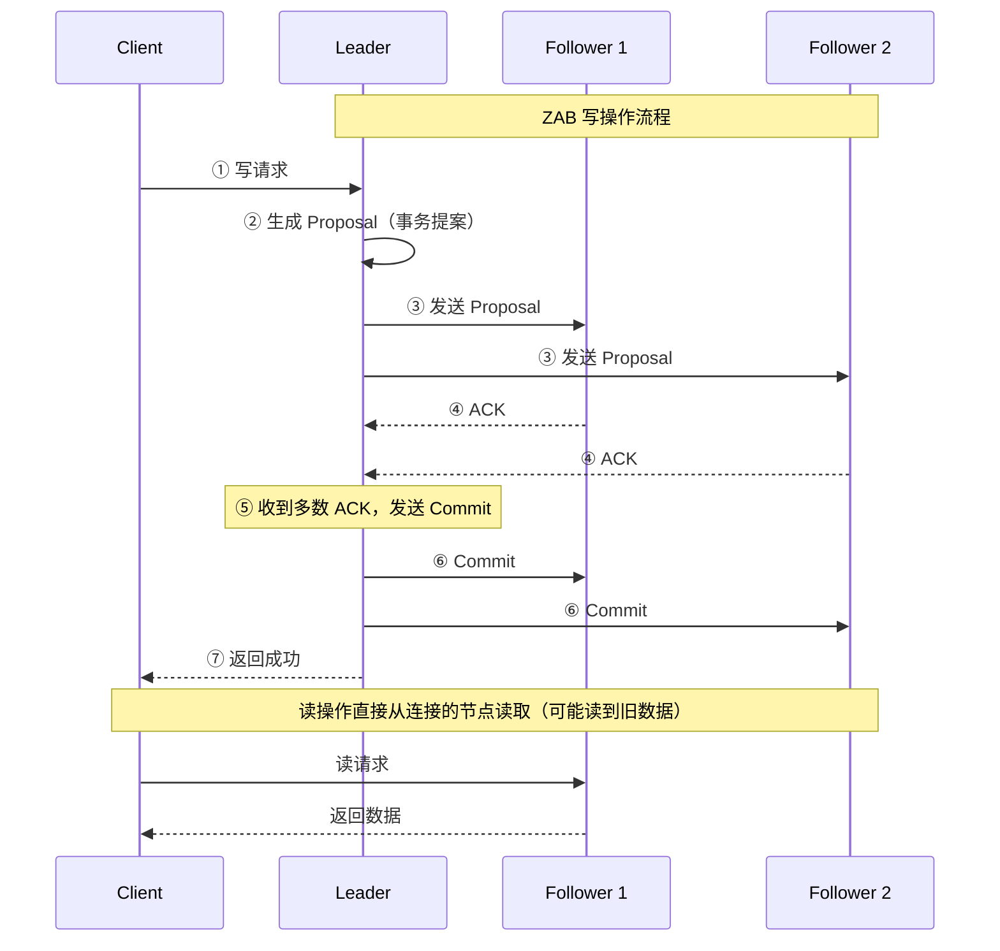
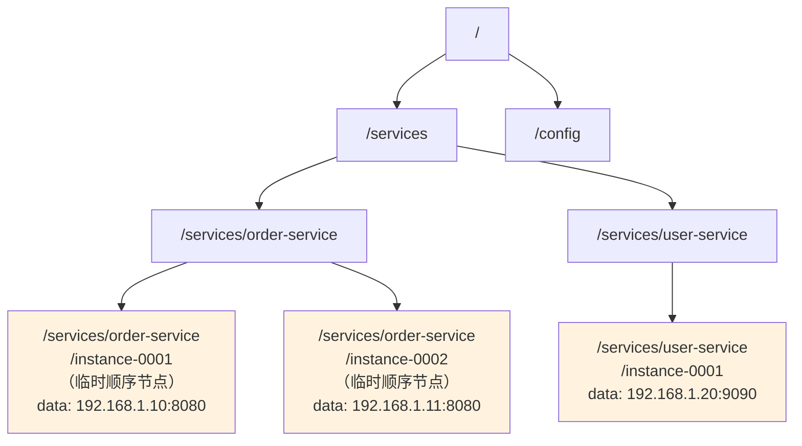
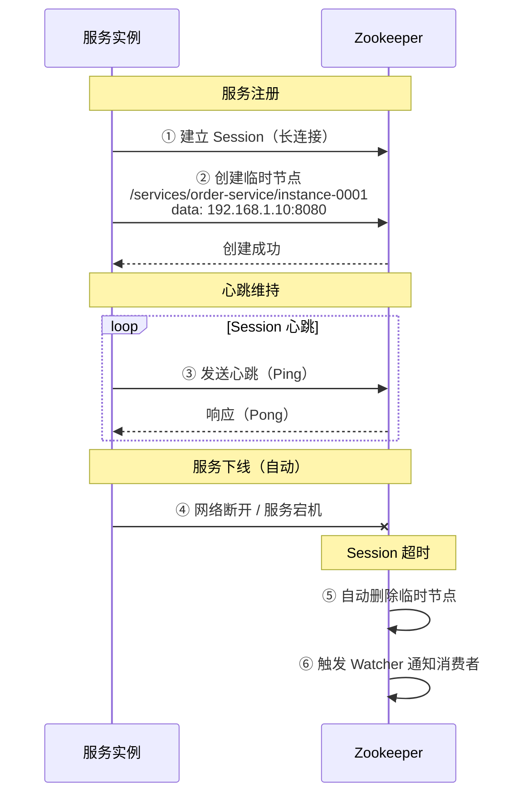
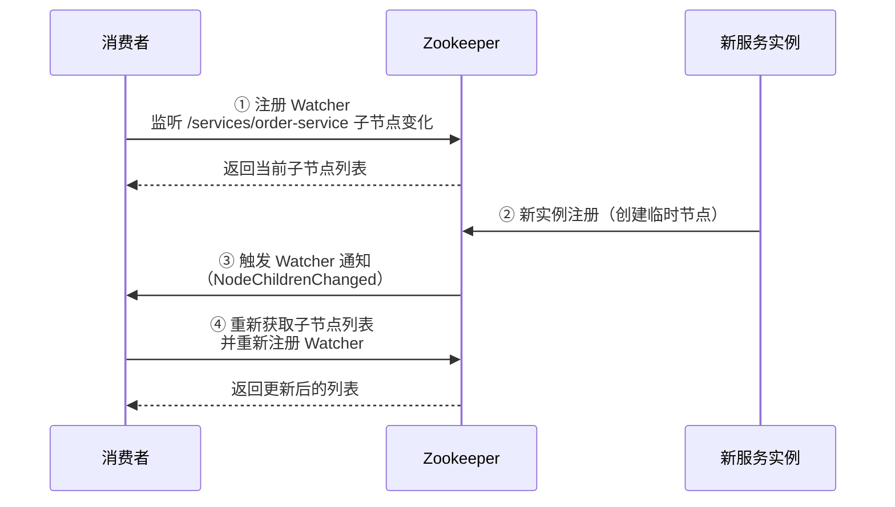

# Zookeeper 作为注册中心

## 概念说明

Apache Zookeeper 是一个分布式协调服务，最初为 Hadoop 生态设计，后来被广泛用作注册中心（如 Dubbo 默认注册中心）。它通过 **ZAB 协议**保证数据一致性（CP 模型），利用**临时节点（Ephemeral Node）**和 **Watcher 机制**实现服务注册与发现。

虽然 Zookeeper 功能强大，但它本质上是一个通用的分布式协调服务，而非专门的注册中心，在大规模微服务场景下存在一些局限性。

## 核心原理

### 一、ZAB 协议（Zookeeper Atomic Broadcast）

ZAB 是 Zookeeper 的核心一致性协议，类似于 Raft，保证所有节点数据的强一致性。



**ZAB vs Raft 对比**：

| 维度 | ZAB | Raft |
|------|-----|------|
| 设计目标 | 原子广播 | 共识算法 |
| Leader 选举 | 基于 ZXID（事务 ID）+ myid | 基于 Term + 日志完整性 |
| 日志复制 | 两阶段提交（Proposal + Commit） | AppendEntries |
| 恢复模式 | 发现 → 同步 → 广播 | 选举 → 日志追赶 |

### 二、数据模型 — ZNode 树

Zookeeper 的数据模型是一棵**树形结构**，每个节点称为 ZNode：



**ZNode 类型**：

| 类型 | 说明 | 注册中心用途 |
|------|------|-------------|
| **持久节点** | 创建后一直存在，除非主动删除 | 服务名节点（如 /services/order-service） |
| **临时节点** | 与 Session 绑定，Session 断开自动删除 | 服务实例节点（实现自动下线） |
| **持久顺序节点** | 持久 + 自动编号 | 分布式锁 |
| **临时顺序节点** | 临时 + 自动编号 | 服务实例（保证唯一性） |

### 三、临时节点实现服务注册



**关键点**：临时节点与 Session 绑定，服务宕机后 Session 超时（默认 30s），临时节点自动删除，消费者通过 Watcher 感知变化。

### 四、Watcher 机制

Watcher 是 Zookeeper 的事件通知机制，消费者可以监听节点变化：



**Watcher 特性**：

| 特性 | 说明 |
|------|------|
| **一次性** | 触发一次后失效，需要重新注册 |
| **有序性** | 事件按照发生顺序通知 |
| **轻量级** | 只通知事件类型，不携带数据 |

> ⚠️ Watcher 的一次性特性是面试高频考点！Curator 框架的 PathChildrenCache/TreeCache 封装了自动重新注册的逻辑。

### 五、Session 管理

| 参数 | 说明 | 默认值 |
|------|------|--------|
| sessionTimeout | Session 超时时间 | 30s |
| tickTime | 心跳间隔 | 2s |
| minSessionTimeout | 最小超时时间 | 2 × tickTime |
| maxSessionTimeout | 最大超时时间 | 20 × tickTime |

Session 超时后，该 Session 创建的所有临时节点都会被删除。

### 六、Curator 客户端

Apache Curator 是 Zookeeper 的高级客户端，封装了常用操作：

```java
// Curator 创建客户端
CuratorFramework client = CuratorFrameworkFactory.builder()
    .connectString("localhost:2181")
    .sessionTimeoutMs(30000)
    .retryPolicy(new ExponentialBackoffRetry(1000, 3))
    .namespace("services")
    .build();
client.start();

// 服务注册 — 创建临时节点
client.create()
    .creatingParentsIfNeeded()
    .withMode(CreateMode.EPHEMERAL_SEQUENTIAL)
    .forPath("/order-service/instance-", 
             "192.168.1.10:8080".getBytes());

// 服务发现 — 获取子节点
List<String> instances = client.getChildren().forPath("/order-service");

// Watcher — 监听子节点变化（自动重新注册）
PathChildrenCache cache = new PathChildrenCache(client, "/order-service", true);
cache.getListenable().addListener((c, event) -> {
    switch (event.getType()) {
        case CHILD_ADDED -> System.out.println("新实例上线: " + event.getData().getPath());
        case CHILD_REMOVED -> System.out.println("实例下线: " + event.getData().getPath());
        case CHILD_UPDATED -> System.out.println("实例更新: " + event.getData().getPath());
    }
});
cache.start();
```

### 七、Zookeeper 作为注册中心的局限性

| 问题 | 说明 |
|------|------|
| **CP 模型** | Leader 选举期间不可用（通常几十秒），影响服务发现 |
| **不适合大规模** | 写操作都经过 Leader，大量服务注册时 Leader 成为瓶颈 |
| **Watcher 一次性** | 需要反复注册，高并发下可能丢失事件 |
| **运维复杂** | 需要独立部署和维护 ZK 集群 |
| **非专用** | 通用协调服务，缺少注册中心专有功能（如健康检查、多数据中心） |

## 代码示例

```java
/**
 * Zookeeper 注册中心演示
 * 
 * 使用临时节点实现服务注册，Watcher 监听服务变化
 */
public class ZookeeperDemo {
    
    // 创建临时顺序节点实现服务注册
    public static void registerService(CuratorFramework client, 
                                        String serviceName, String address) {
        client.create()
              .creatingParentsIfNeeded()
              .withMode(CreateMode.EPHEMERAL_SEQUENTIAL)
              .forPath("/" + serviceName + "/instance-", address.getBytes());
    }
    
    // 获取服务实例列表
    public static List<String> discoverService(CuratorFramework client, 
                                                String serviceName) {
        return client.getChildren().forPath("/" + serviceName);
    }
}
```

> 💻 完整可运行代码：[ZookeeperDemo.java](../../../code-examples/04-middleware/registry-examples/src/main/java/com/example/middleware/registry/zookeeper/ZookeeperDemo.java)

## 常见面试题

### Q1: Zookeeper 的临时节点是如何实现服务自动下线的？

**难度**：⭐⭐⭐ | **频率**：🔥🔥🔥

**答题思路**：

1. 临时节点与 Session 的绑定关系
2. Session 心跳和超时机制
3. 节点删除后的 Watcher 通知

**标准答案**：

Zookeeper 的临时节点（Ephemeral Node）与创建它的 Session 绑定。服务启动时创建临时节点注册自身信息，同时维持与 ZK 的长连接（Session）。服务正常运行时，定期发送心跳维持 Session。当服务宕机或网络断开时，ZK 在 Session 超时后（默认 30s）自动删除该 Session 创建的所有临时节点，相当于自动注销服务。消费者通过 Watcher 监听服务节点的子节点变化，收到 NodeChildrenChanged 事件后重新获取实例列表，从而感知到服务下线。

**深入追问**：

- Session 超时时间设置多少合适？太短和太长各有什么问题？
- 如果网络抖动导致 Session 短暂断开又恢复，会发生什么？
- Watcher 是一次性的，如何保证不丢失事件？

### Q2: ZAB 协议和 Raft 协议有什么区别？

**难度**：⭐⭐⭐ | **频率**：🔥🔥

**答题思路**：

1. 两者的设计目标
2. Leader 选举的差异
3. 日志复制的差异

**标准答案**：

ZAB 和 Raft 都是保证分布式系统数据一致性的协议，核心思想相似但有细节差异。ZAB 的设计目标是原子广播，Leader 选举基于 ZXID（事务 ID 最大的优先）和 myid，采用两阶段提交（Proposal + Commit）；Raft 的设计目标是共识算法，Leader 选举基于 Term 和日志完整性，采用 AppendEntries 进行日志复制。ZAB 在恢复模式下有发现、同步、广播三个阶段，Raft 则是选举后直接进行日志追赶。实际效果上两者都能保证强一致性，Raft 的设计更简洁易理解。

**深入追问**：

- 为什么 ZK 选举时 ZXID 大的优先？
- Raft 的 Term 机制是如何防止脑裂的？

### Q3: Zookeeper 的 Watcher 机制有什么特点？

**难度**：⭐⭐⭐ | **频率**：🔥🔥🔥

**答题思路**：

1. Watcher 的三个核心特性
2. 一次性带来的问题
3. Curator 的解决方案

**标准答案**：

Zookeeper Watcher 有三个核心特性：①一次性——Watcher 触发一次后自动失效，需要重新注册，这意味着在重新注册的间隙可能丢失事件；②有序性——事件按照发生顺序通知客户端；③轻量级——Watcher 通知只包含事件类型和节点路径，不携带节点数据，客户端需要再次查询获取最新数据。一次性是最大的问题，在高并发场景下可能丢失事件。Curator 框架的 PathChildrenCache 和 TreeCache 封装了自动重新注册的逻辑，解决了这个问题。

**深入追问**：

- PathChildrenCache 和 TreeCache 有什么区别？
- 如果 Watcher 通知延迟了，消费者会调用到已下线的实例吗？

## 参考资料

- [Apache Zookeeper 官方文档](https://zookeeper.apache.org/doc/current/)
- [Apache Curator 官方文档](https://curator.apache.org/)
- [《从 Paxos 到 Zookeeper》— 倪超](https://book.douban.com/subject/26292004/)
