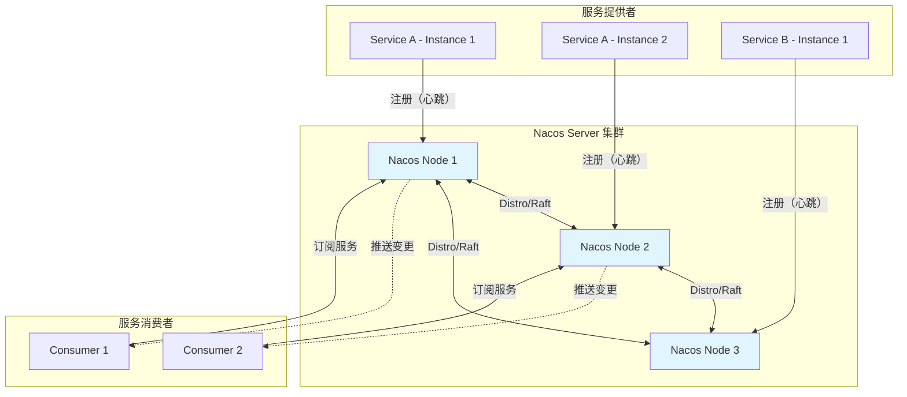
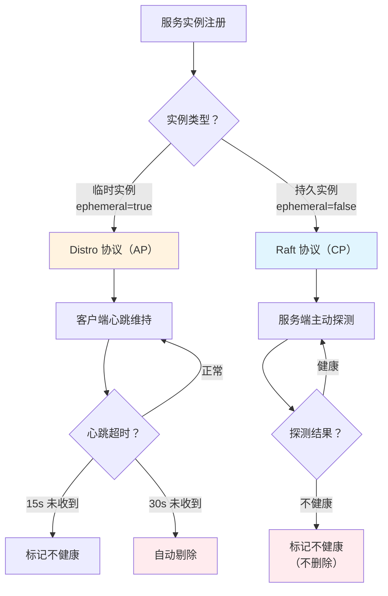
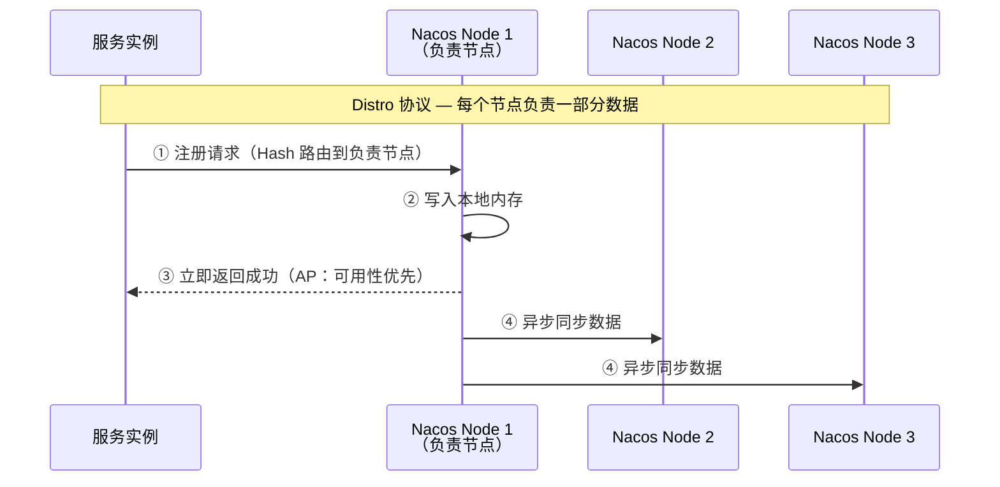

# Nacos 注册中心

## 概念说明

Nacos（Dynamic Naming and Configuration Service）是阿里巴巴开源的服务发现和配置管理平台，同时提供**注册中心**和**配置中心**功能。它最大的特点是支持 **AP/CP 模式切换**——临时实例使用 Distro 协议（AP），持久实例使用 Raft 协议（CP），可以根据业务场景灵活选择。

## 核心原理

### 一、Nacos 架构



### 二、临时实例 vs 持久实例

这是 Nacos 最核心的设计，也是面试高频考点：

| 维度 | 临时实例（Ephemeral） | 持久实例（Persistent） |
|------|----------------------|----------------------|
| 一致性协议 | **Distro**（AP） | **Raft/JRaft**（CP） |
| 健康检查 | 客户端心跳（默认 5s） | 服务端主动探测 |
| 下线方式 | 心跳超时自动剔除（默认 15s） | 标记为不健康，不删除 |
| 适用场景 | 微服务实例（动态扩缩容） | 数据库、中间件等基础服务 |
| 存储 | 内存 | 磁盘持久化 |



### 三、Distro 协议（AP 模式）

Distro 是 Nacos 自研的 AP 一致性协议，用于临时实例的数据同步：



**Distro 协议特点**：
- **数据分片**：每个节点负责一部分服务数据（按 Hash 分配）
- **异步复制**：写入后立即返回，异步同步到其他节点
- **最终一致**：短暂的数据不一致，最终会同步一致
- **全量 + 增量**：新节点加入时全量同步，之后增量同步

### 四、Raft 协议（CP 模式）

持久实例使用 JRaft（Raft 的 Java 实现）保证强一致性：

- 写操作必须经过 Leader，多数节点确认后才返回成功
- 与 Consul 的 Raft 实现类似，保证数据不丢失
- 适用于对一致性要求高的场景

### 五、服务模型

Nacos 的服务模型比其他注册中心更丰富：

```
Namespace（命名空间）
  └── Group（分组）
      └── Service（服务）
          └── Cluster（集群）
              └── Instance（实例）
```

| 层级 | 说明 | 示例 |
|------|------|------|
| **Namespace** | 环境隔离 | dev / test / prod |
| **Group** | 业务分组 | DEFAULT_GROUP / ORDER_GROUP |
| **Service** | 服务名 | order-service |
| **Cluster** | 集群 | beijing / shanghai |
| **Instance** | 实例 | 192.168.1.10:8080 |

### 六、与 Spring Cloud 集成

```yaml
# application.yml
spring:
  application:
    name: order-service
  cloud:
    nacos:
      discovery:
        server-addr: localhost:8848
        namespace: dev
        group: DEFAULT_GROUP
        cluster-name: beijing
        ephemeral: true          # 临时实例（默认）
        weight: 1.0              # 权重
        metadata:
          version: v2.0
```

```xml
<!-- Maven 依赖 -->
<dependency>
    <groupId>com.alibaba.cloud</groupId>
    <artifactId>spring-cloud-starter-alibaba-nacos-discovery</artifactId>
</dependency>
```

### 七、Nacos 的优势与不足

**优势**：
- 同时提供注册中心和配置中心，减少组件数量
- AP/CP 模式可切换，灵活适应不同场景
- 丰富的服务模型（Namespace/Group/Cluster）
- 中文社区活跃，国内使用广泛
- 提供 Web 控制台，运维友好

**不足**：
- 多数据中心支持不如 Consul 原生
- AP 模式下可能出现短暂的数据不一致
- 集群部署依赖 MySQL（持久化存储）
- 社区版功能有限，企业版收费

## 代码示例

```java
/**
 * Nacos 注册中心演示
 * 
 * 演示 Nacos 的服务注册、发现和 AP/CP 模式配置
 */
public class NacosDemo {
    
    // Spring Cloud Nacos 自动注册
    // 配置 spring.cloud.nacos.discovery 即可
    
    // 使用 NacosNamingService 手动操作
    public void registerService() throws NacosException {
        NamingService naming = NamingFactory.createNamingService("localhost:8848");
        
        // 注册临时实例（AP 模式）
        naming.registerInstance("order-service", "192.168.1.10", 8080);
        
        // 注册持久实例（CP 模式）
        Instance instance = new Instance();
        instance.setIp("192.168.1.10");
        instance.setPort(8080);
        instance.setEphemeral(false);  // 持久实例
        naming.registerInstance("db-service", instance);
    }
}
```

> 💻 完整可运行代码：[NacosDemo.java](../../../code-examples/04-middleware/registry-examples/src/main/java/com/example/middleware/registry/nacos/NacosDemo.java)

## 常见面试题

### Q1: Nacos 的临时实例和持久实例有什么区别？

**难度**：⭐⭐⭐ | **频率**：🔥🔥🔥

**答题思路**：

1. 两种实例的定义和区别
2. 底层一致性协议的差异
3. 各自的适用场景

**标准答案**：

Nacos 将服务实例分为临时实例和持久实例两种类型。临时实例（ephemeral=true，默认）使用 Distro 协议（AP 模式），通过客户端心跳维持注册状态，心跳超时 15s 标记不健康、30s 自动剔除，数据存储在内存中，适用于微服务实例等动态扩缩容的场景。持久实例（ephemeral=false）使用 Raft 协议（CP 模式），由服务端主动探测健康状态，不健康时只标记状态不删除实例，数据持久化到磁盘，适用于数据库、中间件等基础服务。这种设计让 Nacos 可以同时满足 AP 和 CP 两种场景的需求。

**深入追问**：

- Distro 协议是如何实现数据分片和同步的？
- 为什么临时实例用 AP 模式而不是 CP 模式？
- 持久实例不健康时为什么不删除？

### Q2: Nacos 的 Distro 协议是什么？

**难度**：⭐⭐⭐ | **频率**：🔥🔥

**答题思路**：

1. Distro 的设计目标
2. 数据分片和路由机制
3. 同步方式（全量 + 增量）

**标准答案**：

Distro 是 Nacos 自研的 AP 一致性协议，用于临时实例的数据同步。核心设计是数据分片——每个 Nacos 节点负责一部分服务数据（按服务名 Hash 分配），注册请求路由到负责节点后立即写入内存并返回成功（保证可用性），然后异步同步到其他节点（最终一致性）。新节点加入集群时进行全量数据同步，之后通过增量同步保持数据一致。这种设计在网络分区时仍然可用，但可能出现短暂的数据不一致。

**深入追问**：

- 如果负责节点宕机了，数据会丢失吗？
- Distro 和 Gossip 协议有什么区别？

### Q3: Nacos 的服务模型有哪些层级？

**难度**：⭐⭐ | **频率**：🔥🔥

**答题思路**：

1. 五层模型结构
2. 每层的作用
3. 实际使用场景

**标准答案**：

Nacos 的服务模型有五个层级：Namespace → Group → Service → Cluster → Instance。Namespace 用于环境隔离（dev/test/prod），不同 Namespace 的服务互不可见；Group 用于业务分组，同一 Namespace 下可以有多个 Group；Service 是服务名；Cluster 用于同城多机房或多区域部署，可以实现同集群优先调用；Instance 是具体的服务实例。这种多层级模型比 Consul 和 Eureka 更灵活，可以满足复杂的多环境、多区域部署需求。

**深入追问**：

- 如何利用 Cluster 实现同机房优先调用？
- Namespace 和 Spring Profile 有什么关系？

## 参考资料

- [Nacos 官方文档](https://nacos.io/docs/latest/what-is-nacos/)
- [Nacos 架构设计](https://nacos.io/docs/latest/architecture/)
- [Spring Cloud Alibaba Nacos Discovery](https://sca.aliyun.com/docs/2023/user-guide/nacos/quick-start/)
