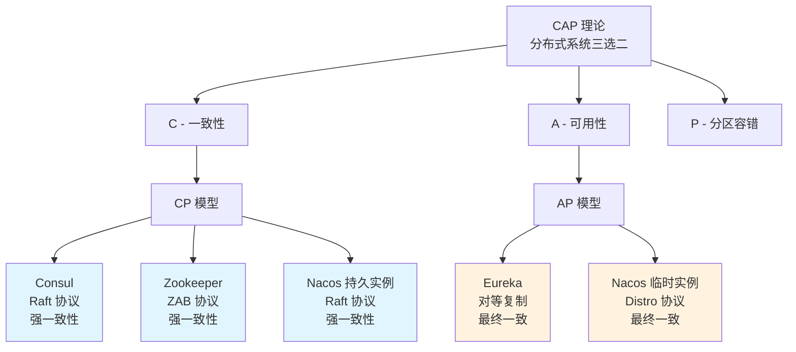
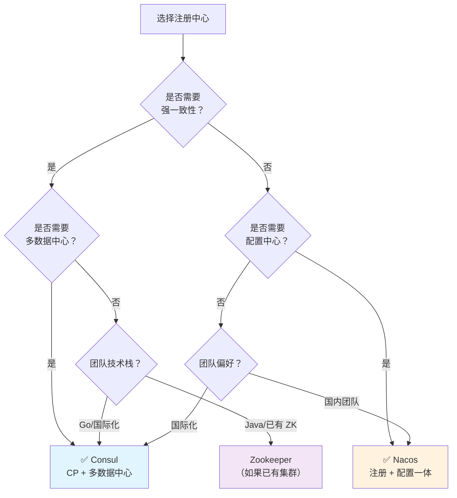

# 注册中心选型对比

## 概念说明

选择注册中心是微服务架构中的重要技术决策。本文从 **CAP 理论**视角出发，全面对比 Consul、Nacos、Eureka、Zookeeper 四种主流注册中心，帮助你在面试和工作中做出合理的选型判断。

## 核心对比

### 一、全维度对比表

| 维度 | Consul | Nacos | Eureka | Zookeeper |
|------|--------|-------|--------|-----------|
| **开发语言** | Go | Java | Java | Java |
| **开源方** | HashiCorp | Alibaba | Netflix | Apache |
| **CAP 模型** | **CP** | **AP/CP 可切换** | **AP** | **CP** |
| **一致性协议** | Raft | Distro(AP) + Raft(CP) | 无（对等复制） | ZAB |
| **健康检查** | HTTP/TCP/gRPC/Script/TTL | 客户端心跳 + 服务端探测 | 客户端心跳 | Session 心跳 |
| **KV 存储** | ✅ 内置 | ✅ 内置（配置中心） | ❌ | ✅ ZNode |
| **多数据中心** | ✅ 原生支持 | ✅ 支持 | ❌ | ❌ |
| **配置中心** | ✅ KV 存储 | ✅ 内置 | ❌ | ❌（需第三方） |
| **ACL 安全** | ✅ 完善 | ✅ 基础 | ❌ | ✅ ACL |
| **Web 控制台** | ✅ 内置 | ✅ 内置 | ❌（需 Eureka Dashboard） | ❌（需第三方） |
| **Spring Cloud 集成** | 官方支持 | Alibaba 支持 | 官方支持（已停更） | 需第三方 |
| **维护状态** | 活跃 | 活跃 | **已停止维护** | 活跃（但更新慢） |
| **性能（注册）** | 中等 | 高 | 高 | 中等 |
| **性能（发现）** | 高 | 高 | 高 | 中等 |
| **运维复杂度** | 中等 | 中等 | 低 | 高 |
| **社区生态** | 国际化 | 国内为主 | 国际化（已衰退） | 国际化 |

### 二、CAP 理论视角分析

#### CP 模型（Consul / Zookeeper）

**特点**：网络分区时，少数派节点拒绝写入，保证数据一致性

**优点**：
- 服务列表始终准确，不会调用到已下线的实例
- 适合对数据一致性要求高的场景

**缺点**：
- Leader 选举期间不可用（Consul 通常几秒，ZK 可能几十秒）
- 写入性能受限于多数派确认

**适用场景**：金融交易、支付系统等对一致性要求极高的场景

#### AP 模型（Eureka / Nacos 临时实例）

**特点**：网络分区时，所有节点仍可提供服务，但可能返回过期数据

**优点**：
- 高可用，注册中心始终可用
- 写入性能高（无需多数派确认）

**缺点**：
- 可能返回已下线的实例地址
- 需要客户端做容错处理（重试、熔断）

**适用场景**：大多数微服务场景（配合客户端重试和熔断机制）

### 三、一致性协议对比

| 维度 | Raft（Consul） | ZAB（Zookeeper） | Distro（Nacos） | 对等复制（Eureka） |
|------|---------------|-----------------|----------------|------------------|
| 类型 | 强一致性 | 强一致性 | 最终一致性 | 最终一致性 |
| Leader | 有 | 有 | 无（数据分片） | 无（对等节点） |
| 写入路径 | Leader → 多数派 | Leader → 多数派 | 负责节点 → 异步同步 | 任意节点 → 异步复制 |
| 读取 | 任意节点（默认） | 任意节点 | 任意节点 | 任意节点 |
| 分区容忍 | 少数派不可写 | 少数派不可写 | 所有节点可写 | 所有节点可写 |

### 四、健康检查对比

| 维度 | Consul | Nacos | Eureka | Zookeeper |
|------|--------|-------|--------|-----------|
| 检查方式 | 服务端主动探测 | 客户端心跳 + 服务端探测 | 客户端心跳 | Session 心跳 |
| 检查类型 | HTTP/TCP/gRPC/Script/TTL | HTTP/TCP/心跳 | 心跳 | 长连接 |
| 灵活性 | ⭐⭐⭐⭐⭐ | ⭐⭐⭐⭐ | ⭐⭐ | ⭐⭐ |
| 准确性 | ⭐⭐⭐⭐⭐ | ⭐⭐⭐⭐ | ⭐⭐⭐ | ⭐⭐⭐⭐ |
| 自我保护 | ❌ | ✅ | ✅ | ❌ |

**Eureka 自我保护机制**：当心跳失败比例超过阈值（默认 85%）时，Eureka 认为是网络问题而非服务问题，不再剔除实例。这是 AP 模型的典型设计——宁可返回可能不可用的实例，也不轻易剔除。

### 五、选型建议

**总结建议**：

| 场景 | 推荐 | 理由 |
|------|------|------|
| 新项目、追求稳定 | **Consul** | CP 模型、功能全面、Spring Cloud 官方支持 |
| 国内团队、追求简单 | **Nacos** | 注册 + 配置一体、中文社区活跃、AP/CP 可切换 |
| 已有 ZK 集群（如 Dubbo） | **Zookeeper** | 避免引入新组件，但不推荐新项目使用 |
| 遗留系统 | **Eureka** | 已停止维护，不推荐新项目使用 |

## 常见面试题

### Q1: 从 CAP 理论角度对比 Consul、Nacos、Eureka、Zookeeper

**难度**：⭐⭐⭐ | **频率**：🔥🔥🔥

**答题思路**：

1. 先简述 CAP 理论
2. 分别说明每个注册中心的 CAP 选择
3. 分析各自的优缺点和适用场景

**标准答案**：

CAP 理论指出分布式系统无法同时满足一致性（C）、可用性（A）和分区容错性（P），必须三选二。在注册中心场景下：Consul 选择 CP，使用 Raft 协议保证强一致性，网络分区时少数派不可写，适合对一致性要求高的场景；Zookeeper 也是 CP，使用 ZAB 协议，但 Leader 选举时间较长；Eureka 选择 AP，采用对等复制，所有节点都可读写，网络分区时仍可用但可能返回过期数据，配合自我保护机制避免误剔除；Nacos 最灵活，临时实例用 Distro 协议（AP），持久实例用 Raft 协议（CP），可以根据业务需求选择。大多数微服务场景下 AP 模型配合客户端重试即可，对一致性要求极高的场景选择 CP 模型。

**深入追问**：

- 注册中心选 CP 还是 AP 更好？为什么？
- AP 模型下返回了已下线的实例怎么办？
- Nacos 的 AP/CP 切换是怎么实现的？

### Q2: 如果让你选择注册中心，你会怎么选？

**难度**：⭐⭐⭐ | **频率**：🔥🔥🔥

**答题思路**：

1. 先问清楚业务场景和约束条件
2. 从多个维度分析
3. 给出明确的推荐和理由

**标准答案**：

选择注册中心需要考虑几个关键因素：①一致性需求——如果是金融、支付等对一致性要求极高的场景，选择 CP 模型的 Consul 或 Zookeeper；大多数互联网业务选择 AP 模型即可。②功能需求——如果同时需要配置中心，Nacos 一体化方案更简单；如果需要多数据中心，Consul 原生支持最好。③团队技术栈——国内团队 Nacos 社区支持更好，国际化团队 Consul 更合适。④运维成本——Nacos 和 Consul 都提供 Web 控制台，运维友好。我个人推荐 Consul，因为它 CP 模型保证数据一致性、功能全面（服务发现 + 健康检查 + KV 存储 + 多数据中心）、Spring Cloud 官方支持、运维简单。

**深入追问**：

- Consul 和 Nacos 你更倾向哪个？为什么？
- 如果公司已经在用 Eureka，你会建议迁移吗？

### Q3: Eureka 的自我保护机制是什么？为什么需要它？

**难度**：⭐⭐⭐ | **频率**：🔥🔥

**答题思路**：

1. 自我保护的触发条件
2. 保护期间的行为
3. 设计目的和利弊

**标准答案**：

Eureka 的自我保护机制是当 Eureka Server 在一定时间内（默认 15 分钟）收到的心跳续约比例低于阈值（默认 85%）时，认为是网络问题而非服务大面积宕机，此时不再剔除任何实例。这是 AP 模型的典型设计——宁可保留可能不可用的实例（保证可用性），也不因为网络抖动误剔除大量健康实例。好处是避免了网络分区时的雪崩效应，坏处是保护期间可能返回已下线的实例地址，需要客户端配合重试和熔断机制。可以通过 `eureka.server.enable-self-preservation=false` 关闭，但生产环境不建议关闭。

**深入追问**：

- 自我保护期间，新注册的服务能被发现吗？
- Consul 有类似的自我保护机制吗？为什么？

## 参考资料

- [CAP 理论 - Wikipedia](https://en.wikipedia.org/wiki/CAP_theorem)
- [Consul vs Other Software](https://developer.hashicorp.com/consul/docs/intro/vs)
- [Nacos 与其他注册中心对比](https://nacos.io/docs/latest/what-is-nacos/)
