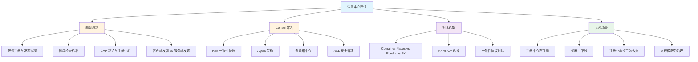
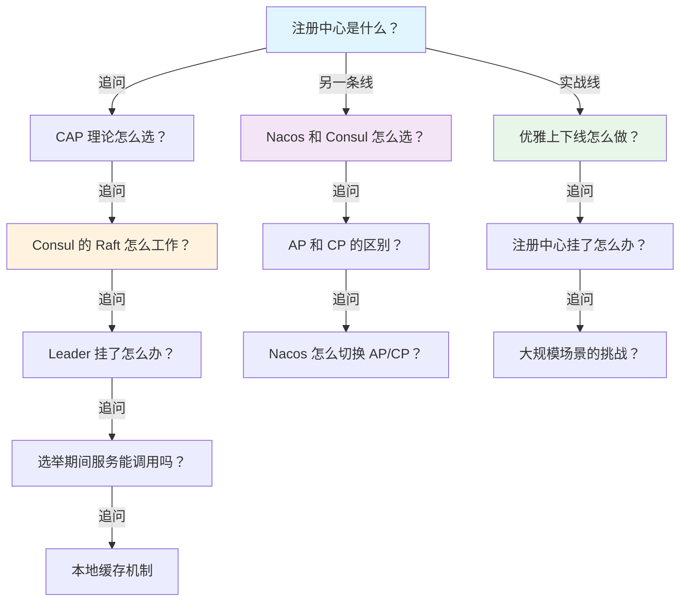

# 注册中心面试指南

## 面试知识图谱

## 高频面试题汇总

### Q1: 注册中心的核心功能是什么？请描述服务注册与发现的完整流程

**难度**：⭐⭐ | **频率**：🔥🔥🔥

**答题思路**：

1. 四大核心功能：注册、发现、健康检查、负载均衡
2. 完整流程：启动注册 → 消费者查询 → 负载均衡调用 → 健康检查 → 下线通知

**标准答案**：

注册中心的四大核心功能：①服务注册——服务启动时将自身信息（服务名、IP、端口、元数据）注册到注册中心；②服务发现——消费者通过服务名从注册中心获取可用实例列表；③健康检查——注册中心持续监控实例健康状态，自动剔除不可用实例；④负载均衡——消费者从多个实例中选择一个发起调用。完整流程：服务提供者启动后注册到注册中心，消费者启动时从注册中心拉取服务列表并缓存到本地，通过负载均衡策略选择实例调用。注册中心定期对服务实例进行健康检查，不健康的实例被剔除，并通知消费者更新本地缓存。

**深入追问**：

- 消费者是每次调用都查询注册中心吗？→ 不是，本地缓存 + 定期刷新/推送通知
- 注册中心挂了，消费者还能调用服务吗？→ 可以，使用本地缓存的服务列表

**易错点**：

- 混淆客户端发现和服务端发现模式
- 忘记提到本地缓存机制

### Q2: Consul 的 Raft 协议是如何工作的？

**难度**：⭐⭐⭐ | **频率**：🔥🔥🔥

**答题思路**：

1. 三种角色：Leader、Follower、Candidate
2. Leader 选举过程
3. 日志复制过程
4. 多数派确认机制

**标准答案**：

Raft 协议有三种角色：Leader 处理所有写请求、Follower 接收日志复制、Candidate 是选举时的临时角色。正常工作时，客户端的写请求发送到 Leader，Leader 将操作写入本地日志，然后通过 AppendEntries RPC 复制到所有 Follower，当多数节点（N/2+1）确认后，Leader 提交日志并返回成功。当 Leader 故障时，Follower 在选举超时后转为 Candidate 发起选举，获得多数票的 Candidate 成为新 Leader。Consul 推荐 3 或 5 个 Server 节点，3 节点可容忍 1 个故障，5 节点可容忍 2 个故障。

**深入追问**：

- 为什么推荐奇数个节点？→ 偶数个节点不能提高容错能力，反而增加通信开销
- 脑裂问题怎么解决？→ 多数派机制天然防止脑裂
- 读请求也需要经过 Leader 吗？→ 默认不需要，但可能读到旧数据；可配置 consistent 模式强制从 Leader 读

**易错点**：

- 混淆 Raft 和 Paxos
- 忘记说明多数派的具体数量

### Q3: Nacos 的 AP 和 CP 模式是怎么切换的？

**难度**：⭐⭐⭐ | **频率**：🔥🔥🔥

**答题思路**：

1. 临时实例 vs 持久实例
2. Distro 协议 vs Raft 协议
3. 各自的适用场景

**标准答案**：

Nacos 通过实例类型来决定使用 AP 还是 CP 模式。临时实例（ephemeral=true，默认）使用 Distro 协议（AP 模式），数据存储在内存中，通过客户端心跳维持注册状态，心跳超时自动剔除，适用于微服务实例。持久实例（ephemeral=false）使用 Raft 协议（CP 模式），数据持久化到磁盘，由服务端主动探测健康状态，不健康时只标记不删除，适用于数据库等基础服务。这不是全局切换，而是按实例粒度选择，同一个 Nacos 集群可以同时存在 AP 和 CP 两种模式的实例。

**深入追问**：

- Distro 协议的数据分片是怎么实现的？
- 为什么临时实例不用 Raft？→ 微服务实例变化频繁，Raft 的写入性能不够

**易错点**：

- 误以为 AP/CP 是全局切换
- 混淆临时实例和持久实例的健康检查方式

### Q4: 注册中心挂了，服务还能正常调用吗？

**难度**：⭐⭐⭐ | **频率**：🔥🔥🔥

**答题思路**：

1. 本地缓存机制
2. 不同注册中心的容灾策略
3. 恢复后的处理

**标准答案**：

注册中心挂了，已经运行的服务仍然可以正常调用，因为消费者会将服务列表缓存在本地内存中。Spring Cloud 的 LoadBalancer 和 OpenFeign 都使用本地缓存的服务列表进行负载均衡，不依赖注册中心的实时查询。但会有以下影响：①新服务无法注册，新启动的实例不会被发现；②已下线的实例不会被及时剔除，可能调用到不可用的实例（需要配合重试和熔断机制）；③服务列表无法更新，扩缩容不生效。注册中心恢复后，服务会自动重新注册，消费者会刷新本地缓存。Nacos 还支持将服务列表持久化到本地文件，即使客户端重启也能使用上次的缓存。

**深入追问**：

- 如何提高注册中心的可用性？→ 集群部署、多数据中心
- 本地缓存多久刷新一次？→ 取决于配置，通常 30s 定期拉取 + 推送通知

**易错点**：

- 误以为注册中心挂了服务就不能调用
- 忘记提到新服务无法注册的影响

### Q5: 如何实现服务的优雅上下线？

**难度**：⭐⭐⭐ | **频率**：🔥🔥

**答题思路**：

1. 优雅下线的流程
2. 优雅上线的流程
3. Spring Cloud 的实现方式

**标准答案**：

优雅下线：①先从注册中心注销服务（调用 deregister API）；②等待一段时间让消费者感知到变化并更新本地缓存（通常 10-30s）；③停止接收新请求，处理完已有请求；④关闭服务进程。Spring Boot 的 `server.shutdown=graceful` 配合 `spring.lifecycle.timeout-per-shutdown-phase=30s` 可以实现优雅停机。优雅上线：①服务启动完成后再注册到注册中心（延迟注册）；②注册后先设置较低的权重，逐步提高（预热）；③确认健康检查通过后再接收流量。Consul 的健康检查机制天然支持这一点——服务注册后，只有健康检查通过才会出现在健康服务列表中。

**深入追问**：

- 如果消费者的本地缓存还没更新就调用了已下线的实例怎么办？→ 重试到其他实例
- K8s 环境下如何实现优雅上下线？→ preStop hook + readinessProbe

### Q6: Zookeeper 的临时节点和 Watcher 机制在注册中心中是怎么用的？

**难度**：⭐⭐⭐ | **频率**：🔥🔥

**答题思路**：

1. 临时节点实现自动下线
2. Watcher 实现变更通知
3. Watcher 一次性的问题和解决方案

**标准答案**：

Zookeeper 用临时节点实现服务注册：服务启动时创建临时节点（如 /services/order-service/instance-0001），节点数据存储实例地址。临时节点与 Session 绑定，服务宕机后 Session 超时，节点自动删除，实现自动下线。消费者通过 Watcher 监听服务节点的子节点变化，当有实例上线或下线时，ZK 触发 NodeChildrenChanged 事件通知消费者。但 Watcher 是一次性的，触发后需要重新注册，在重新注册的间隙可能丢失事件。Curator 框架的 PathChildrenCache 封装了自动重新注册的逻辑，解决了这个问题。

**深入追问**：

- Session 超时时间设置多少合适？→ 太短容易误判，太长下线感知慢，通常 30s
- 为什么 Watcher 设计成一次性的？→ 减少服务端压力，避免大量长期 Watcher 占用资源

### Q7: 大规模微服务场景下，注册中心会遇到什么问题？如何解决？

**难度**：⭐⭐⭐⭐ | **频率**：🔥🔥

**答题思路**：

1. 性能瓶颈
2. 网络风暴
3. 解决方案

**标准答案**：

大规模场景（数千服务、数万实例）下的主要问题：①注册风暴——大量服务同时启动注册，注册中心压力大，解决方案是随机延迟注册、分批启动；②推送风暴——一个服务变更触发大量消费者更新，解决方案是增量推送（只推送变更部分）、合并推送（短时间内多次变更合并为一次推送）；③存储压力——大量服务元数据占用内存，解决方案是精简元数据、分片存储（Nacos Distro）；④网络开销——大量心跳和健康检查占用带宽，解决方案是调整检查间隔、使用长连接复用。Consul 通过 Blocking Query（长轮询）减少无效查询，Nacos 通过 Distro 数据分片分散压力。

**深入追问**：

- 你们公司的注册中心管理了多少服务？遇到过什么问题？
- 如何监控注册中心的健康状态？

## 面试追问链路

## 参考资料

- [Consul 官方文档](https://developer.hashicorp.com/consul/docs)
- [Nacos 官方文档](https://nacos.io/docs/latest/what-is-nacos/)
- [Apache Zookeeper 官方文档](https://zookeeper.apache.org/doc/current/)
