# Nginx 模块概述

## 概念说明

Nginx（发音 "engine-x"）是一个高性能的 **HTTP 服务器和反向代理服务器**，同时也是 IMAP/POP3 代理服务器。由 Igor Sysoev 于 2004 年发布，以其高并发、低内存消耗和稳定性著称。在 Java 后端架构中，Nginx 通常作为最前端的入口网关，负责反向代理、负载均衡、SSL 终止、静态资源服务等。

## 模块知识图谱

```mermaid
graph TD
    A["Nginx 知识体系"] --> B["架构原理"]
    A --> C["反向代理"]
    A --> D["负载均衡"]
    A --> E["HTTPS 配置"]
    A --> F["限流防刷"]
    A --> G["跨域配置"]
    A --> H["进阶主题"]

    B --> B1["Master-Worker 模型"]
    B --> B2["事件驱动 / epoll"]
    B --> B3["进程模型"]

    C --> C1["proxy_pass"]
    C --> C2["upstream"]
    C --> C3["请求头传递"]
    C --> C4["WebSocket 代理"]

    D --> D1["轮询 / 加权"]
    D --> D2["IP Hash"]
    D --> D3["最少连接"]
    D --> D4["一致性哈希"]
    D --> D5["健康检查"]

    E --> E1["SSL 证书配置"]
    E --> E2["HTTP/2"]
    E --> E3["HSTS"]
    E --> E4["Let's Encrypt"]

    F --> F1["limit_req 漏桶"]
    F --> F2["limit_conn 连接数"]
    F --> F3["burst 突发"]

    G --> G1["CORS 原理"]
    G --> G2["预检请求 OPTIONS"]
    G --> G3["add_header"]

    H --> H1["OpenResty / Lua"]
    H --> H2["vs Spring Cloud Gateway"]
    H --> H3["Keepalived 高可用"]
    H --> H4["性能调优"]

    style A fill:#e1f5fe
    style B fill:#e8f5e9
    style C fill:#fff3e0
    style D fill:#fce4ec
    style E fill:#f3e5f5
    style F fill:#e0f2f1
    style G fill:#ede7f6
    style H fill:#fafafa
```



## 推荐学习顺序

| 序号 | 知识点 | 文档 | 建议时间 |
|------|--------|------|----------|
| 1 | Nginx 架构 | [01-architecture](./01-architecture.md) | 45min |
| 2 | 反向代理配置 | [02-reverse-proxy](./02-reverse-proxy.md) | 45min |
| 3 | 负载均衡策略 | [03-load-balance](./03-load-balance.md) | 45min |
| 4 | HTTPS 配置 | [04-https](./04-https.md) | 30min |
| 5 | 限流防刷 | [05-rate-limit](./05-rate-limit.md) | 30min |
| 6 | 跨域配置 | [06-cors](./06-cors.md) | 30min |
| 7 | 进阶主题 | [07-advanced](./07-advanced.md) | 45min |
| 8 | Nginx 面试指南 | [99-interview](./99-interview.md) | 30min |

## 环境准备

```bash
# 启动 Nginx（Docker）
docker compose -f docker/docker-compose.nginx.yml up -d

# 验证 Nginx 是否启动成功
curl http://localhost:80
```

## 配置示例

> 💻 完整配置文件：[code-examples/04-middleware/nginx-examples/conf/](../../../code-examples/04-middleware/nginx-examples/conf/)

## 相关模块

- [网络与协议](../../2-framework/2.1-network/01-tcp-ip.md) — 理解 HTTP/TCP 协议有助于理解 Nginx 的工作原理
- [Spring Cloud Gateway](../../2-framework/2.3-springcloud/05-gateway.md) — 与 Nginx 的对比和配合使用
- [注册中心](../4.5-registry/01-principles.md) — 微服务架构中 Nginx 与服务发现的配合
