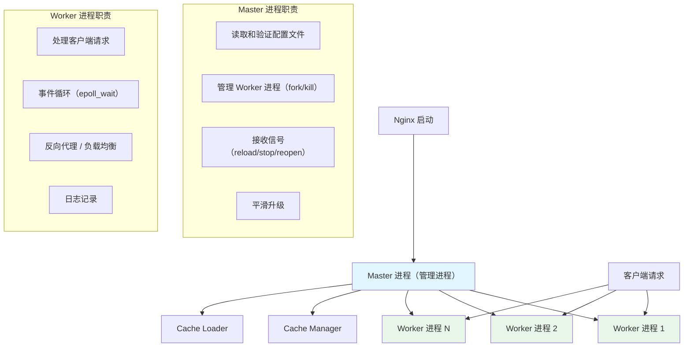
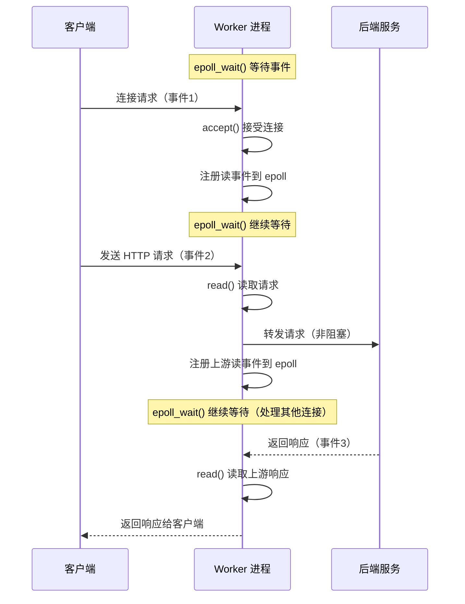
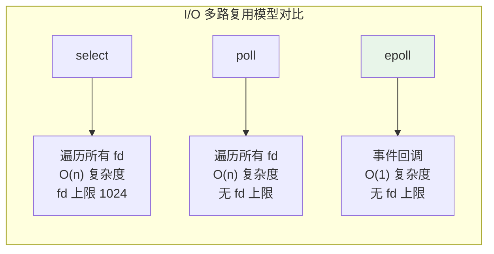
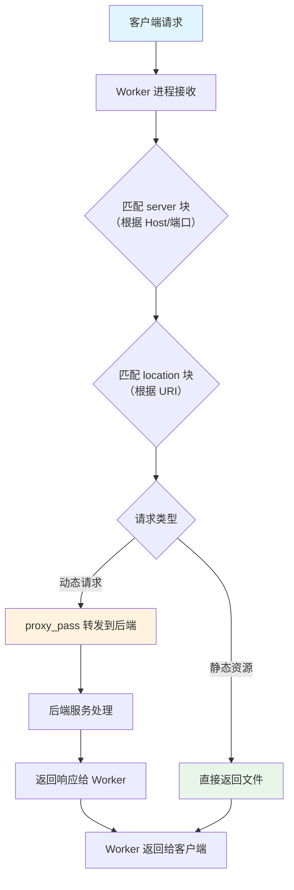

# Nginx 架构

## 概念说明

Nginx 采用 **Master-Worker 多进程模型** + **事件驱动（epoll）** 的架构设计，使其能够以极低的内存消耗处理数万甚至数十万的并发连接。理解 Nginx 的架构是掌握其配置和调优的基础，也是面试中的高频考点。

## 核心原理

### 一、Master-Worker 进程模型



| 进程 | 数量 | 职责 |
|------|------|------|
| Master | 1 个 | 读取配置、管理 Worker、接收信号（reload/stop） |
| Worker | 通常 = CPU 核心数 | 处理客户端请求、事件循环 |
| Cache Manager | 1 个 | 管理缓存过期 |
| Cache Loader | 1 个 | 启动时加载缓存 |

### 二、事件驱动模型

Nginx 的 Worker 进程使用**事件驱动**（非阻塞 I/O）处理请求，而非传统的"一个连接一个线程"模型：



#### 为什么 Nginx 能处理高并发？

| 对比维度 | 传统模型（Apache prefork） | Nginx 事件驱动 |
|----------|--------------------------|----------------|
| 并发模型 | 一个连接一个进程/线程 | 一个进程处理数千连接 |
| 内存消耗 | 每个连接 ~2MB | 每个连接 ~2.5KB |
| 上下文切换 | 频繁（进程/线程切换） | 极少（事件驱动） |
| 10K 连接内存 | ~20GB | ~25MB |
| 适用场景 | 动态内容处理 | 反向代理、静态资源 |

### 三、epoll 事件模型

Nginx 在 Linux 上使用 **epoll** 作为事件通知机制：



| 模型 | 时间复杂度 | fd 上限 | 机制 |
|------|-----------|---------|------|
| select | O(n) | 1024 | 遍历所有 fd |
| poll | O(n) | 无限制 | 遍历所有 fd |
| epoll | O(1) | 无限制 | 事件回调（红黑树 + 就绪链表） |

### 四、请求处理流程



### 五、配置文件结构

```nginx
# Nginx 配置文件层级结构
# 全局块
worker_processes auto;          # Worker 进程数（通常 = CPU 核心数）
error_log /var/log/nginx/error.log warn;
pid /var/run/nginx.pid;

# events 块 — 事件模型配置
events {
    use epoll;                  # 使用 epoll 事件模型（Linux）
    worker_connections 1024;    # 每个 Worker 的最大连接数
    multi_accept on;            # 一次 accept 多个连接
}

# http 块 — HTTP 服务配置
http {
    include mime.types;
    default_type application/octet-stream;

    # server 块 — 虚拟主机配置
    server {
        listen 80;
        server_name example.com;

        # location 块 — 路由匹配
        location / {
            root /usr/share/nginx/html;
            index index.html;
        }

        location /api/ {
            proxy_pass http://backend;
        }
    }
}
```

#### location 匹配优先级

| 优先级 | 语法 | 说明 | 示例 |
|--------|------|------|------|
| 1 | `= /path` | 精确匹配 | `= /login` |
| 2 | `^~ /path` | 前缀匹配（不检查正则） | `^~ /static/` |
| 3 | `~ regex` | 正则匹配（区分大小写） | `~ \.php$` |
| 4 | `~* regex` | 正则匹配（不区分大小写） | `~* \.(jpg|png)$` |
| 5 | `/path` | 普通前缀匹配 | `/api/` |

## 代码示例

> 💻 完整配置文件：[code-examples/04-middleware/nginx-examples/conf/](https://github.com/skyhe58/guide-java/tree/main/code-examples/04-middleware/nginx-examples/conf/)
> <!-- 本地路径：code-examples/04-middleware/nginx-examples/conf/ -->
>
> ⚠️ 需要 Nginx 环境：`docker compose -f docker/docker-compose.nginx.yml up -d`

## 常见面试题

### Q1: 请描述 Nginx 的 Master-Worker 架构

**难度**：⭐⭐⭐ | **频率**：🔥🔥🔥

**答题思路**：

1. Master 进程的职责
2. Worker 进程的职责和数量
3. 事件驱动模型
4. 与传统模型的对比

**标准答案**：

Nginx 采用 Master-Worker 多进程模型。Master 进程负责读取配置、管理 Worker 进程、接收信号（如 reload 平滑重载）。Worker 进程负责处理客户端请求，数量通常设置为 CPU 核心数。每个 Worker 使用事件驱动（epoll）模型，一个进程可以处理数千个并发连接，避免了传统模型中一个连接一个线程的高内存消耗和频繁上下文切换。

**深入追问**：

- Worker 进程之间如何避免惊群效应？（accept_mutex 锁，新版本使用 EPOLLEXCLUSIVE）
- Nginx reload 的过程是怎样的？（Master 启动新 Worker，旧 Worker 处理完当前请求后退出）
- worker_connections 和最大并发数的关系？（最大并发 = worker_processes × worker_connections）

### Q2: 为什么 Nginx 能处理高并发？

**难度**：⭐⭐⭐ | **频率**：🔥🔥🔥

**标准答案**：

Nginx 高并发的核心在于事件驱动 + 非阻塞 I/O。Worker 进程使用 epoll 事件循环，一个进程可以同时处理数千个连接，每个连接只占约 2.5KB 内存。相比传统的一个连接一个线程模型（每个线程约 2MB 内存），Nginx 的内存消耗极低。加上 Master-Worker 多进程模型避免了锁竞争，使得 Nginx 能轻松处理数万甚至数十万并发连接。

**深入追问**：

- epoll 和 select/poll 的区别？
- Nginx 适合处理什么类型的请求？（I/O 密集型，如反向代理、静态资源）
- Nginx 不适合什么场景？（CPU 密集型计算）

### Q3: Nginx 的 location 匹配规则是什么？

**难度**：⭐⭐ | **频率**：🔥🔥

**标准答案**：

location 匹配优先级从高到低：精确匹配（`=`）> 前缀匹配且不检查正则（`^~`）> 正则匹配（`~` 区分大小写、`~*` 不区分大小写）> 普通前缀匹配。多个正则匹配时按配置文件中的顺序，第一个匹配的生效。普通前缀匹配选择最长匹配。

## 参考资料

- [Nginx 官方文档](https://nginx.org/en/docs/)
- [Nginx 架构设计](https://www.aosabook.org/en/nginx.html)
