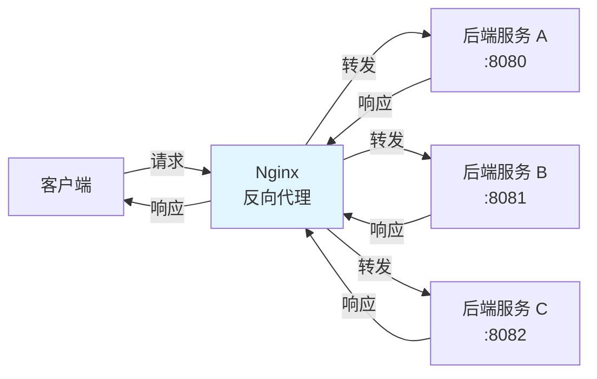

# 反向代理配置

## 概念说明

反向代理（Reverse Proxy）是 Nginx 最核心的功能之一。客户端不直接访问后端服务器，而是通过 Nginx 转发请求。反向代理隐藏了后端服务器的真实地址，同时可以实现负载均衡、SSL 终止、缓存等功能。



### 正向代理 vs 反向代理

| 对比维度 | 正向代理 | 反向代理 |
|----------|----------|----------|
| 代理对象 | 客户端 | 服务端 |
| 客户端感知 | 知道代理的存在 | 不知道代理的存在 |
| 典型场景 | VPN、翻墙 | Nginx、CDN |
| 隐藏对象 | 隐藏客户端 | 隐藏服务端 |

## 核心原理

### 一、基本反向代理配置

```nginx
# 最简单的反向代理
server {
    listen 80;
    server_name api.example.com;

    location / {
        proxy_pass http://127.0.0.1:8080;
    }
}
```

#### proxy_pass 末尾斜杠的区别

```nginx
# 有斜杠 — 替换 location 匹配的路径
location /api/ {
    proxy_pass http://backend/;
}
# 请求 /api/users → 转发到 http://backend/users

# 无斜杠 — 保留 location 匹配的路径
location /api/ {
    proxy_pass http://backend;
}
# 请求 /api/users → 转发到 http://backend/api/users
```

### 二、请求头传递

```nginx
server {
    listen 80;
    server_name api.example.com;

    location / {
        proxy_pass http://backend;

        # 传递客户端真实 IP
        proxy_set_header Host $host;
        proxy_set_header X-Real-IP $remote_addr;
        proxy_set_header X-Forwarded-For $proxy_add_x_forwarded_for;
        proxy_set_header X-Forwarded-Proto $scheme;

        # 超时设置
        proxy_connect_timeout 60s;
        proxy_send_timeout 60s;
        proxy_read_timeout 60s;

        # 缓冲区设置
        proxy_buffering on;
        proxy_buffer_size 4k;
        proxy_buffers 8 4k;
    }
}
```

> **面试重点**：后端服务获取客户端真实 IP 需要读取 `X-Real-IP` 或 `X-Forwarded-For` 请求头，而不是直接获取 `remoteAddr`（那是 Nginx 的地址）。

### 三、upstream 配置

```nginx
# 定义后端服务器组
upstream backend {
    server 192.168.1.10:8080 weight=3;
    server 192.168.1.11:8080 weight=2;
    server 192.168.1.12:8080 weight=1;
    server 192.168.1.13:8080 backup;    # 备用服务器
}

server {
    listen 80;
    location / {
        proxy_pass http://backend;
    }
}
```

### 四、WebSocket 代理

```nginx
# WebSocket 需要 HTTP 升级
map $http_upgrade $connection_upgrade {
    default upgrade;
    '' close;
}

server {
    listen 80;

    location /ws/ {
        proxy_pass http://websocket_backend;
        proxy_http_version 1.1;
        proxy_set_header Upgrade $http_upgrade;
        proxy_set_header Connection $connection_upgrade;
        proxy_set_header Host $host;

        # WebSocket 长连接超时（默认 60s）
        proxy_read_timeout 3600s;
        proxy_send_timeout 3600s;
    }
}
```

## 代码示例

> 💻 完整配置文件：[reverse-proxy.conf](../../../code-examples/04-middleware/nginx-examples/conf/reverse-proxy.conf)
>
> ⚠️ 需要 Nginx 环境：`docker compose -f docker/docker-compose.nginx.yml up -d`

## 常见面试题

### Q1: 正向代理和反向代理的区别？

**难度**：⭐⭐ | **频率**：🔥🔥🔥

**标准答案**：

正向代理代理的是客户端，客户端知道代理的存在，代理帮客户端访问目标服务器（如 VPN）。反向代理代理的是服务端，客户端不知道代理的存在，以为直接访问的是目标服务器（如 Nginx）。正向代理隐藏客户端，反向代理隐藏服务端。

**深入追问**：

- 反向代理有什么好处？（负载均衡、SSL 终止、缓存、安全隔离）
- CDN 是正向代理还是反向代理？（反向代理）

### Q2: Nginx 如何获取客户端真实 IP？

**难度**：⭐⭐ | **频率**：🔥🔥

**标准答案**：

Nginx 通过 `proxy_set_header X-Real-IP $remote_addr` 和 `proxy_set_header X-Forwarded-For $proxy_add_x_forwarded_for` 将客户端真实 IP 传递给后端。后端服务从 `X-Real-IP` 或 `X-Forwarded-For` 请求头中获取。`X-Forwarded-For` 是一个链式结构，经过多层代理时会追加每一层代理的 IP。

**深入追问**：

- X-Forwarded-For 可以被伪造吗？（可以，客户端可以自行设置该头）
- 如何防止 X-Forwarded-For 伪造？（在最外层 Nginx 设置 `proxy_set_header X-Forwarded-For $remote_addr`）

### Q3: proxy_pass 末尾有无斜杠的区别？

**难度**：⭐⭐ | **频率**：🔥🔥

**标准答案**：

有斜杠时，Nginx 会将 location 匹配的路径部分替换掉。例如 `location /api/` + `proxy_pass http://backend/`，请求 `/api/users` 会转发到 `http://backend/users`。无斜杠时，Nginx 会保留完整的请求路径，请求 `/api/users` 会转发到 `http://backend/api/users`。

## 参考资料

- [Nginx 官方文档 - proxy_pass](https://nginx.org/en/docs/http/ngx_http_proxy_module.html)
