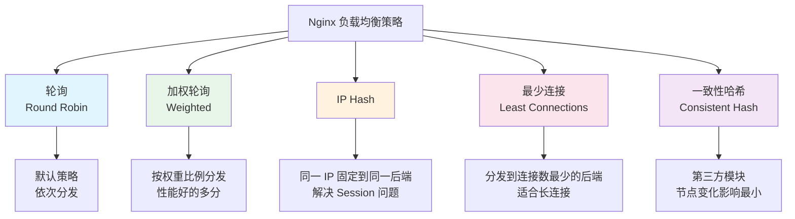
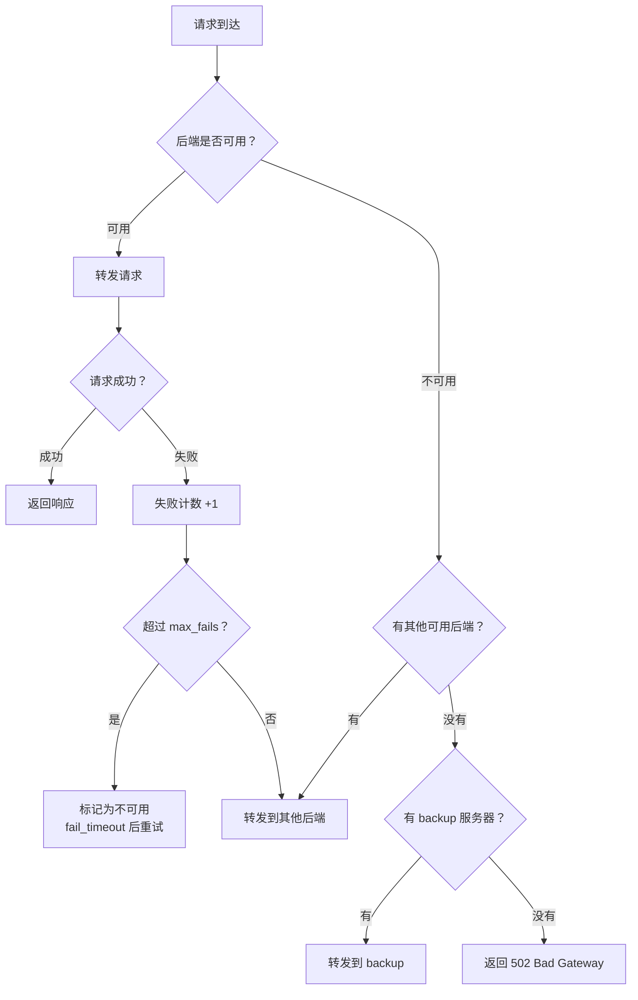

# 负载均衡策略

## 概念说明

负载均衡（Load Balancing）是将客户端请求分发到多个后端服务器的技术，目的是提高系统的吞吐量、可用性和响应速度。Nginx 支持多种负载均衡策略，选择合适的策略对系统性能至关重要。

## 核心原理

### 一、负载均衡策略对比



| 策略 | 配置 | 适用场景 | 优点 | 缺点 |
|------|------|----------|------|------|
| 轮询 | 默认 | 后端性能相近 | 简单公平 | 不考虑服务器性能差异 |
| 加权轮询 | `weight=N` | 后端性能不同 | 按能力分配 | 需要手动配置权重 |
| IP Hash | `ip_hash` | 需要 Session 保持 | 同一客户端固定后端 | 分布不均匀 |
| 最少连接 | `least_conn` | 请求处理时间差异大 | 动态均衡 | 新节点可能被压垮 |
| 一致性哈希 | `hash $key consistent` | 缓存场景 | 节点变化影响小 | 需要第三方模块 |

### 二、各策略配置示例

#### 1. 轮询（默认）

```nginx
upstream backend {
    server 192.168.1.10:8080;
    server 192.168.1.11:8080;
    server 192.168.1.12:8080;
}
```

#### 2. 加权轮询

```nginx
upstream backend {
    server 192.168.1.10:8080 weight=5;   # 50% 流量
    server 192.168.1.11:8080 weight=3;   # 30% 流量
    server 192.168.1.12:8080 weight=2;   # 20% 流量
}
```

#### 3. IP Hash

```nginx
upstream backend {
    ip_hash;
    server 192.168.1.10:8080;
    server 192.168.1.11:8080;
    server 192.168.1.12:8080;
}
# 同一客户端 IP 的请求始终转发到同一后端
# ⚠️ 如果前面有 CDN/代理，所有请求可能来自同一 IP
```

#### 4. 最少连接

```nginx
upstream backend {
    least_conn;
    server 192.168.1.10:8080;
    server 192.168.1.11:8080;
    server 192.168.1.12:8080;
}
# 将请求分发到当前活跃连接数最少的后端
```

#### 5. 一致性哈希

```nginx
upstream backend {
    hash $request_uri consistent;
    server 192.168.1.10:8080;
    server 192.168.1.11:8080;
    server 192.168.1.12:8080;
}
# 相同 URI 的请求固定到同一后端（适合缓存场景）
```

### 三、健康检查

```nginx
upstream backend {
    server 192.168.1.10:8080 max_fails=3 fail_timeout=30s;
    server 192.168.1.11:8080 max_fails=3 fail_timeout=30s;
    server 192.168.1.12:8080 backup;     # 备用服务器
    server 192.168.1.13:8080 down;       # 标记为下线
}
```

| 参数 | 说明 | 默认值 |
|------|------|--------|
| `max_fails` | 最大失败次数，超过后标记为不可用 | 1 |
| `fail_timeout` | 失败超时时间（检测周期 + 不可用时间） | 10s |
| `backup` | 备用服务器，只在主服务器全部不可用时启用 | — |
| `down` | 标记为永久下线 | — |



### 四、Nginx 负载均衡 vs Spring Cloud LoadBalancer

| 对比维度 | Nginx | Spring Cloud LoadBalancer |
|----------|-------|--------------------------|
| 负载均衡层 | 服务端（七层/四层） | 客户端 |
| 服务发现 | 静态配置（或 Consul Template） | 动态（注册中心） |
| 健康检查 | 被动检查（请求失败计数） | 主动检查（心跳） |
| 适用场景 | 外部流量入口 | 微服务内部调用 |
| 配置方式 | 配置文件 | 代码/注解 |

## 代码示例

> 💻 完整配置文件：[load-balance.conf](../../../code-examples/04-middleware/nginx-examples/conf/load-balance.conf)
>
> ⚠️ 需要 Nginx 环境：`docker compose -f docker/docker-compose.nginx.yml up -d`

## 常见面试题

### Q1: Nginx 有哪些负载均衡策略？各自适用什么场景？

**难度**：⭐⭐⭐ | **频率**：🔥🔥🔥

**答题思路**：

1. 列举五种策略
2. 说明各自的适用场景
3. 提到健康检查机制

**标准答案**：

Nginx 支持五种负载均衡策略：轮询（默认，后端性能相近时使用）、加权轮询（后端性能不同时按权重分配）、IP Hash（需要 Session 保持时使用，同一 IP 固定到同一后端）、最少连接（请求处理时间差异大时使用）、一致性哈希（缓存场景，节点变化影响最小）。Nginx 通过 max_fails 和 fail_timeout 实现被动健康检查。

**深入追问**：

- IP Hash 有什么问题？（前面有 CDN 时所有请求可能来自同一 IP，导致分布不均）
- 如何解决 Session 问题？（IP Hash、Redis Session、JWT 无状态）
- Nginx 的健康检查是主动还是被动的？（被动，商业版 Nginx Plus 支持主动健康检查）

### Q2: Nginx 和 Spring Cloud LoadBalancer 的区别？

**难度**：⭐⭐⭐ | **频率**：🔥🔥

**标准答案**：

Nginx 是服务端负载均衡，部署在服务端前面，客户端不感知后端服务器；Spring Cloud LoadBalancer 是客户端负载均衡，客户端从注册中心获取服务列表后自行选择。Nginx 适合外部流量入口，配置静态；Spring Cloud LoadBalancer 适合微服务内部调用，配合注册中心动态发现服务。实际架构中两者通常配合使用：Nginx 做外部入口，内部服务间用 LoadBalancer。

### Q3: 如何实现 Nginx 的主动健康检查？

**难度**：⭐⭐⭐ | **频率**：🔥🔥

**标准答案**：

开源版 Nginx 只支持被动健康检查（请求失败后标记不可用）。主动健康检查可以通过：Nginx Plus 商业版内置支持；nginx_upstream_check_module 第三方模块；或者配合 Consul/Nacos 等注册中心实现服务发现和健康检查，通过 Consul Template 动态更新 Nginx 配置。

## 参考资料

- [Nginx 官方文档 - upstream](https://nginx.org/en/docs/http/ngx_http_upstream_module.html)
