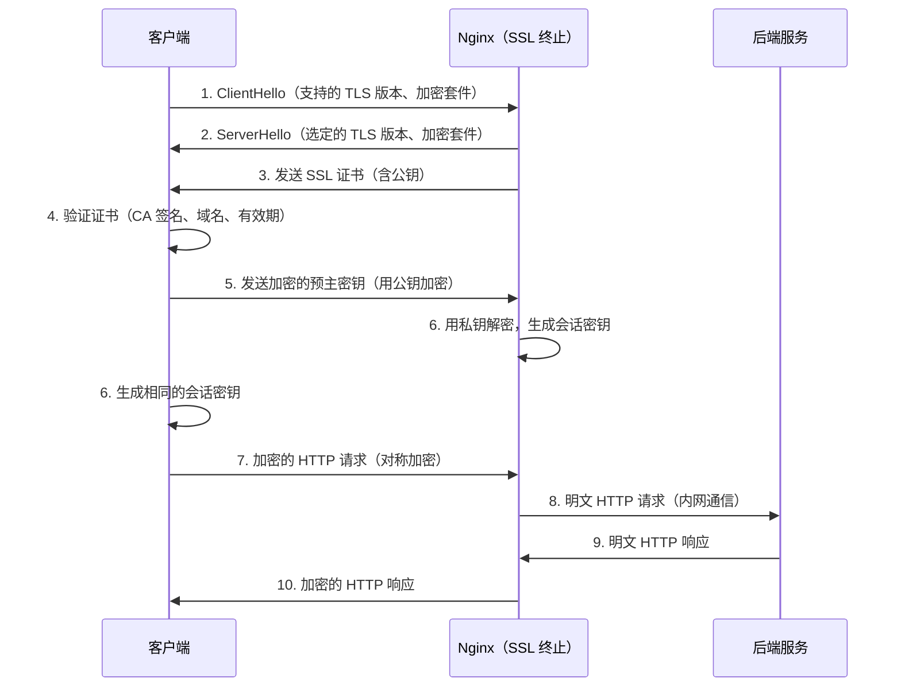

# HTTPS 配置

## 概念说明

HTTPS = HTTP + TLS/SSL，通过加密传输保护数据安全。在生产环境中，Nginx 通常作为 SSL 终止点（SSL Termination），负责处理 HTTPS 加密解密，后端服务之间使用 HTTP 明文通信，减轻后端服务的计算负担。

## 核心原理

### 一、SSL/TLS 握手流程



### 二、HTTPS + HTTP/2 完整配置

```nginx
server {
    listen 443 ssl http2;
    server_name example.com;

    # SSL 证书配置
    ssl_certificate /etc/nginx/ssl/example.com.crt;
    ssl_certificate_key /etc/nginx/ssl/example.com.key;

    # TLS 版本（禁用不安全的旧版本）
    ssl_protocols TLSv1.2 TLSv1.3;

    # 加密套件（优先使用服务端配置）
    ssl_prefer_server_ciphers on;
    ssl_ciphers 'ECDHE-ECDSA-AES128-GCM-SHA256:ECDHE-RSA-AES128-GCM-SHA256';

    # SSL 会话缓存（减少握手次数）
    ssl_session_cache shared:SSL:10m;
    ssl_session_timeout 10m;

    # OCSP Stapling（加速证书验证）
    ssl_stapling on;
    ssl_stapling_verify on;
    ssl_trusted_certificate /etc/nginx/ssl/ca-bundle.crt;

    # HSTS（强制 HTTPS）
    add_header Strict-Transport-Security "max-age=31536000; includeSubDomains" always;

    location / {
        proxy_pass http://backend;
        proxy_set_header Host $host;
        proxy_set_header X-Real-IP $remote_addr;
        proxy_set_header X-Forwarded-Proto https;
    }
}

# HTTP → HTTPS 重定向
server {
    listen 80;
    server_name example.com;
    return 301 https://$host$request_uri;
}
```

### 三、Let's Encrypt 自动证书

```bash
# 使用 certbot 申请免费 SSL 证书
certbot --nginx -d example.com -d www.example.com

# 自动续期（证书有效期 90 天）
certbot renew --dry-run

# crontab 定时续期
0 0 1 * * certbot renew --quiet && nginx -s reload
```

### 四、HTTP/2 的优势

| 特性 | HTTP/1.1 | HTTP/2 |
|------|----------|--------|
| 连接复用 | 每个请求一个连接（或 Keep-Alive） | 单连接多路复用 |
| 头部压缩 | 无 | HPACK 压缩 |
| 服务端推送 | 无 | 支持 Server Push |
| 二进制传输 | 文本协议 | 二进制帧 |
| 优先级 | 无 | 流优先级 |

## 代码示例

> 💻 完整配置文件：[https.conf](https://github.com/skyhe58/guide-java/tree/main/code-examples/04-middleware/nginx-examples/conf/https.conf)
> <!-- 本地路径：code-examples/04-middleware/nginx-examples/conf/https.conf -->
>
> ⚠️ 需要 Nginx 环境：`docker compose -f docker/docker-compose.nginx.yml up -d`

## 常见面试题

### Q1: HTTPS 的工作原理是什么？

**难度**：⭐⭐⭐ | **频率**：🔥🔥🔥

**标准答案**：

HTTPS 在 HTTP 和 TCP 之间加入了 TLS 层。首先进行 TLS 握手：客户端发送支持的加密套件，服务端选择并返回 SSL 证书（含公钥）；客户端验证证书后，用公钥加密预主密钥发送给服务端；双方基于预主密钥生成对称会话密钥。之后的数据传输使用对称加密（AES），兼顾安全性和性能。

**深入追问**：

- 为什么不全程使用非对称加密？（非对称加密计算量大，对称加密快 100 倍以上）
- HSTS 是什么？有什么作用？（强制浏览器使用 HTTPS，防止 SSL 剥离攻击）

### Q2: Nginx 如何配置 SSL 终止？

**难度**：⭐⭐ | **频率**：🔥🔥

**标准答案**：

在 Nginx 的 server 块中配置 `listen 443 ssl`，指定 `ssl_certificate` 和 `ssl_certificate_key`，设置 `ssl_protocols` 只允许 TLSv1.2 和 TLSv1.3，配置 `ssl_session_cache` 减少握手次数。Nginx 处理 HTTPS 加解密后，通过 `proxy_pass` 以 HTTP 明文转发给后端服务，减轻后端计算负担。同时配置 HTTP 80 端口 301 重定向到 HTTPS。

### Q3: 如何优化 Nginx 的 HTTPS 性能？

**难度**：⭐⭐⭐ | **频率**：🔥🔥

**标准答案**：

开启 SSL 会话缓存（ssl_session_cache）减少重复握手；使用 TLSv1.3（0-RTT 恢复）；开启 OCSP Stapling 加速证书验证；使用 ECDHE 密钥交换（比 RSA 快）；开启 HTTP/2 多路复用减少连接数；合理配置 ssl_buffer_size。

## 参考资料

- [Nginx 官方文档 - SSL](https://nginx.org/en/docs/http/configuring_https_servers.html)
- [Let's Encrypt](https://letsencrypt.org/)
