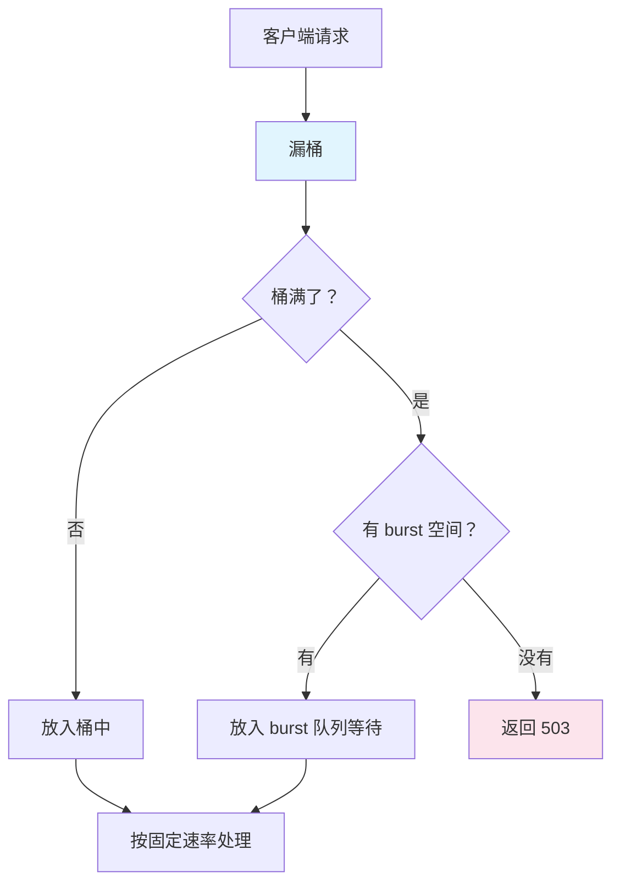
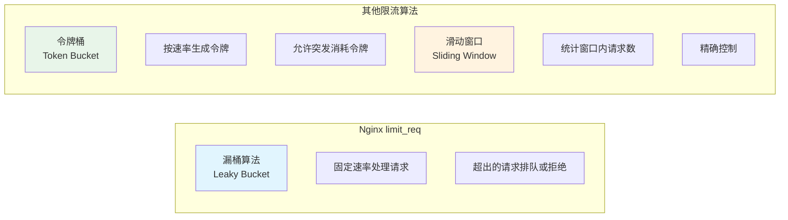

# 限流防刷

## 概念说明

限流（Rate Limiting）是保护后端服务的重要手段，防止恶意请求或突发流量压垮系统。Nginx 提供两种限流机制：`limit_req`（请求速率限制，基于漏桶算法）和 `limit_conn`（并发连接数限制）。

## 核心原理

### 一、limit_req — 请求速率限制（漏桶算法）



```nginx
# 定义限流区域（基于客户端 IP）
# zone=api_limit:10m — 使用 10MB 共享内存存储状态
# rate=10r/s — 每秒允许 10 个请求（每 100ms 处理 1 个）
limit_req_zone $binary_remote_addr zone=api_limit:10m rate=10r/s;

server {
    listen 80;

    location /api/ {
        # burst=20 — 允许突发 20 个请求排队
        # nodelay — 突发请求立即处理（不排队等待）
        limit_req zone=api_limit burst=20 nodelay;

        # 限流返回状态码（默认 503）
        limit_req_status 429;

        proxy_pass http://backend;
    }
}
```

#### burst 和 nodelay 的区别

| 配置 | 行为 | 适用场景 |
|------|------|----------|
| 无 burst | 超过速率的请求直接拒绝 | 严格限流 |
| `burst=20` | 超过速率的请求排队等待（最多 20 个） | 允许短暂突发 |
| `burst=20 nodelay` | 突发请求立即处理，但消耗 burst 配额 | 允许突发且不延迟 |

### 二、limit_conn — 并发连接数限制

```nginx
# 定义连接数限制区域
limit_conn_zone $binary_remote_addr zone=conn_limit:10m;

server {
    listen 80;

    location /download/ {
        # 每个 IP 最多 5 个并发连接
        limit_conn conn_limit 5;
        limit_conn_status 429;

        # 限制每个连接的下载速度
        limit_rate 500k;

        proxy_pass http://file_server;
    }
}
```

### 三、组合使用

```nginx
# 同时限制请求速率和连接数
limit_req_zone $binary_remote_addr zone=req_limit:10m rate=10r/s;
limit_conn_zone $binary_remote_addr zone=conn_limit:10m;

server {
    listen 80;

    # API 接口 — 限制请求速率
    location /api/ {
        limit_req zone=req_limit burst=20 nodelay;
        limit_req_status 429;
        proxy_pass http://backend;
    }

    # 文件下载 — 限制连接数和带宽
    location /download/ {
        limit_conn conn_limit 3;
        limit_rate 1m;
        proxy_pass http://file_server;
    }

    # 登录接口 — 严格限流（防暴力破解）
    location /login {
        limit_req zone=req_limit burst=5;
        limit_req_status 429;
        proxy_pass http://backend;
    }
}
```

### 四、限流算法对比



| 算法 | Nginx 实现 | 特点 |
|------|-----------|------|
| 漏桶 | `limit_req` | 固定速率输出，平滑流量 |
| 令牌桶 | Lua 脚本实现 | 允许突发，更灵活 |
| 滑动窗口 | Lua 脚本实现 | 精确统计，实现复杂 |

## 代码示例

> 💻 完整配置文件：[limit.conf](../../../code-examples/04-middleware/nginx-examples/conf/limit.conf)
>
> ⚠️ 需要 Nginx 环境：`docker compose -f docker/docker-compose.nginx.yml up -d`

## 常见面试题

### Q1: Nginx 如何实现限流？

**难度**：⭐⭐⭐ | **频率**：🔥🔥🔥

**答题思路**：

1. limit_req（请求速率限制）— 漏桶算法
2. limit_conn（连接数限制）
3. burst 和 nodelay 的作用

**标准答案**：

Nginx 提供两种限流机制：`limit_req` 基于漏桶算法限制请求速率，通过 `limit_req_zone` 定义限流区域（通常按客户端 IP），`rate` 参数设置每秒允许的请求数，`burst` 参数允许短暂突发，`nodelay` 让突发请求立即处理而不排队。`limit_conn` 限制并发连接数，常用于文件下载场景。两者可以组合使用。

**深入追问**：

- 漏桶算法和令牌桶算法的区别？（漏桶固定速率输出，令牌桶允许突发）
- burst=20 nodelay 和 burst=20 的区别？
- 如何对不同接口设置不同的限流策略？

### Q2: 如何防止接口被恶意刷取？

**难度**：⭐⭐⭐ | **频率**：🔥🔥

**标准答案**：

多层防护：Nginx 层使用 limit_req 限制请求速率 + limit_conn 限制连接数；对登录等敏感接口设置更严格的限流；配合 fail2ban 自动封禁恶意 IP；应用层使用验证码、Token 校验；Redis 实现更精细的限流（如滑动窗口）。

### Q3: limit_req 的 burst 参数是什么意思？

**难度**：⭐⭐ | **频率**：🔥🔥

**标准答案**：

burst 定义了一个缓冲队列的大小。当请求速率超过 rate 限制时，超出的请求不会立即被拒绝，而是放入 burst 队列中排队等待处理。如果队列也满了，才返回 503/429。加上 nodelay 参数后，burst 队列中的请求会立即处理（不排队），但会消耗 burst 配额，配额按 rate 速率恢复。

## 参考资料

- [Nginx 官方文档 - limit_req](https://nginx.org/en/docs/http/ngx_http_limit_req_module.html)
- [Nginx 官方文档 - limit_conn](https://nginx.org/en/docs/http/ngx_http_limit_conn_module.html)
