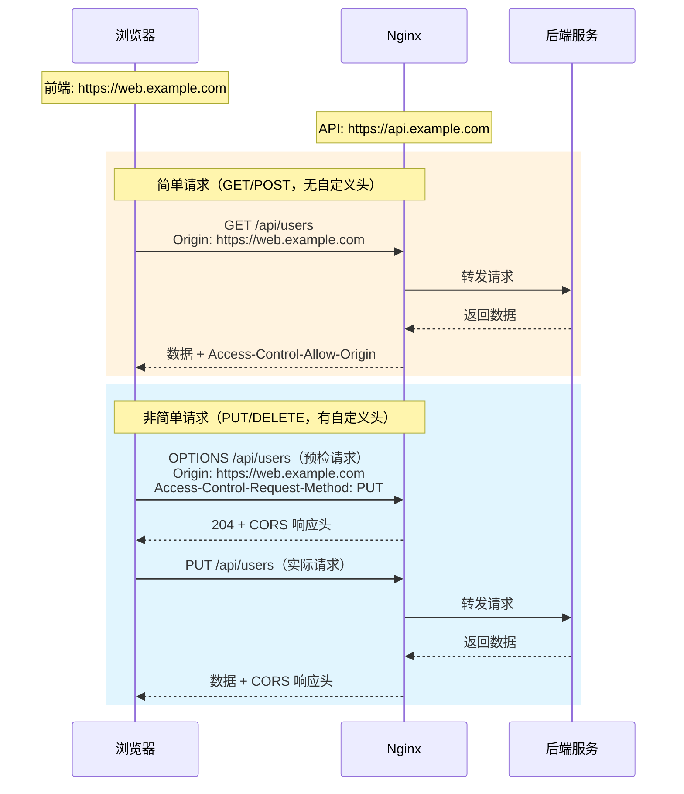

# 跨域配置

## 概念说明

跨域资源共享（CORS, Cross-Origin Resource Sharing）是浏览器的安全机制。当前端页面的域名与 API 接口的域名不同时（协议、域名、端口任一不同），浏览器会阻止跨域请求。Nginx 可以通过添加 CORS 响应头来解决跨域问题。

## 核心原理

### 一、CORS 原理



### 二、简单请求 vs 非简单请求

| 条件 | 简单请求 | 非简单请求 |
|------|----------|------------|
| 方法 | GET / POST / HEAD | PUT / DELETE / PATCH |
| Content-Type | text/plain / multipart/form-data / application/x-www-form-urlencoded | application/json 等 |
| 自定义头 | 无 | 有（如 Authorization） |
| 预检请求 | 不需要 | 需要 OPTIONS 预检 |

### 三、Nginx CORS 配置

```nginx
server {
    listen 80;
    server_name api.example.com;

    location /api/ {
        # 允许的源（生产环境指定具体域名）
        add_header 'Access-Control-Allow-Origin' 'https://web.example.com' always;

        # 允许的方法
        add_header 'Access-Control-Allow-Methods' 'GET, POST, PUT, DELETE, OPTIONS' always;

        # 允许的请求头
        add_header 'Access-Control-Allow-Headers' 'Content-Type, Authorization, X-Requested-With' always;

        # 允许携带 Cookie
        add_header 'Access-Control-Allow-Credentials' 'true' always;

        # 预检请求缓存时间（秒）
        add_header 'Access-Control-Max-Age' 3600 always;

        # 处理 OPTIONS 预检请求
        if ($request_method = 'OPTIONS') {
            return 204;
        }

        proxy_pass http://backend;
    }
}
```

#### 动态允许多个域名

```nginx
# 使用 map 动态匹配允许的域名
map $http_origin $cors_origin {
    default "";
    "https://web.example.com" $http_origin;
    "https://admin.example.com" $http_origin;
    "http://localhost:3000" $http_origin;
}

server {
    listen 80;

    location /api/ {
        add_header 'Access-Control-Allow-Origin' $cors_origin always;
        add_header 'Access-Control-Allow-Methods' 'GET, POST, PUT, DELETE, OPTIONS' always;
        add_header 'Access-Control-Allow-Headers' 'Content-Type, Authorization' always;
        add_header 'Access-Control-Allow-Credentials' 'true' always;

        if ($request_method = 'OPTIONS') {
            add_header 'Access-Control-Max-Age' 3600;
            return 204;
        }

        proxy_pass http://backend;
    }
}
```

> **安全提示**：生产环境不要使用 `Access-Control-Allow-Origin: *`，应指定具体的允许域名。使用 `*` 时不能同时设置 `Access-Control-Allow-Credentials: true`。

## 代码示例

> 💻 完整配置文件：[cors.conf](https://github.com/skyhe58/guide-java/tree/main/code-examples/04-middleware/nginx-examples/conf/cors.conf)
> <!-- 本地路径：code-examples/04-middleware/nginx-examples/conf/cors.conf -->
>
> ⚠️ 需要 Nginx 环境：`docker compose -f docker/docker-compose.nginx.yml up -d`

## 常见面试题

### Q1: 什么是跨域？如何解决跨域问题？

**难度**：⭐⭐ | **频率**：🔥🔥🔥

**答题思路**：

1. 解释同源策略
2. 跨域的判断条件
3. 解决方案

**标准答案**：

浏览器的同源策略要求协议、域名、端口三者完全相同才算同源。跨域请求会被浏览器拦截。解决方案有：Nginx 配置 CORS 响应头（最常用）；后端代码添加 CORS 头（如 Spring 的 @CrossOrigin）；JSONP（仅支持 GET，已过时）；代理转发（开发环境用 webpack devServer proxy）。

**深入追问**：

- 预检请求（OPTIONS）是什么？什么时候会触发？
- `Access-Control-Allow-Origin: *` 有什么安全风险？
- 为什么 `*` 不能和 `Credentials: true` 同时使用？

### Q2: 什么是预检请求？

**难度**：⭐⭐ | **频率**：🔥🔥🔥

**标准答案**：

预检请求是浏览器在发送非简单请求（如 PUT/DELETE、带自定义头、Content-Type 为 application/json）之前，先发送一个 OPTIONS 请求询问服务器是否允许该跨域请求。服务器通过 CORS 响应头告知浏览器允许的方法、头部等。预检请求的结果可以通过 `Access-Control-Max-Age` 缓存，避免每次都发送。

### Q3: Nginx 和后端都配置了 CORS 会怎样？

**难度**：⭐⭐ | **频率**：🔥🔥

**标准答案**：

会导致 CORS 响应头重复，浏览器会报错。解决方案是只在一处配置 CORS：要么在 Nginx 层统一处理（推荐），要么在后端代码中处理。如果必须两处都有，Nginx 可以使用 `proxy_hide_header` 去掉后端返回的 CORS 头，由 Nginx 统一添加。

## 参考资料

- [MDN - CORS](https://developer.mozilla.org/zh-CN/docs/Web/HTTP/CORS)
