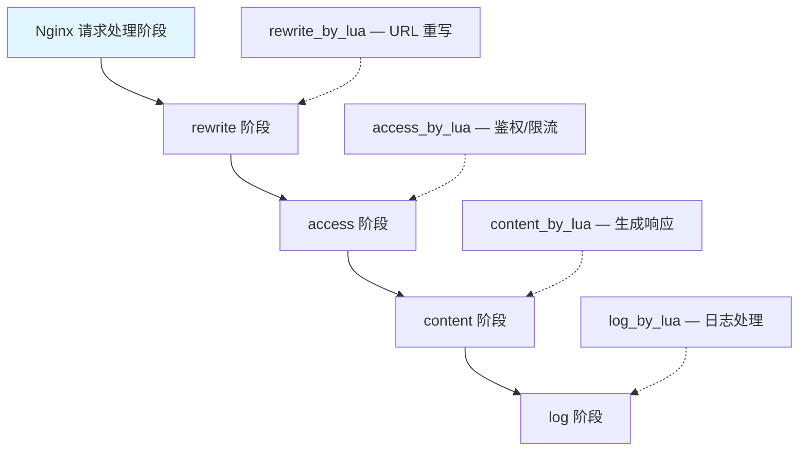
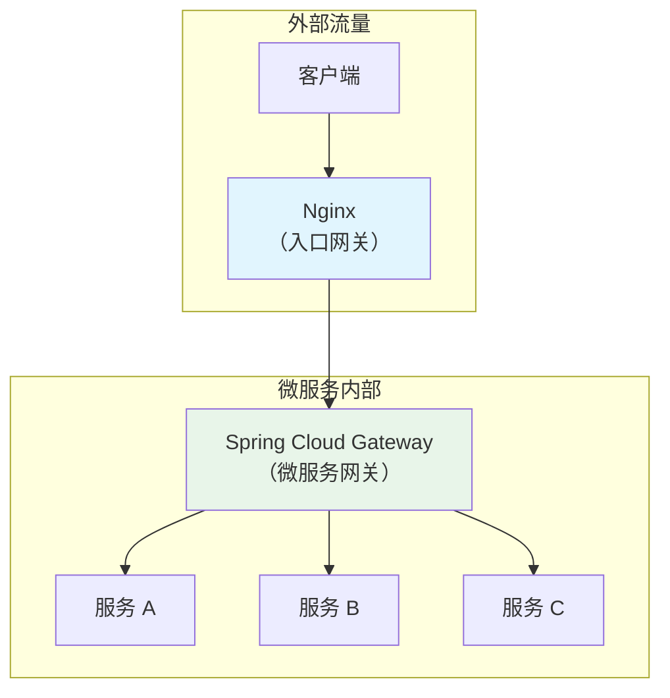
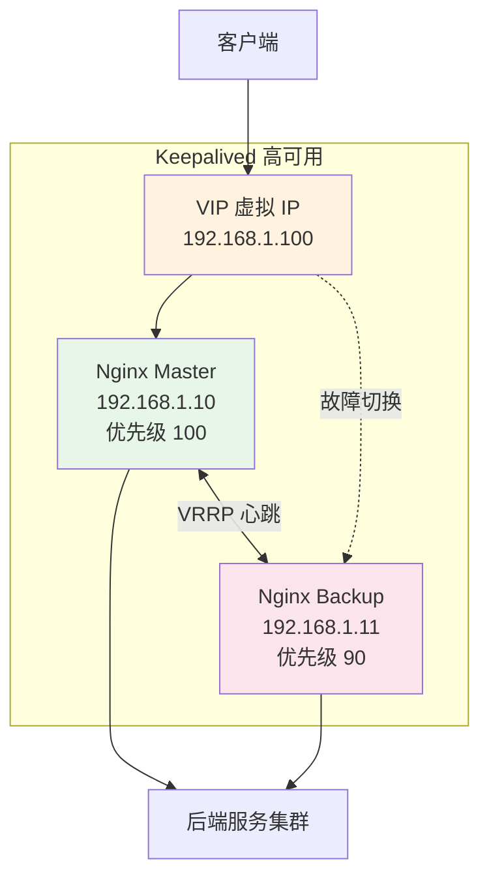

# 进阶主题

## 概念说明

本节覆盖 Nginx 的进阶主题，包括 OpenResty/Lua 扩展、与 Spring Cloud Gateway 的对比、Keepalived 高可用方案以及性能调优参数。这些知识在架构设计和高级面试中经常被考察。

## 核心原理

### 一、OpenResty / Lua 扩展

OpenResty 是基于 Nginx 的 Web 平台，内嵌 LuaJIT，可以在 Nginx 的各个处理阶段执行 Lua 脚本，实现复杂的业务逻辑。



```nginx
# OpenResty Lua 示例：基于 Redis 的动态限流
location /api/ {
    access_by_lua_block {
        local redis = require "resty.redis"
        local red = redis:new()
        red:connect("127.0.0.1", 6379)

        local key = "rate_limit:" .. ngx.var.remote_addr
        local count = red:incr(key)
        if count == 1 then
            red:expire(key, 1)  -- 1 秒过期
        end

        if count > 100 then
            ngx.exit(429)  -- 超过 100 次/秒，返回 429
        end
    }

    proxy_pass http://backend;
}
```

### 二、Nginx vs Spring Cloud Gateway



| 对比维度 | Nginx | Spring Cloud Gateway |
|----------|-------|---------------------|
| 定位 | 入口网关（七层/四层） | 微服务网关（七层） |
| 语言 | C + Lua | Java |
| 性能 | 极高（C 语言，事件驱动） | 高（Reactor 非阻塞） |
| 服务发现 | 静态配置 / Consul Template | 动态（注册中心集成） |
| 路由规则 | 配置文件 | 代码/配置，支持动态路由 |
| 过滤器 | Lua 脚本 | Java Filter（更灵活） |
| 限流 | limit_req（漏桶） | Redis + Lua（令牌桶） |
| 鉴权 | Lua / 基本认证 | Spring Security / OAuth2 |
| 适用场景 | SSL 终止、静态资源、外部入口 | 微服务路由、鉴权、限流 |

**最佳实践**：两者配合使用。Nginx 作为最外层入口，负责 SSL 终止、静态资源、基础限流；Spring Cloud Gateway 作为微服务网关，负责动态路由、鉴权、精细限流。

### 三、Keepalived + Nginx 高可用



Keepalived 使用 VRRP（虚拟路由冗余协议）实现 Nginx 的高可用：

1. 两台 Nginx 服务器运行 Keepalived
2. Master 持有虚拟 IP（VIP），处理所有请求
3. Keepalived 通过 VRRP 心跳检测 Master 状态
4. Master 宕机时，Backup 自动接管 VIP（秒级切换）

### 四、性能调优参数

```nginx
# 全局配置
worker_processes auto;              # Worker 数 = CPU 核心数
worker_cpu_affinity auto;           # Worker 绑定 CPU 核心
worker_rlimit_nofile 65535;         # 每个 Worker 最大打开文件数

events {
    use epoll;                      # 使用 epoll（Linux）
    worker_connections 65535;       # 每个 Worker 最大连接数
    multi_accept on;                # 一次 accept 多个连接
}

http {
    # 文件传输优化
    sendfile on;                    # 零拷贝传输文件
    tcp_nopush on;                  # 合并小包发送（配合 sendfile）
    tcp_nodelay on;                 # 禁用 Nagle 算法（减少延迟）

    # 连接优化
    keepalive_timeout 65;           # Keep-Alive 超时
    keepalive_requests 1000;        # 单连接最大请求数

    # Gzip 压缩
    gzip on;
    gzip_min_length 1k;
    gzip_comp_level 4;
    gzip_types text/plain text/css application/json application/javascript;
    gzip_vary on;

    # 缓冲区
    client_body_buffer_size 16k;
    client_max_body_size 10m;
    proxy_buffer_size 4k;
    proxy_buffers 8 4k;

    # 日志优化
    access_log /var/log/nginx/access.log combined buffer=32k flush=5s;
}
```

#### 关键调优参数说明

| 参数 | 说明 | 推荐值 |
|------|------|--------|
| `worker_processes` | Worker 进程数 | `auto`（= CPU 核心数） |
| `worker_connections` | 每个 Worker 最大连接数 | 10240~65535 |
| `sendfile` | 零拷贝文件传输 | `on` |
| `tcp_nopush` | 合并小包（配合 sendfile） | `on` |
| `tcp_nodelay` | 禁用 Nagle 算法 | `on` |
| `gzip` | 响应压缩 | `on` |
| `keepalive_timeout` | 长连接超时 | 60~120s |

> **最大并发连接数** = worker_processes × worker_connections

## 常见面试题

### Q1: Nginx 和 Spring Cloud Gateway 如何配合使用？

**难度**：⭐⭐⭐ | **频率**：🔥🔥🔥

**标准答案**：

典型架构是 Nginx 作为最外层入口网关，负责 SSL 终止、静态资源服务、基础限流和负载均衡；Spring Cloud Gateway 作为微服务内部网关，负责动态路由、鉴权（JWT/OAuth2）、精细限流、熔断降级。Nginx 将 API 请求转发给 Gateway，Gateway 再根据路由规则转发到具体的微服务。两者各司其职，Nginx 擅长高性能的网络层处理，Gateway 擅长业务层的路由和安全控制。

**深入追问**：

- 为什么不只用 Nginx 或只用 Gateway？
- OpenResty 能替代 Spring Cloud Gateway 吗？

### Q2: 如何实现 Nginx 的高可用？

**难度**：⭐⭐⭐ | **频率**：🔥🔥

**标准答案**：

使用 Keepalived + Nginx 实现高可用。两台 Nginx 服务器运行 Keepalived，通过 VRRP 协议维护一个虚拟 IP（VIP）。正常情况下 Master 持有 VIP 处理请求，Master 宕机时 Backup 自动接管 VIP，实现秒级故障切换。客户端只需要访问 VIP，无需感知后端 Nginx 的切换。

### Q3: Nginx 有哪些性能调优手段？

**难度**：⭐⭐⭐ | **频率**：🔥🔥

**标准答案**：

Worker 进程数设为 CPU 核心数（worker_processes auto）；开启 epoll 事件模型；开启 sendfile 零拷贝和 tcp_nopush 合并小包；开启 Gzip 压缩减少传输量；合理设置 keepalive_timeout 复用连接；调整 worker_connections 和 worker_rlimit_nofile；使用 proxy_buffer 优化代理缓冲；日志使用 buffer 异步写入。

## 参考资料

- [OpenResty 官方文档](https://openresty.org/cn/)
- [Keepalived 官方文档](https://www.keepalived.org/manpage.html)
