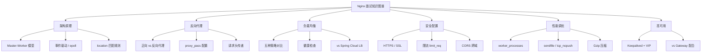

# Nginx 面试指南

## 面试知识图谱

## 高频面试题汇总

### 🔥🔥🔥 必问题

#### Q1: 请描述 Nginx 的 Master-Worker 架构

**追问链路**：Master/Worker 职责 → 事件驱动模型 → epoll vs select → 为什么能处理高并发 → Worker 数量设置

详见 [Nginx 架构](./01-architecture.md#常见面试题)

#### Q2: Nginx 有哪些负载均衡策略？

**追问链路**：五种策略 → 各自适用场景 → IP Hash 的问题 → Session 保持方案 → 健康检查机制

详见 [负载均衡策略](./03-load-balance.md#常见面试题)

#### Q3: 正向代理和反向代理的区别？

**追问链路**：代理对象不同 → 反向代理的好处 → Nginx 如何获取客户端真实 IP → X-Forwarded-For 伪造问题

详见 [反向代理配置](./02-reverse-proxy.md#常见面试题)

#### Q4: 什么是跨域？Nginx 如何解决跨域？

**追问链路**：同源策略 → CORS 原理 → 预检请求 OPTIONS → Nginx add_header 配置 → 允许多个域名

详见 [跨域配置](./06-cors.md#常见面试题)

#### Q5: Nginx 如何实现限流？

**追问链路**：limit_req 漏桶算法 → burst 和 nodelay → limit_conn 连接数限制 → 漏桶 vs 令牌桶

详见 [限流防刷](./05-rate-limit.md#常见面试题)

### 🔥🔥 常问题

#### Q6: Nginx 和 Spring Cloud Gateway 的区别和配合？

**追问链路**：各自定位 → 性能对比 → 服务发现方式 → 典型架构中如何配合

详见 [进阶主题](./07-advanced.md#常见面试题)

#### Q7: 如何实现 Nginx 高可用？

**标准答案**：使用 Keepalived + Nginx 双机热备。两台 Nginx 运行 Keepalived，通过 VRRP 协议维护虚拟 IP。Master 宕机时 Backup 秒级接管 VIP。客户端只访问 VIP，无感知切换。

#### Q8: HTTPS 的工作原理？Nginx 如何配置 SSL？

**追问链路**：TLS 握手流程 → 对称/非对称加密 → SSL 终止 → 性能优化 → Let's Encrypt

详见 [HTTPS 配置](./04-https.md#常见面试题)

### 🔥 偶尔问

#### Q9: Nginx 的 location 匹配规则？

**标准答案**：优先级从高到低：精确匹配（`=`）> 前缀匹配不检查正则（`^~`）> 正则匹配（`~` / `~*`）> 普通前缀匹配。多个正则按配置顺序匹配，普通前缀选最长匹配。

#### Q10: sendfile 和 tcp_nopush 是什么？

**标准答案**：sendfile 开启零拷贝，文件数据直接从内核缓冲区传输到 socket，不经过用户空间，减少一次数据拷贝。tcp_nopush 配合 sendfile 使用，将多个小数据包合并为一个大包发送，减少网络开销。tcp_nodelay 禁用 Nagle 算法，减少小包的发送延迟。三者通常同时开启。

## 面试答题技巧

1. **Master-Worker 架构**是 Nginx 面试的必考题，要能画出架构图
2. **负载均衡策略**要能说出五种策略的区别和适用场景
3. **跨域问题**前后端面试都会问，要理解 CORS 原理和预检请求
4. 回答**性能调优**时，从 Worker 配置、I/O 优化、压缩、缓存四个维度展开
5. 与 **Spring Cloud Gateway 的对比**体现架构思维，说明两者如何配合
