# 分布式系统理论模块概述

## 概念说明

分布式系统理论是理解微服务架构、中间件选型和系统设计的基石。本模块聚焦于面试高频的分布式核心理论，包括 CAP/BASE 理论、一致性算法、分布式锁、分布式事务、幂等性设计和限流算法。

掌握这些理论能帮助你：
- **理解中间件选型依据**：为什么 Consul 是 CP、Eureka 是 AP？
- **设计高可用系统**：如何在一致性和可用性之间做权衡？
- **应对面试深度追问**：从理论到实践，形成完整的知识链路

## 模块知识图谱

```mermaid
graph TD
    A["分布式系统理论"] --> B["CAP & BASE 理论"]
    A --> C["一致性算法"]
    A --> D["分布式锁"]
    A --> E["分布式事务"]
    A --> F["幂等性设计"]
    A --> G["限流算法"]

    B --> B1["CAP 三选二证明"]
    B --> B2["实际系统的 CAP 选择"]
    B --> B3["BASE 最终一致性"]

    C --> C1["Raft 选举/日志复制"]
    C --> C2["Paxos 基本概念"]
    C --> C3["ZAB 协议对比"]

    D --> D1["Redis SETNX / Redisson / RedLock"]
    D --> D2["ZK 临时顺序节点"]
    D --> D3["MySQL 乐观锁/悲观锁"]

    E --> E1["2PC / 3PC"]
    E --> E2["TCC 补偿事务"]
    E --> E3["Saga 编排/协调"]
    E --> E4["消息最终一致性"]
    E --> E5["Seata AT/TCC"]

    F --> F1["Token 机制"]
    F --> F2["唯一索引 / 状态机"]
    F --> F3["去重表 / 分布式锁"]

    G --> G1["固定窗口 / 滑动窗口"]
    G --> G2["漏桶 / 令牌桶"]
    G --> G3["Sentinel / Guava RateLimiter"]

    style A fill:#e1f5fe
    style B fill:#e8f5e9
    style C fill:#fff3e0
    style D fill:#fce4ec
    style E fill:#f3e5f5
    style F fill:#e0f2f1
    style G fill:#ede7f6
```

## 推荐学习顺序

| 序号 | 知识点 | 文档 | 建议时间 |
|------|--------|------|----------|
| 1 | CAP & BASE 理论 | [01-cap-base](./01-cap-base.md) | 45min |
| 2 | 一致性算法 | [02-consensus](./02-consensus.md) | 60min |
| 3 | 分布式锁 | [03-distributed-lock](./03-distributed-lock.md) | 60min |
| 4 | 分布式事务 | [04-distributed-transaction](./04-distributed-transaction.md) | 60min |
| 5 | 幂等性设计 | [05-idempotent](./05-idempotent.md) | 45min |
| 6 | 限流算法 | [06-rate-limiting](./06-rate-limiting.md) | 45min |
| 7 | 分布式面试指南 | [99-interview](./99-interview.md) | 30min |

## 代码示例

> 💻 完整可运行代码：[code-examples/05-distributed/distributed-examples/](../../../code-examples/05-distributed/distributed-examples/)

## 相关模块

- [Redis](../../3-data-store/3.2-redis/05-distributed-lock.md) — Redis 分布式锁的详细实现
- [注册中心](../../4-middleware/4.5-registry/05-comparison.md) — CAP 理论在注册中心选型中的应用
- [Spring Cloud](../../2-framework/2.3-springcloud/08-transaction.md) — Seata 分布式事务实践
- [消息队列](../../4-middleware/4.1-mq-rabbitmq/02-rabbitmq-reliability.md) — 消息最终一致性方案
