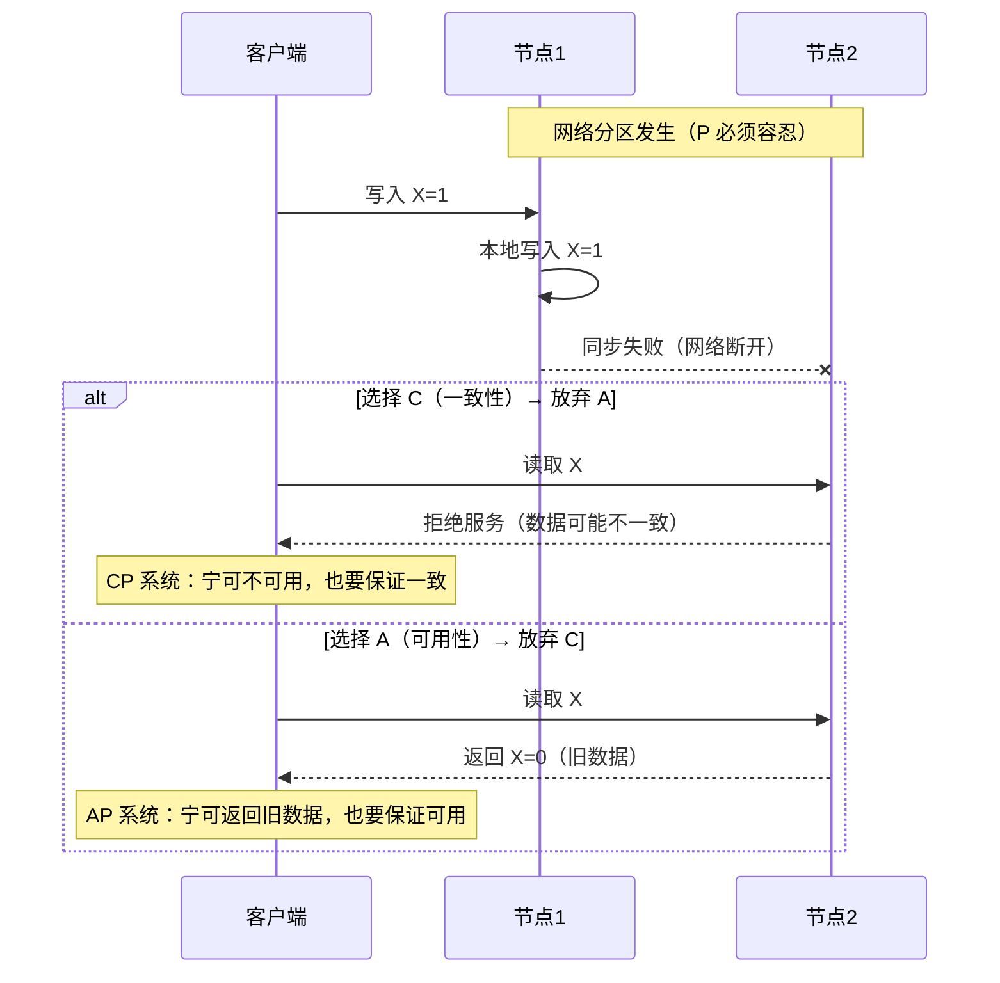
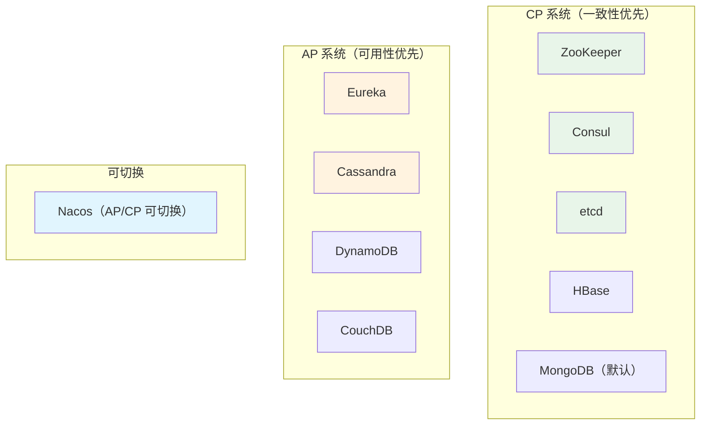
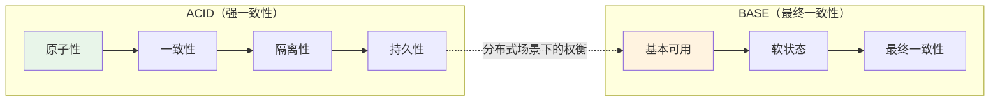

# CAP 理论与 BASE 理论

## 概念说明

CAP 理论和 BASE 理论是分布式系统设计的两大基石。CAP 告诉我们分布式系统不可能同时满足一致性、可用性和分区容错性；BASE 则是对 CAP 中一致性和可用性权衡的实践总结，提出了"最终一致性"的思路。

## 核心原理

### 一、CAP 理论

CAP 理论由 Eric Brewer 在 2000 年提出，2002 年被 Seth Gilbert 和 Nancy Lynch 证明。

#### CAP 三要素

| 要素 | 英文 | 含义 |
|------|------|------|
| C | Consistency（一致性） | 所有节点在同一时刻看到的数据一致（线性一致性） |
| A | Availability（可用性） | 每个请求都能在合理时间内收到非错误响应 |
| P | Partition Tolerance（分区容错性） | 网络分区发生时系统仍能继续运行 |

#### 为什么是"三选二"？

**关键理解**：在分布式环境中，网络分区（P）是不可避免的，所以实际上是在 C 和 A 之间做选择。

#### 实际系统的 CAP 选择

| 系统 | CAP 选择 | 原因 |
|------|----------|------|
| ZooKeeper | CP | ZAB 协议保证强一致性，Leader 宕机时短暂不可用 |
| Consul | CP | Raft 协议保证一致性，适合服务发现场景 |
| etcd | CP | Raft 协议，K8s 的核心存储 |
| Eureka | AP | 自我保护机制，网络分区时仍返回可能过期的服务列表 |
| Nacos | AP/CP | 临时实例用 AP（Distro 协议），持久实例用 CP（Raft 协议） |
| Redis Cluster | AP | 异步复制，主节点故障时可能丢失少量数据 |

> **面试重点**：不要死记硬背 CAP 分类，要理解每个系统为什么做出这样的选择。比如注册中心选 CP 还是 AP，取决于你能否容忍短暂的服务列表不一致。

### 二、CAP 的常见误区

| 误区 | 正确理解 |
|------|----------|
| CAP 是静态的三选二 | CAP 的选择可以是动态的，同一系统在不同场景下可以做不同选择 |
| 放弃 C 就是完全不一致 | 放弃的是强一致性，通常仍保证最终一致性 |
| 放弃 A 就是完全不可用 | 放弃的是 100% 可用，通常只是部分节点短暂不可用 |
| CA 系统存在 | 在分布式环境中 P 不可避免，CA 只存在于单机系统（如单机 MySQL） |

### 三、BASE 理论

BASE 是对 CAP 中 AP 方案的实践总结，是大规模互联网系统的设计指导思想。

| 缩写 | 英文 | 含义 | 示例 |
|------|------|------|------|
| BA | Basically Available（基本可用） | 系统出现故障时，允许损失部分功能，保证核心功能可用 | 电商大促时关闭推荐功能，保证下单功能 |
| S | Soft State（软状态） | 允许系统中的数据存在中间状态，不要求实时一致 | 订单状态"支付中"是一个中间状态 |
| E | Eventually Consistent（最终一致性） | 经过一段时间后，所有节点的数据最终达到一致 | 主从复制延迟后最终数据一致 |

#### 最终一致性的实现方式

| 方式 | 说明 | 典型场景 |
|------|------|----------|
| 读时修复（Read Repair） | 读取时发现不一致，触发修复 | Cassandra |
| 写时修复（Write Repair） | 写入时检测冲突并修复 | DynamoDB |
| 反熵（Anti-Entropy） | 后台定期比对并同步数据 | Cassandra Merkle Tree |
| 异步复制 | 主节点写入后异步同步到从节点 | MySQL 主从复制、Redis 主从 |
| 消息队列 | 通过消息中间件保证最终一致 | 订单系统 + 库存系统 |

## 代码示例

CAP 和 BASE 是理论概念，没有直接的代码实现。但可以通过以下代码示例理解其应用：

> 💻 分布式锁（CP 思想）：[DistributedLockCompare.java](https://github.com/skyhe58/guide-java/tree/main/code-examples/05-distributed/distributed-examples/src/main/java/com/example/distributed/lock/DistributedLockCompare.java)
> <!-- 本地路径：code-examples/05-distributed/distributed-examples/src/main/java/com/example/distributed/lock/DistributedLockCompare.java -->
>
> 💻 分布式事务（BASE 思想）：[DistributedTransactionDemo.java](https://github.com/skyhe58/guide-java/tree/main/code-examples/05-distributed/distributed-examples/src/main/java/com/example/distributed/transaction/DistributedTransactionDemo.java)
> <!-- 本地路径：code-examples/05-distributed/distributed-examples/src/main/java/com/example/distributed/transaction/DistributedTransactionDemo.java -->

## 常见面试题

### Q1: 请解释 CAP 理论，为什么是三选二？

**难度**：⭐⭐⭐ | **频率**：🔥🔥🔥

**答题思路**：

1. 先解释 C、A、P 三个要素的含义
2. 用网络分区场景说明为什么不能同时满足
3. 举实际系统的例子

**标准答案**：

CAP 理论指出分布式系统不可能同时满足一致性（C）、可用性（A）和分区容错性（P）。在分布式环境中网络分区不可避免，所以实际是在 C 和 A 之间选择。当网络分区发生时，如果要保证一致性（CP），就必须拒绝部分请求直到数据同步完成，牺牲可用性；如果要保证可用性（AP），就必须允许返回可能不一致的数据。例如 ZooKeeper/Consul 选择 CP，Leader 宕机时短暂不可用；Eureka 选择 AP，网络分区时仍返回可能过期的服务列表。

**深入追问**：

- Nacos 是 CP 还是 AP？（可切换，临时实例 AP，持久实例 CP）
- 为什么说 CA 系统在分布式环境中不存在？
- CAP 中的 C 和 ACID 中的 C 是一回事吗？（不是，CAP 的 C 是线性一致性，ACID 的 C 是事务一致性）

**易错点**：

- 把 CAP 理解为静态的三选二，实际上可以根据场景动态选择
- 认为放弃 C 就是完全不一致，实际上通常是最终一致性

### Q2: 什么是 BASE 理论？和 ACID 有什么区别？

**难度**：⭐⭐⭐ | **频率**：🔥🔥🔥

**答题思路**：

1. 解释 BASE 三个要素
2. 与 ACID 对比
3. 说明适用场景

**标准答案**：

BASE 是 Basically Available（基本可用）、Soft State（软状态）、Eventually Consistent（最终一致性）的缩写，是对 CAP 中 AP 方案的实践总结。与 ACID 追求强一致性不同，BASE 允许系统在一定时间内存在不一致的中间状态，最终达到一致。ACID 适用于单机数据库事务，BASE 适用于分布式系统。例如电商下单后，订单服务和库存服务之间通过消息队列保证最终一致性，而不是用分布式事务保证强一致性。

**深入追问**：

- 最终一致性的"最终"是多久？（取决于系统设计，可能是毫秒级到秒级）
- 有哪些实现最终一致性的方式？（消息队列、异步复制、读时修复、反熵）

## 参考资料

- [Brewer's CAP Theorem (2000)](https://www.infoq.com/articles/cap-twelve-years-later-how-the-rules-have-changed/)
- [CAP Theorem Proof (Gilbert & Lynch, 2002)](https://groups.csail.mit.edu/tds/papers/Gilbert/Brewer2.pdf)
