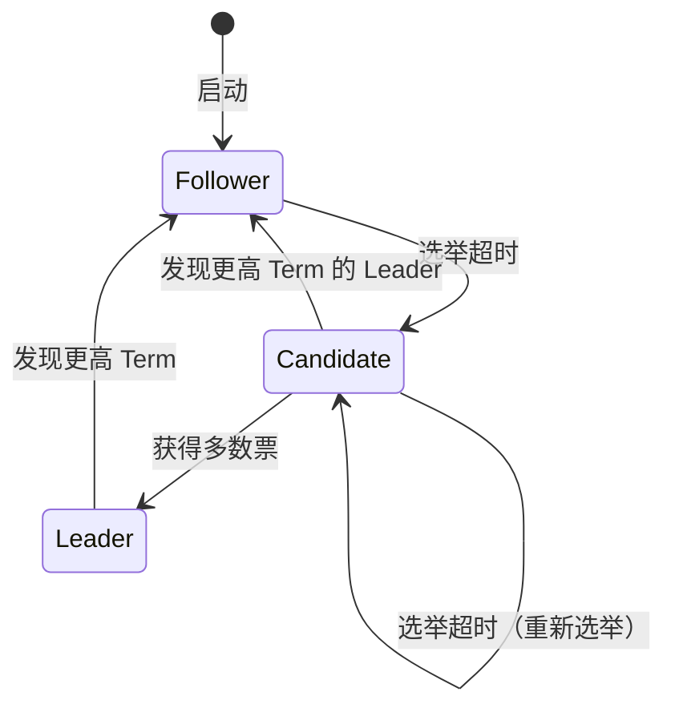
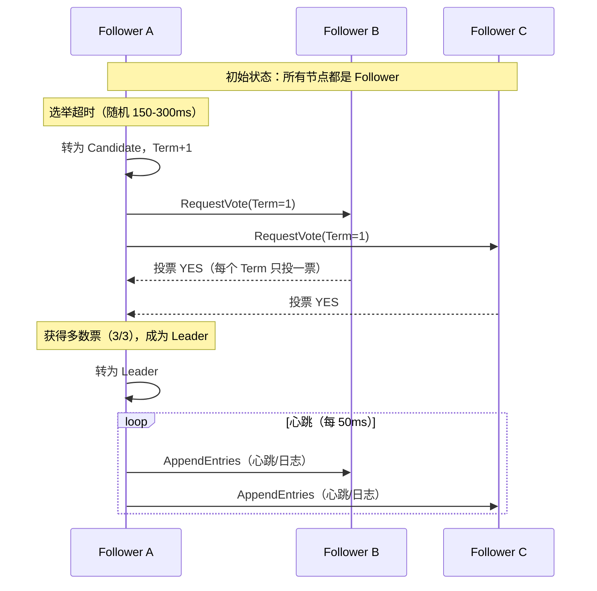
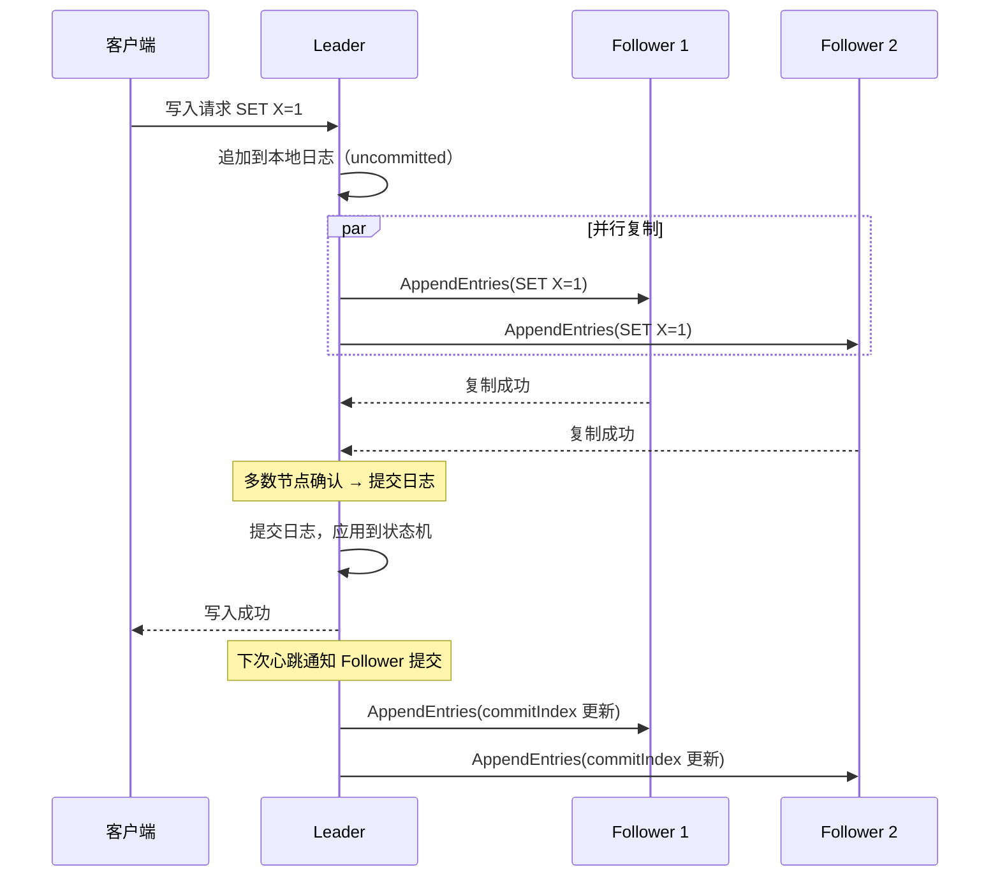
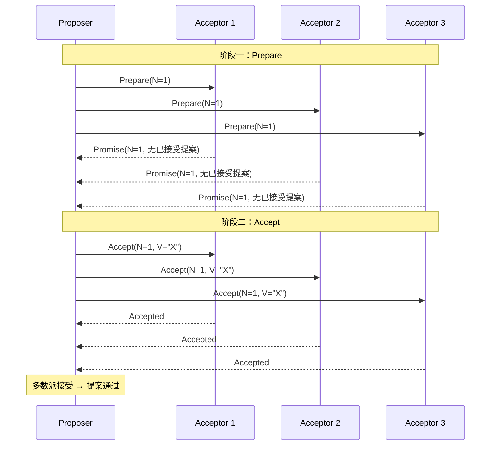
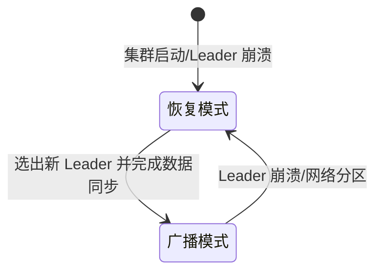
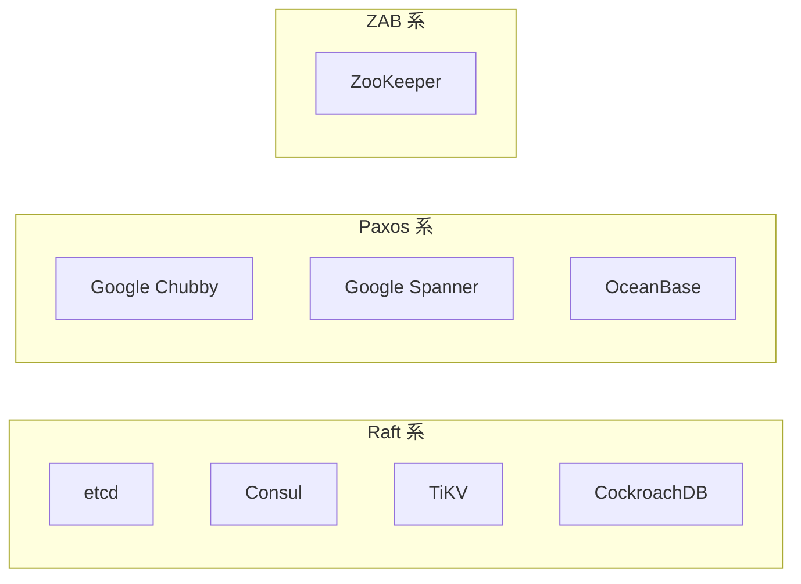

# 分布式一致性算法

## 概念说明

分布式一致性算法解决的核心问题是：**在多个节点组成的集群中，如何就某个值（或一系列操作）达成一致**。即使部分节点故障或网络延迟，系统仍能正确运行。Raft、Paxos 和 ZAB 是三种最重要的一致性算法，分别被 etcd/Consul、Google Chubby 和 ZooKeeper 采用。

## 核心原理

### 一、Raft 算法

Raft 是 Diego Ongaro 在 2014 年提出的一致性算法，设计目标是**易于理解**（相比 Paxos）。Raft 将一致性问题分解为三个子问题：Leader 选举、日志复制、安全性。

#### 1. 节点角色



| 角色 | 职责 | 数量 |
|------|------|------|
| Leader | 处理所有客户端请求，负责日志复制 | 最多 1 个 |
| Follower | 被动接收 Leader 的日志复制和心跳 | 多个 |
| Candidate | 选举过程中的临时角色 | 多个 |

#### 2. Leader 选举流程



**选举关键点**：
- 每个 Term（任期）内，每个节点只能投一票（先到先得）
- 选举超时时间随机化（150-300ms），避免多个节点同时发起选举
- 获得**多数派**（N/2 + 1）投票即当选 Leader

#### 3. 日志复制流程



#### 4. 安全性保证

| 安全性规则 | 说明 |
|-----------|------|
| 选举限制 | Candidate 的日志必须至少和多数节点一样新，才能当选 Leader |
| Leader 完整性 | 已提交的日志条目一定会出现在后续所有 Leader 的日志中 |
| 日志匹配 | 如果两个日志在相同索引位置的 Term 相同，则该索引之前的所有日志都相同 |

### 二、Paxos 算法

Paxos 由 Leslie Lamport 在 1990 年提出，是分布式一致性算法的鼻祖。

#### 基本角色

| 角色 | 职责 |
|------|------|
| Proposer（提议者） | 发起提案，提出要达成一致的值 |
| Acceptor（接受者） | 对提案进行投票，决定是否接受 |
| Learner（学习者） | 学习已经达成一致的值 |

#### Basic Paxos 两阶段



**Paxos 的问题**：
- 理解困难，工程实现复杂
- Basic Paxos 每次只能对一个值达成一致，效率低
- Multi-Paxos 优化了效率，但论文描述不够详细，各实现差异大

### 三、ZAB 协议

ZAB（ZooKeeper Atomic Broadcast）是 ZooKeeper 使用的一致性协议，本质上是一种特殊的 Paxos 变体。

#### ZAB 的两种模式



| 模式 | 触发条件 | 行为 |
|------|----------|------|
| 恢复模式（Recovery） | 集群启动或 Leader 崩溃 | 选举新 Leader，同步数据到所有 Follower |
| 广播模式（Broadcast） | Leader 正常工作 | Leader 接收写请求，通过类似 2PC 的方式广播给 Follower |

### 四、三种算法对比

| 维度 | Raft | Paxos | ZAB |
|------|------|-------|-----|
| 提出时间 | 2014 | 1990 | 2008 |
| 设计目标 | 易于理解 | 理论完备 | ZooKeeper 专用 |
| Leader | 强 Leader | 无固定 Leader（Multi-Paxos 有） | 强 Leader |
| 日志连续性 | 要求连续 | 允许空洞 | 要求连续 |
| 典型实现 | etcd、Consul、TiKV | Google Chubby | ZooKeeper |
| 理解难度 | ⭐⭐ | ⭐⭐⭐⭐⭐ | ⭐⭐⭐ |
| 工程实现 | 相对简单 | 非常复杂 | 中等 |



## 代码示例

一致性算法的完整实现非常复杂，这里通过伪代码说明 Raft 的核心逻辑：

```java
/**
 * Raft 节点核心逻辑（伪代码）
 */
public class RaftNode {
    private int currentTerm = 0;      // 当前任期
    private Integer votedFor = null;  // 当前任期投票给谁
    private List<LogEntry> log;       // 日志条目
    private Role role = Role.FOLLOWER;

    /**
     * 处理投票请求
     */
    public VoteResponse handleVoteRequest(VoteRequest request) {
        // 1. 如果请求的 Term 小于当前 Term，拒绝
        if (request.term < currentTerm) {
            return new VoteResponse(currentTerm, false);
        }
        // 2. 如果还没投票或已投给该候选人，且候选人日志至少和自己一样新
        if ((votedFor == null || votedFor == request.candidateId)
                && isLogUpToDate(request)) {
            votedFor = request.candidateId;
            return new VoteResponse(currentTerm, true);
        }
        return new VoteResponse(currentTerm, false);
    }
}
```

> 💻 完整说明：[DistributedLockCompare.java](https://github.com/skyhe58/guide-java/tree/main/code-examples/05-distributed/distributed-examples/src/main/java/com/example/distributed/lock/DistributedLockCompare.java)（分布式锁中涉及一致性算法的应用）
> <!-- 本地路径：code-examples/05-distributed/distributed-examples/src/main/java/com/example/distributed/lock/DistributedLockCompare.java -->

## 常见面试题

### Q1: 请描述 Raft 算法的 Leader 选举过程

**难度**：⭐⭐⭐ | **频率**：🔥🔥🔥

**答题思路**：

1. 说明三种角色和初始状态
2. 描述选举触发条件（超时）
3. 说明投票规则和当选条件
4. 提到随机超时避免活锁

**标准答案**：

Raft 集群中每个节点初始为 Follower。当 Follower 在选举超时时间内没有收到 Leader 的心跳，就转为 Candidate，将 Term 加 1 并向其他节点发送 RequestVote 请求。每个节点在同一个 Term 内只能投一票（先到先得），Candidate 获得多数派投票后成为 Leader。为避免多个节点同时发起选举导致活锁，选举超时时间是随机的（通常 150-300ms）。Leader 当选后通过定期心跳维持权威。

**深入追问**：

- 如果两个 Candidate 同时发起选举怎么办？（随机超时重试）
- Raft 如何保证已提交的日志不会丢失？（选举限制：日志必须足够新）
- Raft 和 Paxos 的核心区别是什么？（Raft 要求日志连续，强 Leader）

**易错点**：

- 忘记提到"每个 Term 只能投一票"这个关键约束
- 混淆 Raft 的 Term 和 Paxos 的 Proposal Number

### Q2: Raft 的日志复制是如何保证一致性的？

**难度**：⭐⭐⭐⭐ | **频率**：🔥🔥

**答题思路**：

1. 描述写入流程（Leader 追加 → 复制 → 多数确认 → 提交）
2. 说明 commitIndex 的作用
3. 提到日志匹配属性

**标准答案**：

客户端写请求只发给 Leader。Leader 先将日志追加到本地（uncommitted），然后并行发送 AppendEntries RPC 给所有 Follower。当多数节点（N/2+1）确认复制成功后，Leader 提交该日志并应用到状态机，然后响应客户端。Follower 在下次收到 Leader 的心跳时得知 commitIndex 更新，也提交对应的日志。日志匹配属性保证：如果两个节点在相同索引位置的 Term 相同，则该索引之前的所有日志都相同。

**深入追问**：

- 如果 Follower 的日志和 Leader 不一致怎么办？（Leader 回退 nextIndex 直到找到一致点）
- 什么是脑裂？Raft 如何避免？（多数派机制，旧 Leader 无法获得多数确认）

## 参考资料

- [Raft 论文 (In Search of an Understandable Consensus Algorithm)](https://raft.github.io/raft.pdf)
- [Raft 可视化演示](https://raft.github.io/)
- [Paxos Made Simple (Lamport)](https://lamport.azurewebsites.net/pubs/paxos-simple.pdf)
