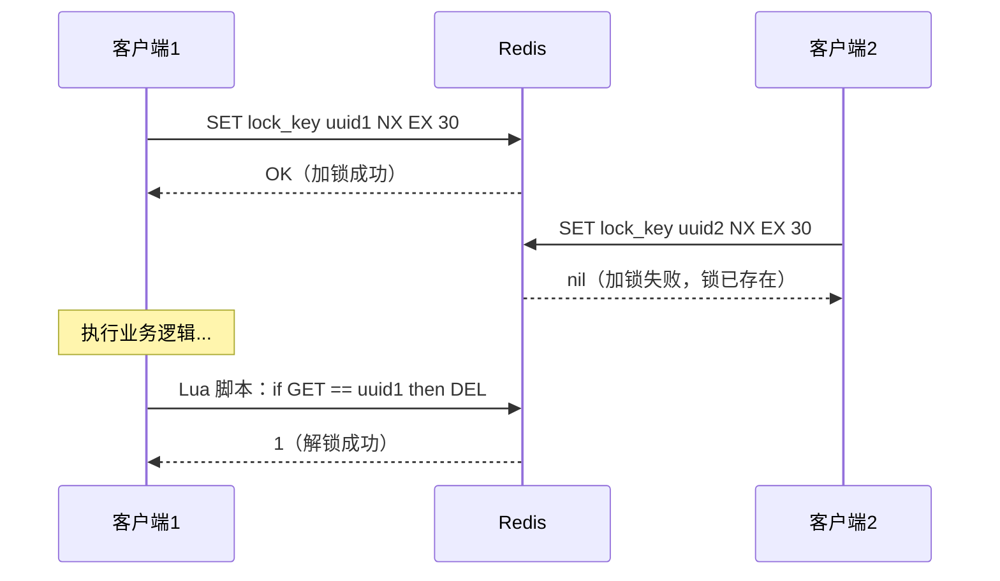
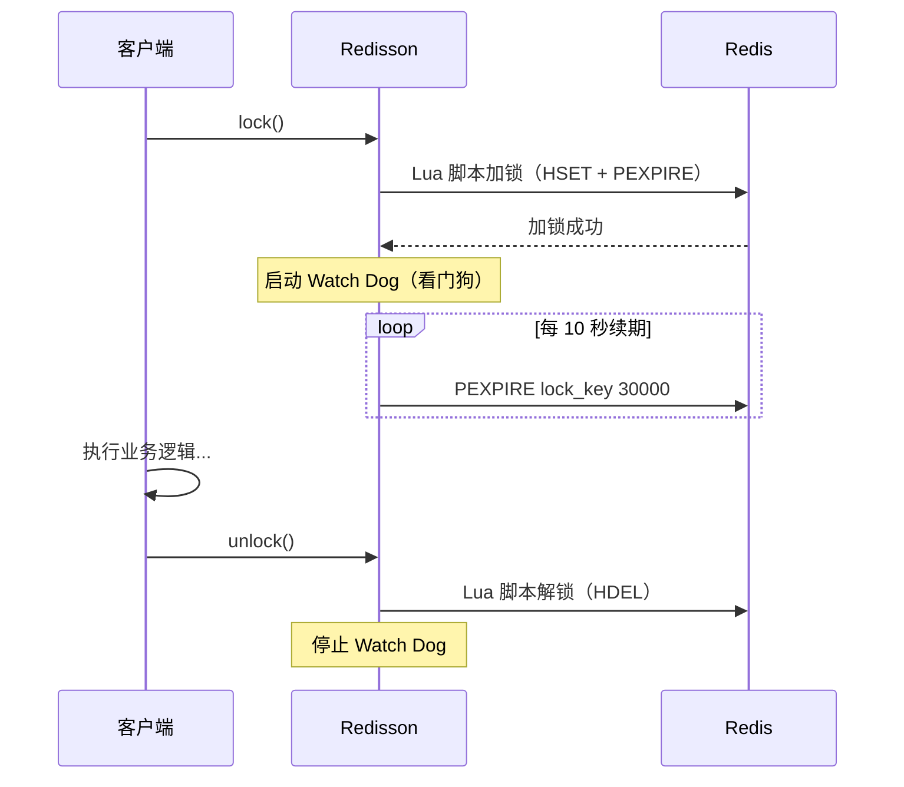
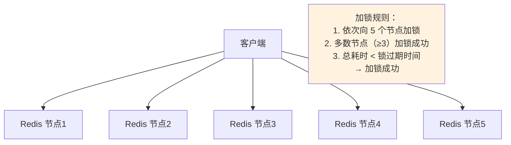
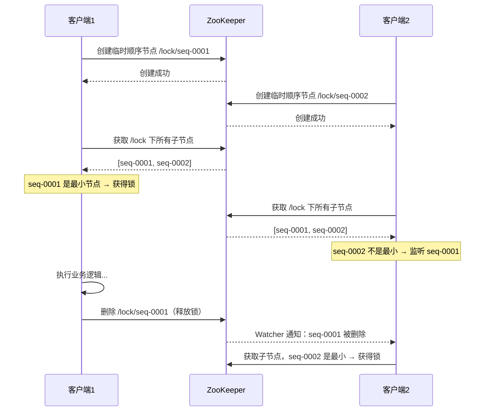
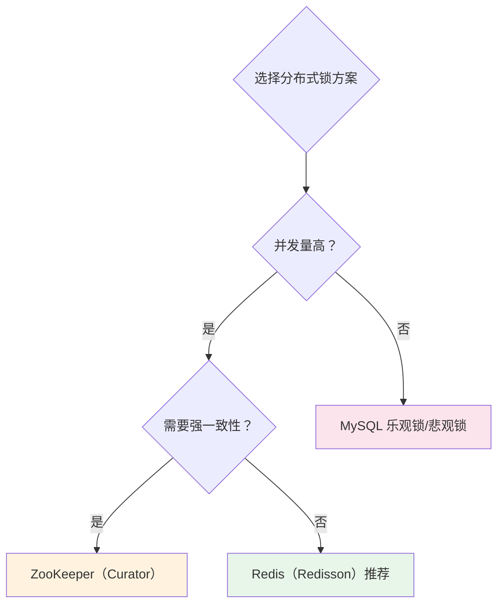

# 分布式锁方案对比

## 概念说明

分布式锁用于在分布式系统中协调多个进程/服务对共享资源的互斥访问。与单机锁（synchronized/ReentrantLock）不同，分布式锁需要借助外部存储（Redis、ZooKeeper、MySQL）来实现跨进程的互斥。

## 核心原理

### 一、分布式锁的核心要求

| 要求 | 说明 |
|------|------|
| 互斥性 | 同一时刻只有一个客户端能持有锁 |
| 防死锁 | 持有锁的客户端崩溃后，锁能自动释放 |
| 可重入 | 同一客户端可以多次获取同一把锁 |
| 高可用 | 锁服务本身要高可用 |
| 高性能 | 加锁/解锁操作要快 |

### 二、Redis 分布式锁

#### 方案 1：SETNX + 过期时间（基础版）



**关键点**：
- `SET key value NX EX seconds`：原子操作，设置值 + 过期时间
- 解锁必须用 Lua 脚本保证原子性（先判断再删除）
- value 使用 UUID 防止误删其他客户端的锁

```java
// 加锁
String uuid = UUID.randomUUID().toString();
Boolean success = redis.opsForValue()
    .setIfAbsent("lock_key", uuid, 30, TimeUnit.SECONDS);

// 解锁（Lua 脚本保证原子性）
String luaScript = """
    if redis.call('get', KEYS[1]) == ARGV[1] then
        return redis.call('del', KEYS[1])
    else
        return 0
    end
    """;
redis.execute(new DefaultRedisScript<>(luaScript, Long.class),
    List.of("lock_key"), uuid);
```

**问题**：锁过期时间难以设置——太短业务没执行完锁就释放了，太长影响性能。

#### 方案 2：Redisson（推荐生产使用）

Redisson 是 Redis 的 Java 客户端，提供了完善的分布式锁实现。



**Redisson 的优势**：
- **Watch Dog 自动续期**：默认 30 秒过期，每 10 秒自动续期，解决锁过期问题
- **可重入**：使用 Hash 结构记录加锁次数
- **公平锁**：支持按请求顺序获取锁
- **RedLock**：支持多 Redis 实例的分布式锁

#### 方案 3：RedLock（多节点）

RedLock 是 Redis 作者 Antirez 提出的多节点分布式锁算法：



> **争议**：Martin Kleppmann 指出 RedLock 在时钟跳跃等场景下仍有问题，Antirez 进行了回应。生产环境中 Redisson 单节点方案通常已足够。

### 三、ZooKeeper 分布式锁

利用 ZK 的**临时顺序节点**实现：



**ZK 锁的优势**：
- 临时节点：客户端断开连接后自动删除，天然防死锁
- 顺序节点：避免惊群效应（只监听前一个节点）
- 强一致性：ZAB 协议保证

### 四、MySQL 分布式锁

#### 乐观锁（版本号）

```sql
-- 查询当前版本
SELECT stock, version FROM product WHERE id = 1;
-- stock=10, version=1

-- 更新时带版本号条件
UPDATE product SET stock = stock - 1, version = version + 1
WHERE id = 1 AND version = 1;
-- 影响行数=1 → 成功；影响行数=0 → 版本冲突，重试
```

#### 悲观锁（SELECT FOR UPDATE）

```sql
BEGIN;
SELECT * FROM product WHERE id = 1 FOR UPDATE;  -- 加行锁
-- 执行业务逻辑
UPDATE product SET stock = stock - 1 WHERE id = 1;
COMMIT;
```

### 五、三种方案对比

| 维度 | Redis | ZooKeeper | MySQL |
|------|-------|-----------|-------|
| 性能 | ⭐⭐⭐⭐⭐ 极高 | ⭐⭐⭐ 中等 | ⭐⭐ 较低 |
| 可靠性 | ⭐⭐⭐ 异步复制可能丢锁 | ⭐⭐⭐⭐⭐ 强一致性 | ⭐⭐⭐⭐ 事务保证 |
| 实现复杂度 | ⭐⭐ 简单 | ⭐⭐⭐ 中等 | ⭐ 最简单 |
| 防死锁 | 过期时间 + Watch Dog | 临时节点自动删除 | 事务超时 |
| 可重入 | Redisson 支持 | Curator 支持 | 需自行实现 |
| 适用场景 | 高并发、性能敏感 | 强一致性要求 | 并发量低、已有 MySQL |



## 代码示例

> 💻 完整可运行代码：[DistributedLockCompare.java](https://github.com/skyhe58/guide-java/tree/main/code-examples/05-distributed/distributed-examples/src/main/java/com/example/distributed/lock/DistributedLockCompare.java)
> <!-- 本地路径：code-examples/05-distributed/distributed-examples/src/main/java/com/example/distributed/lock/DistributedLockCompare.java -->

## 常见面试题

### Q1: Redis 分布式锁如何实现？有什么问题？

**难度**：⭐⭐⭐ | **频率**：🔥🔥🔥

**答题思路**：

1. 说明基本实现（SETNX + 过期时间 + Lua 解锁）
2. 指出问题（锁过期、主从切换丢锁）
3. 引出 Redisson 的 Watch Dog 方案

**标准答案**：

Redis 分布式锁通过 `SET key value NX EX seconds` 原子命令实现加锁，value 使用 UUID 标识持有者，解锁时用 Lua 脚本先判断 value 再删除，保证原子性。主要问题：1）锁过期时间难以设置，业务没执行完锁就释放了；2）Redis 主从切换时可能丢锁。Redisson 通过 Watch Dog 机制解决过期问题——默认 30 秒过期，每 10 秒自动续期。对于主从切换问题，可以使用 RedLock 算法（向多个独立 Redis 节点加锁，多数成功才算成功）。

**深入追问**：

- Redisson 的 Watch Dog 是怎么实现的？（Netty 的 HashedWheelTimer 定时任务）
- RedLock 有什么争议？（Martin Kleppmann 指出时钟跳跃问题）
- 如何实现可重入锁？（Hash 结构记录加锁次数）

**易错点**：

- 解锁时直接 DEL 而不判断 value，可能误删其他客户端的锁
- 忘记 SETNX 和 EXPIRE 必须是原子操作

### Q2: ZooKeeper 分布式锁和 Redis 分布式锁的区别？

**难度**：⭐⭐⭐ | **频率**：🔥🔥🔥

**答题思路**：

1. 分别说明实现原理
2. 从性能、可靠性、复杂度三个维度对比
3. 给出选型建议

**标准答案**：

Redis 锁基于 SETNX 命令，性能极高但依赖过期时间防死锁，主从切换可能丢锁。ZK 锁基于临时顺序节点，客户端断开连接后节点自动删除，天然防死锁，且 ZAB 协议保证强一致性，但性能不如 Redis。选型建议：高并发场景优先 Redis（Redisson），强一致性要求用 ZK（Curator），低并发场景用 MySQL 乐观锁即可。

## 参考资料

- [Redisson 官方文档](https://redisson.org/)
- [Martin Kleppmann - How to do distributed locking](https://martin.kleppmann.com/2016/02/08/how-to-do-distributed-locking.html)
- [Antirez - Is Redlock safe?](http://antirez.com/news/101)
