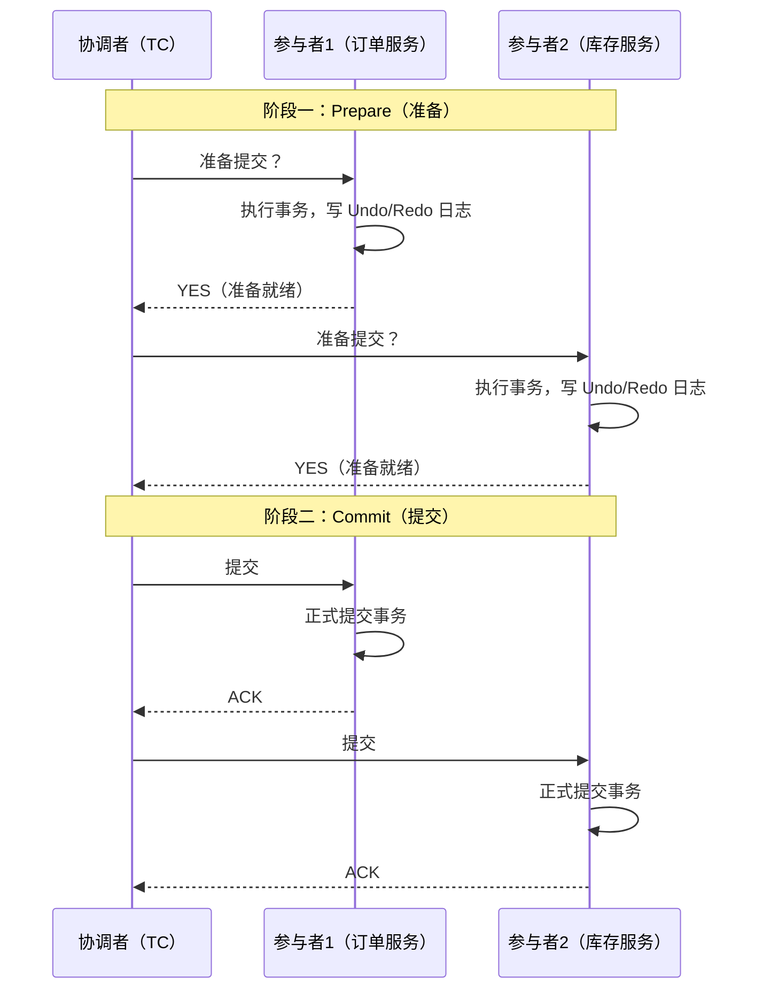
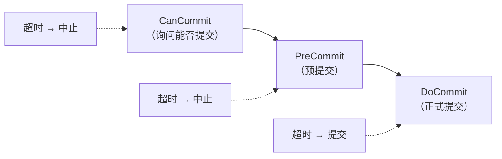
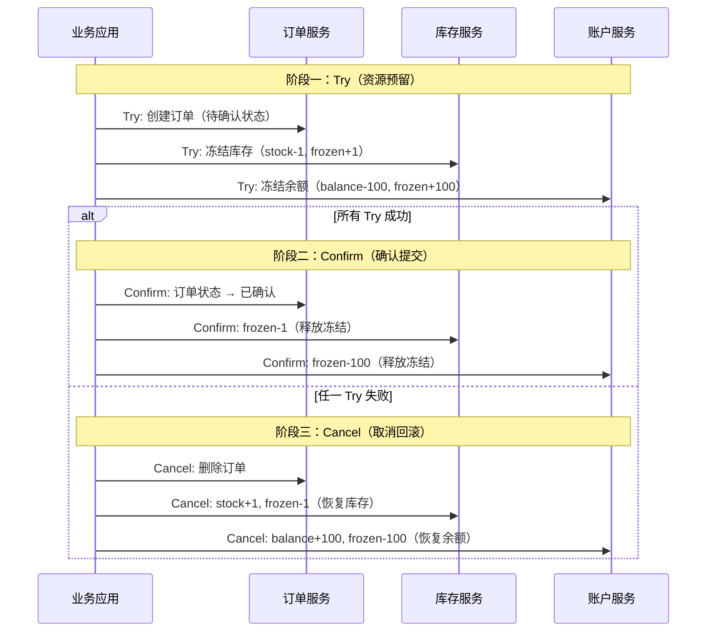
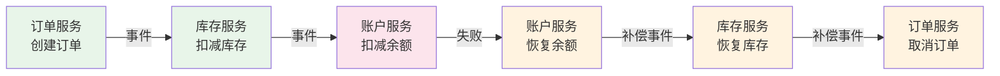
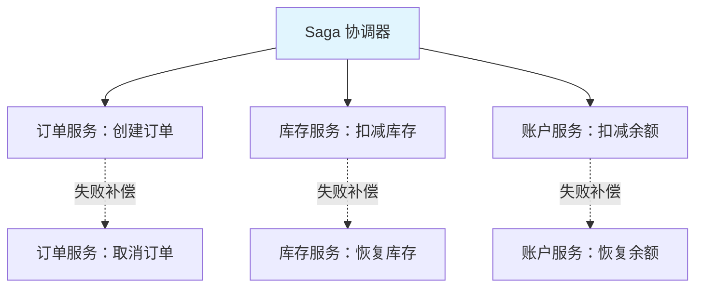
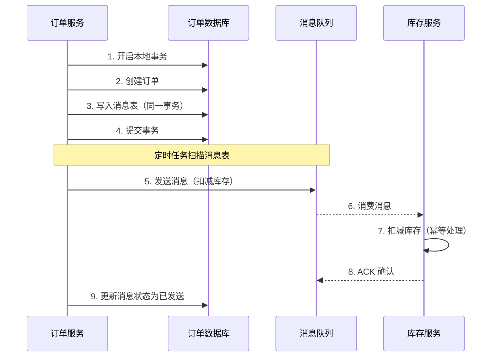
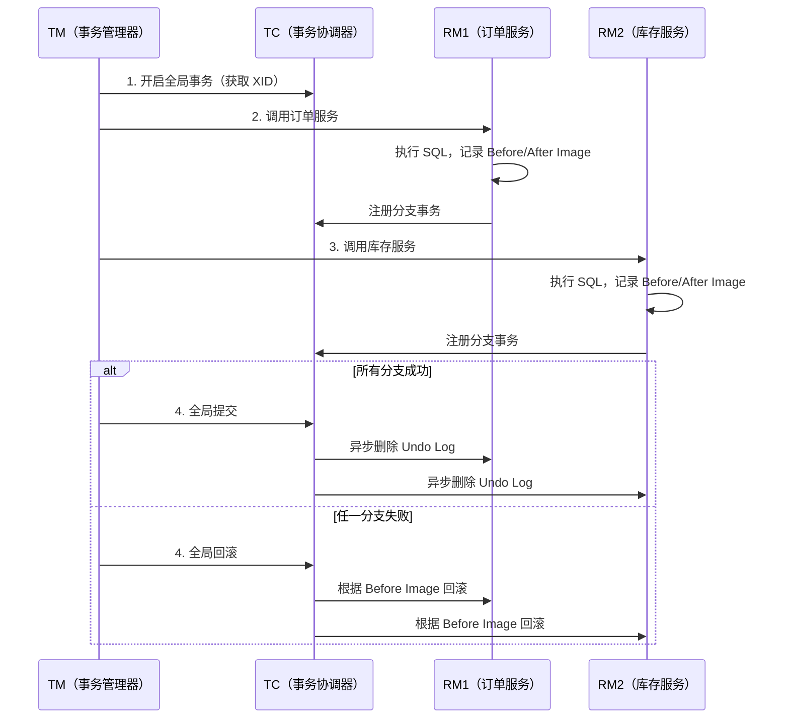
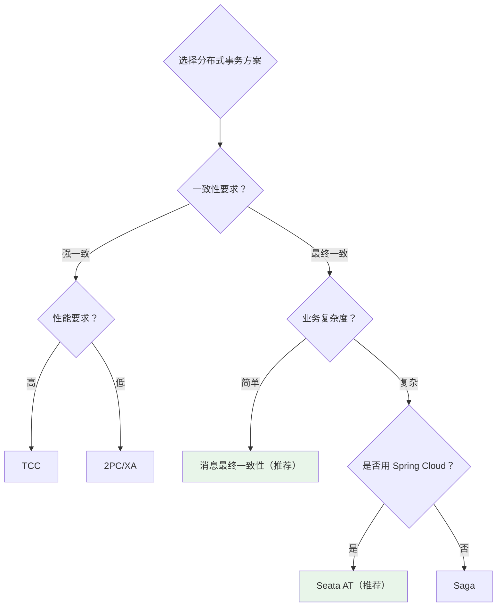

# 分布式事务

## 概念说明

分布式事务解决的是**跨多个服务/数据库的数据一致性问题**。在微服务架构中，一个业务操作可能涉及多个服务（如下单 = 扣库存 + 创建订单 + 扣余额），每个服务有自己的数据库，无法使用本地事务保证一致性。

## 核心原理

### 一、2PC（两阶段提交）

2PC 是最经典的分布式事务协议，由协调者（Coordinator）和参与者（Participant）组成。

**2PC 的问题**：

| 问题 | 说明 |
|------|------|
| 同步阻塞 | 参与者在 Prepare 后必须等待协调者指令，期间资源被锁定 |
| 单点故障 | 协调者宕机，参与者一直阻塞 |
| 数据不一致 | 阶段二如果部分参与者没收到 Commit，数据不一致 |
| 性能差 | 两轮网络通信 + 资源锁定时间长 |

### 二、3PC（三阶段提交）

3PC 在 2PC 基础上增加了 CanCommit 阶段和超时机制：

**3PC vs 2PC**：3PC 引入超时机制减少阻塞，但仍无法完全解决数据不一致问题，实际应用较少。

### 三、TCC（Try-Confirm-Cancel）

TCC 是一种业务层面的补偿事务方案，将事务拆分为三个阶段：

**TCC 的关键设计**：

| 阶段 | 职责 | 要求 |
|------|------|------|
| Try | 资源检查和预留 | 不做真正的业务操作，只冻结资源 |
| Confirm | 确认提交 | 必须幂等，可能被重复调用 |
| Cancel | 取消回滚 | 必须幂等，释放 Try 阶段预留的资源 |

**TCC 的优缺点**：
- ✅ 不依赖数据库事务，性能好
- ✅ 每个阶段都是本地事务，不会长时间锁资源
- ❌ 业务侵入性强，每个服务都要实现 Try/Confirm/Cancel
- ❌ 开发成本高，需要考虑幂等、空回滚、悬挂等问题

### 四、Saga 模式

Saga 将长事务拆分为多个本地事务，每个本地事务有对应的补偿事务。

#### 编排模式（Choreography）

#### 协调模式（Orchestration）

| 模式 | 优点 | 缺点 |
|------|------|------|
| 编排模式 | 去中心化，服务间松耦合 | 流程分散，难以追踪和调试 |
| 协调模式 | 流程集中管理，易于理解 | 协调器是单点，逻辑集中 |

### 五、消息最终一致性

通过消息队列实现最终一致性，是最常用的分布式事务方案之一。

**关键设计**：
- 本地消息表：订单和消息在同一个事务中写入，保证原子性
- 定时任务：扫描未发送的消息，重试发送
- 消费端幂等：消费者必须做幂等处理，防止重复消费

### 六、Seata 框架

Seata 是阿里开源的分布式事务框架，支持 AT、TCC、Saga、XA 四种模式。

#### AT 模式（推荐）

**AT 模式特点**：
- 对业务无侵入，只需加 `@GlobalTransactional` 注解
- 通过 Undo Log 实现自动回滚
- 性能优于 2PC（一阶段直接提交本地事务）

### 七、方案对比总结

| 方案 | 一致性 | 性能 | 业务侵入 | 适用场景 |
|------|--------|------|----------|----------|
| 2PC/XA | 强一致 | ⭐ | 无 | 传统数据库分布式事务 |
| TCC | 最终一致 | ⭐⭐⭐⭐ | 强 | 资金类高一致性要求 |
| Saga | 最终一致 | ⭐⭐⭐ | 中 | 长事务、跨多服务 |
| 消息最终一致 | 最终一致 | ⭐⭐⭐⭐⭐ | 弱 | 异步场景、最常用 |
| Seata AT | 最终一致 | ⭐⭐⭐⭐ | 无 | Spring Cloud 微服务 |

## 代码示例

> 💻 完整可运行代码：[DistributedTransactionDemo.java](../../../code-examples/05-distributed/distributed-examples/src/main/java/com/example/distributed/transaction/DistributedTransactionDemo.java)

## 常见面试题

### Q1: 分布式事务有哪些方案？各自的优缺点？

**难度**：⭐⭐⭐⭐ | **频率**：🔥🔥🔥

**答题思路**：

1. 列举主要方案：2PC、TCC、Saga、消息最终一致性、Seata
2. 从一致性、性能、侵入性三个维度对比
3. 给出选型建议

**标准答案**：

分布式事务主要有五种方案：1）2PC 两阶段提交，强一致但性能差、有阻塞问题；2）TCC 补偿事务，性能好但业务侵入强，需要实现 Try/Confirm/Cancel 三个接口；3）Saga 模式，适合长事务，每个步骤有对应的补偿操作；4）消息最终一致性，通过本地消息表 + 消息队列实现，性能最好，是最常用的方案；5）Seata AT 模式，对业务无侵入，通过 Undo Log 自动回滚。选型建议：一般场景用消息最终一致性，Spring Cloud 微服务用 Seata AT，资金类场景用 TCC。

**深入追问**：

- TCC 的空回滚和悬挂问题是什么？如何解决？
- Seata AT 模式的原理是什么？和 XA 有什么区别？
- 消息最终一致性如何保证消息一定能发出去？（本地消息表 + 定时重试）

**易错点**：

- 把 2PC 和 TCC 混淆（2PC 是协议层面，TCC 是业务层面）
- 忘记提到消息最终一致性方案（这是实际最常用的）

### Q2: 如何保证消息最终一致性？

**难度**：⭐⭐⭐ | **频率**：🔥🔥🔥

**答题思路**：

1. 说明本地消息表方案
2. 描述完整流程
3. 强调幂等性

**标准答案**：

消息最终一致性通过本地消息表实现：业务操作和消息写入在同一个本地事务中完成，保证原子性。然后通过定时任务扫描消息表，将未发送的消息发送到 MQ。消费端消费消息后执行业务操作，必须做幂等处理（通过唯一 ID 去重）。如果消费失败，MQ 会重试投递。整个过程保证了最终一致性。也可以使用 RocketMQ 的事务消息，原理类似但不需要自己维护消息表。

## 参考资料

- [Seata 官方文档](https://seata.io/zh-cn/)
- [分布式事务方案对比](https://www.infoq.cn/article/2018/08/distributed-transaction)
