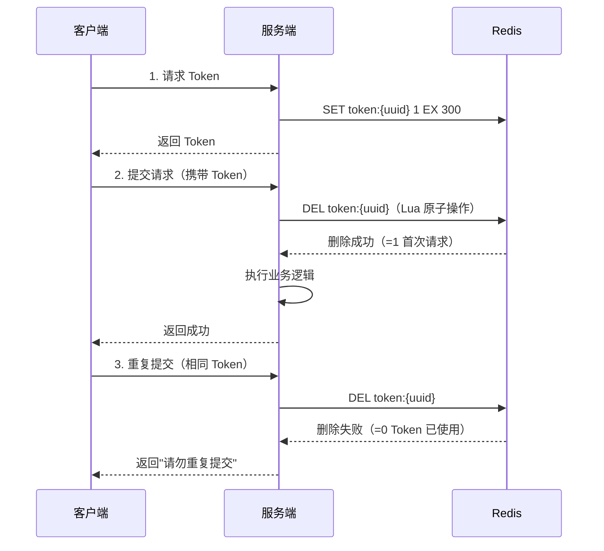
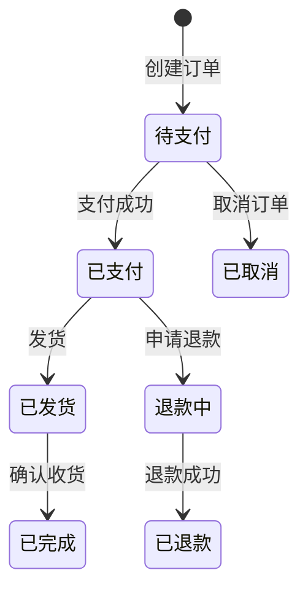

# 幂等性设计

## 概念说明

幂等性（Idempotency）是指**同一操作执行一次和执行多次的效果相同**。在分布式系统中，由于网络超时、重试机制、消息重复消费等原因，同一请求可能被执行多次，幂等性设计是保证数据正确性的关键。

**需要幂等的典型场景**：
- 用户重复点击提交按钮
- 网络超时后客户端自动重试
- MQ 消息重复消费
- 微服务间调用超时重试（Feign/Ribbon 重试）

## 核心原理

### 一、HTTP 方法的幂等性

| 方法 | 幂等 | 说明 |
|------|------|------|
| GET | ✅ | 查询操作，天然幂等 |
| PUT | ✅ | 全量更新，多次执行结果相同 |
| DELETE | ✅ | 删除操作，多次删除结果相同 |
| POST | ❌ | 创建操作，多次执行会创建多条记录 |
| PATCH | ❌ | 部分更新，取决于具体实现 |

### 二、六种幂等性实现方案

#### 方案 1：Token 机制（防重复提交）



**适用场景**：表单提交、订单创建

#### 方案 2：唯一索引（数据库去重）

```sql
-- 创建唯一索引
ALTER TABLE orders ADD UNIQUE INDEX uk_order_no (order_no);

-- 插入时如果 order_no 重复，会抛出 DuplicateKeyException
INSERT INTO orders (order_no, user_id, amount) VALUES ('ORD202401001', 1, 100);
```

**适用场景**：有唯一业务标识的场景（订单号、流水号）

#### 方案 3：状态机（状态流转控制）



```sql
-- 状态机幂等：只有当前状态是"待支付"才能更新为"已支付"
UPDATE orders SET status = 'PAID'
WHERE order_no = 'ORD202401001' AND status = 'UNPAID';
-- 影响行数=1 → 成功；影响行数=0 → 状态已变更，幂等返回
```

**适用场景**：有明确状态流转的业务（订单、审批流程）

#### 方案 4：乐观锁（版本号控制）

```sql
-- 查询当前版本
SELECT stock, version FROM product WHERE id = 1;
-- stock=10, version=5

-- 带版本号更新
UPDATE product SET stock = stock - 1, version = version + 1
WHERE id = 1 AND version = 5;
-- 影响行数=1 → 成功；影响行数=0 → 版本冲突，重试或返回
```

**适用场景**：库存扣减、余额变更等并发更新场景

#### 方案 5：分布式锁

```java
// 使用 Redisson 分布式锁保证幂等
RLock lock = redisson.getLock("idempotent:" + requestId);
try {
    if (lock.tryLock(5, 30, TimeUnit.SECONDS)) {
        // 先查询是否已处理
        if (isProcessed(requestId)) {
            return cachedResult(requestId);
        }
        // 执行业务逻辑
        Result result = doBusiness();
        // 标记已处理
        markProcessed(requestId, result);
        return result;
    }
} finally {
    lock.unlock();
}
```

**适用场景**：无唯一索引、无状态机的通用场景

#### 方案 6：去重表

```sql
-- 去重表
CREATE TABLE idempotent_record (
    id BIGINT PRIMARY KEY AUTO_INCREMENT,
    biz_type VARCHAR(32) NOT NULL,     -- 业务类型
    biz_id VARCHAR(64) NOT NULL,       -- 业务唯一标识
    result TEXT,                        -- 处理结果
    created_at DATETIME DEFAULT NOW(),
    UNIQUE INDEX uk_biz (biz_type, biz_id)
);

-- 处理前先插入去重记录
INSERT INTO idempotent_record (biz_type, biz_id) VALUES ('ORDER', 'ORD202401001');
-- 插入成功 → 首次请求，执行业务
-- DuplicateKeyException → 重复请求，返回之前的结果
```

**适用场景**：MQ 消息消费去重、通用幂等方案

### 三、方案对比

| 方案 | 实现复杂度 | 性能 | 适用场景 |
|------|-----------|------|----------|
| Token 机制 | ⭐⭐ | ⭐⭐⭐⭐ | 前端表单防重复提交 |
| 唯一索引 | ⭐ | ⭐⭐⭐⭐⭐ | 有唯一业务标识 |
| 状态机 | ⭐⭐ | ⭐⭐⭐⭐⭐ | 有状态流转的业务 |
| 乐观锁 | ⭐⭐ | ⭐⭐⭐⭐ | 并发更新场景 |
| 分布式锁 | ⭐⭐⭐ | ⭐⭐⭐ | 通用场景 |
| 去重表 | ⭐⭐ | ⭐⭐⭐⭐ | MQ 消费去重 |

## 代码示例

```java
/**
 * Token 机制幂等实现示例
 */
public class TokenIdempotent {

    /**
     * 生成 Token
     */
    public String createToken() {
        String token = UUID.randomUUID().toString();
        redisTemplate.opsForValue().set("token:" + token, "1", 5, TimeUnit.MINUTES);
        return token;
    }

    /**
     * 验证并消费 Token（Lua 脚本保证原子性）
     */
    public boolean consumeToken(String token) {
        String script = """
            if redis.call('get', KEYS[1]) then
                return redis.call('del', KEYS[1])
            else
                return 0
            end
            """;
        Long result = redisTemplate.execute(
            new DefaultRedisScript<>(script, Long.class),
            List.of("token:" + token));
        return result != null && result == 1;
    }
}
```

> 💻 完整可运行代码：[IdempotentDemo.java](https://github.com/skyhe58/guide-java/tree/main/code-examples/05-distributed/distributed-examples/src/main/java/com/example/distributed/idempotent/IdempotentDemo.java)
> <!-- 本地路径：code-examples/05-distributed/distributed-examples/src/main/java/com/example/distributed/idempotent/IdempotentDemo.java -->

## 常见面试题

### Q1: 如何保证接口的幂等性？

**难度**：⭐⭐⭐ | **频率**：🔥🔥🔥

**答题思路**：

1. 先解释什么是幂等性以及为什么需要
2. 列举常见方案（Token、唯一索引、状态机、乐观锁、去重表）
3. 结合具体场景说明选型

**标准答案**：

幂等性是指同一操作执行多次效果相同。在分布式系统中，网络超时重试、MQ 重复消费等场景都需要幂等保证。常见方案：1）Token 机制——请求前获取 Token，提交时消费 Token，适合表单防重复提交；2）唯一索引——利用数据库唯一约束去重，适合有唯一业务标识的场景；3）状态机——通过状态流转条件控制，如订单只有"待支付"才能变为"已支付"；4）乐观锁——通过版本号控制并发更新；5）去重表——插入唯一记录，重复插入会失败，适合 MQ 消费去重。

**深入追问**：

- Token 机制中如何保证 Token 验证和删除的原子性？（Lua 脚本）
- MQ 消息重复消费如何做幂等？（去重表 + 唯一消息 ID）
- 乐观锁失败后如何处理？（重试或返回失败）

**易错点**：

- 只说一种方案，没有根据场景选型
- Token 验证时先 GET 再 DEL，不是原子操作

## 参考资料

- [幂等性设计最佳实践](https://www.infoq.cn/article/idempotent-design)
