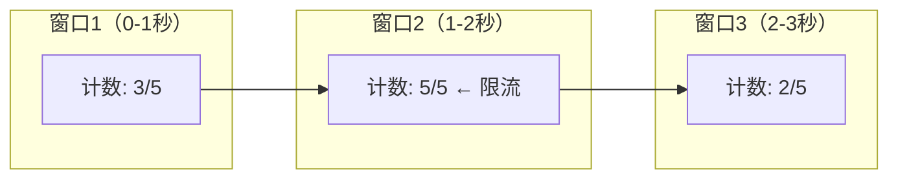
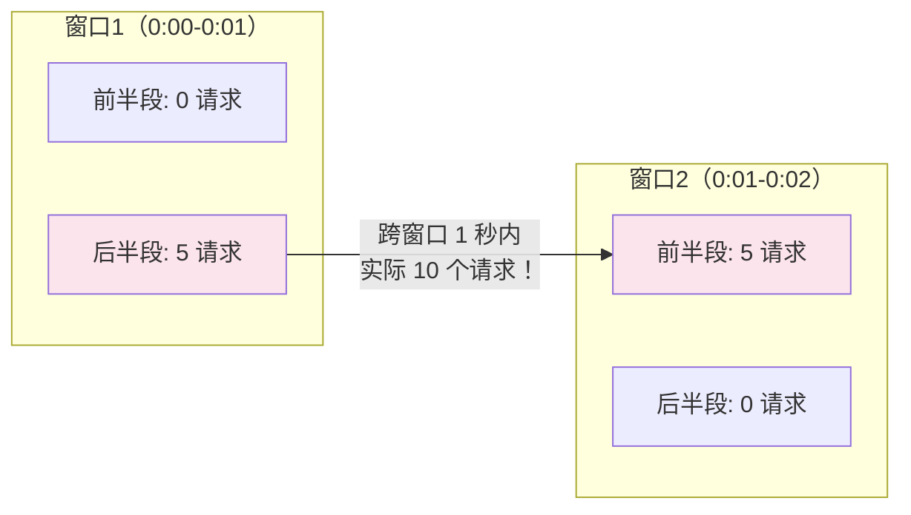
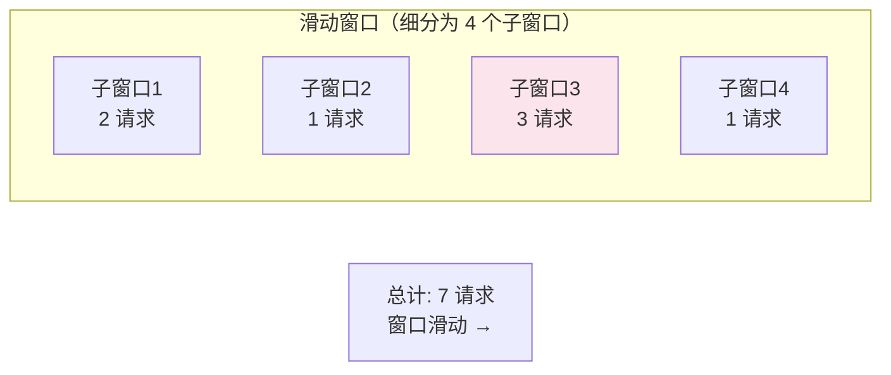
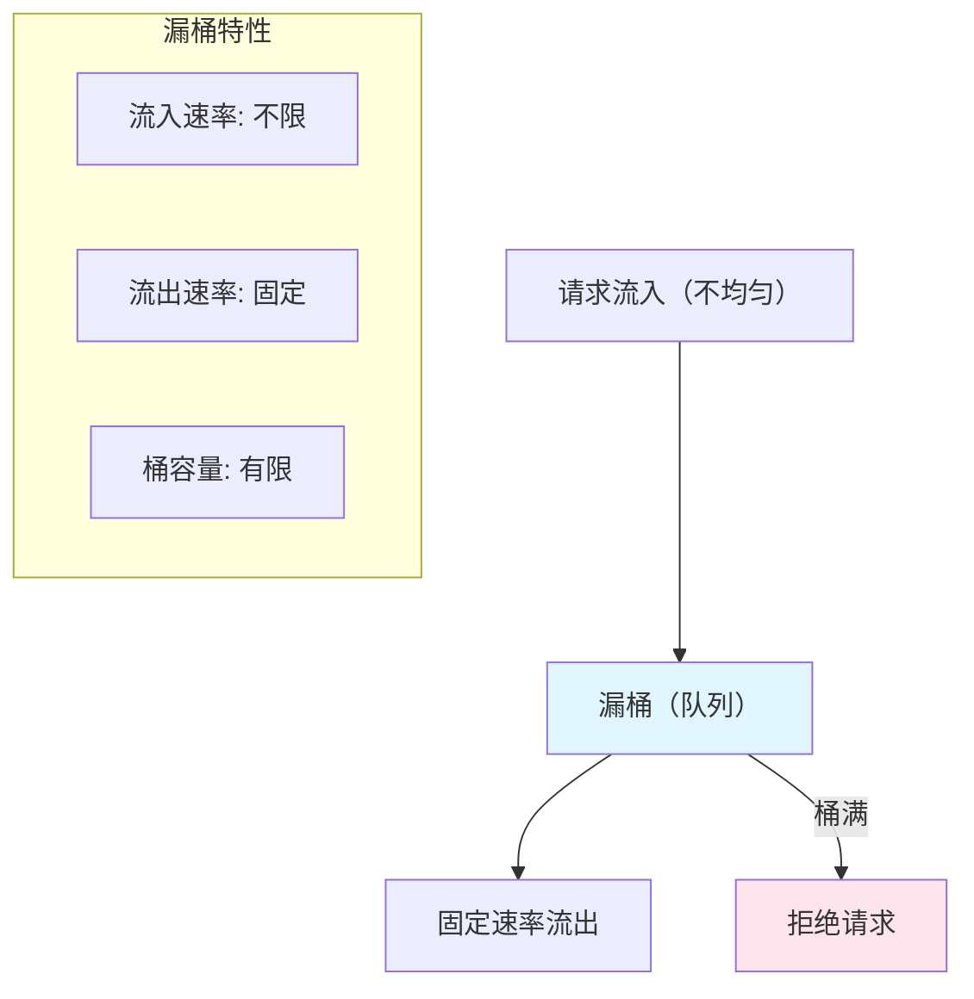
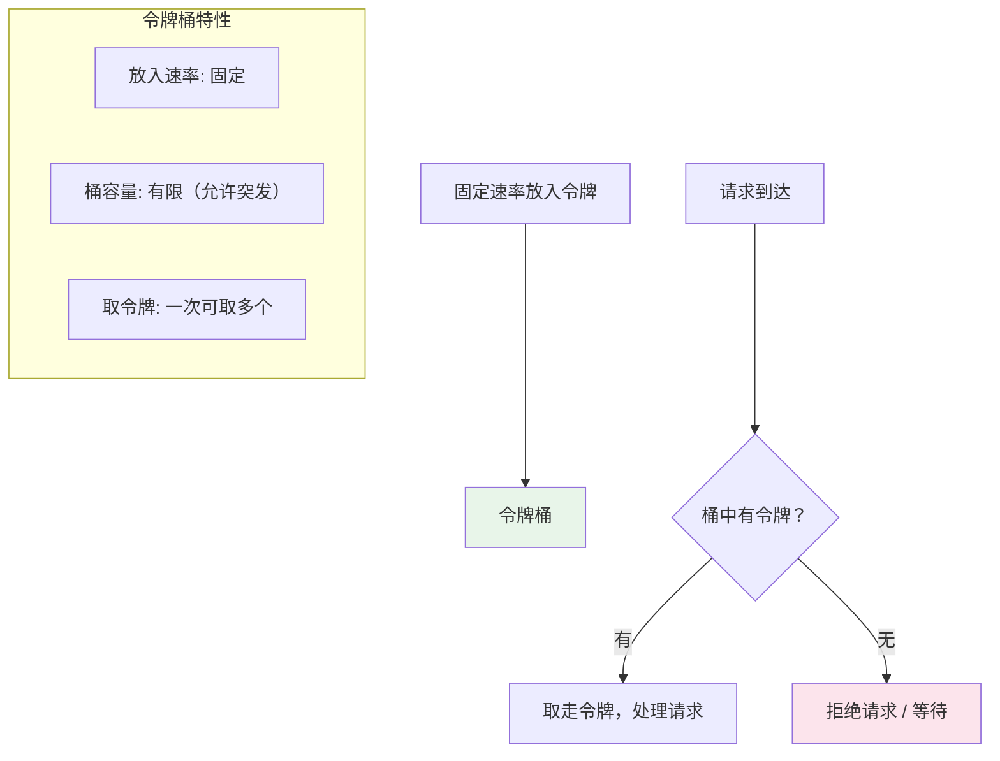
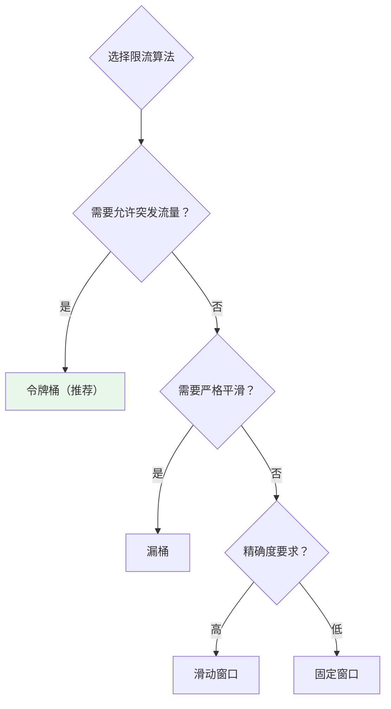

# 限流算法

## 概念说明

限流（Rate Limiting）是保护系统的重要手段，通过控制请求的速率，防止系统因突发流量而崩溃。常见的限流算法有四种：固定窗口、滑动窗口、漏桶和令牌桶，各有优缺点和适用场景。

## 核心原理

### 一、固定窗口计数器

将时间划分为固定大小的窗口（如 1 秒），每个窗口内维护一个计数器。



**问题：临界突刺**



在窗口交界处的 1 秒内，实际通过了 10 个请求（限制是 5/秒），这就是临界突刺问题。

### 二、滑动窗口计数器

将固定窗口细分为多个小窗口，统计当前时间往前一个完整窗口内的请求总数。



**优点**：解决了固定窗口的临界突刺问题
**缺点**：子窗口越多越精确，但内存开销也越大

### 三、漏桶算法（Leaky Bucket）

请求先进入桶中排队，以固定速率从桶中流出处理。桶满则拒绝新请求。



| 特性 | 说明 |
|------|------|
| 流入速率 | 任意（突发流量会被缓冲） |
| 流出速率 | 固定（平滑输出） |
| 桶容量 | 有限（超出则拒绝） |
| 优点 | 输出速率恒定，保护下游 |
| 缺点 | 无法应对突发流量，即使系统有余力也只能匀速处理 |

### 四、令牌桶算法（Token Bucket）

以固定速率向桶中放入令牌，请求需要获取令牌才能被处理。桶满时多余的令牌被丢弃。



| 特性 | 说明 |
|------|------|
| 令牌生成速率 | 固定 |
| 桶容量 | 有限（决定了突发流量的上限） |
| 优点 | 允许一定程度的突发流量（桶中积累的令牌） |
| 缺点 | 实现相对复杂 |

### 五、四种算法对比

| 维度 | 固定窗口 | 滑动窗口 | 漏桶 | 令牌桶 |
|------|----------|----------|------|--------|
| 实现复杂度 | ⭐ | ⭐⭐ | ⭐⭐ | ⭐⭐⭐ |
| 精确度 | 低 | 高 | 高 | 高 |
| 突发流量 | 有临界突刺 | 基本解决 | 完全平滑 | 允许突发 |
| 适用场景 | 简单限流 | API 限流 | 平滑限流 | 通用限流（推荐） |
| 典型实现 | 简单计数器 | Redis ZSET | MQ 消费 | Guava RateLimiter |



### 六、常用限流框架

| 框架 | 算法 | 适用场景 |
|------|------|----------|
| Guava RateLimiter | 令牌桶 | 单机限流 |
| Sentinel | 滑动窗口 + 令牌桶 | 分布式限流、熔断降级 |
| Nginx limit_req | 漏桶 | 网关层限流 |
| Redis + Lua | 滑动窗口/令牌桶 | 分布式限流 |

## 代码示例

### 令牌桶算法实现

```java
/**
 * 令牌桶算法实现
 */
public class TokenBucketRateLimiter {
    private final long capacity;        // 桶容量
    private final long refillRate;      // 每秒放入令牌数
    private long tokens;                // 当前令牌数
    private long lastRefillTime;        // 上次填充时间

    public TokenBucketRateLimiter(long capacity, long refillRate) {
        this.capacity = capacity;
        this.refillRate = refillRate;
        this.tokens = capacity;
        this.lastRefillTime = System.nanoTime();
    }

    public synchronized boolean tryAcquire() {
        refill();
        if (tokens > 0) {
            tokens--;
            return true;
        }
        return false;
    }

    private void refill() {
        long now = System.nanoTime();
        long elapsed = now - lastRefillTime;
        long newTokens = elapsed * refillRate / 1_000_000_000L;
        if (newTokens > 0) {
            tokens = Math.min(capacity, tokens + newTokens);
            lastRefillTime = now;
        }
    }
}
```

### 滑动窗口算法实现

```java
/**
 * 滑动窗口限流算法实现
 */
public class SlidingWindowRateLimiter {
    private final int maxRequests;       // 窗口内最大请求数
    private final long windowSizeMs;     // 窗口大小（毫秒）
    private final Deque<Long> timestamps = new LinkedList<>();

    public SlidingWindowRateLimiter(int maxRequests, long windowSizeMs) {
        this.maxRequests = maxRequests;
        this.windowSizeMs = windowSizeMs;
    }

    public synchronized boolean tryAcquire() {
        long now = System.currentTimeMillis();
        // 移除窗口外的时间戳
        while (!timestamps.isEmpty() && now - timestamps.peekFirst() > windowSizeMs) {
            timestamps.pollFirst();
        }
        if (timestamps.size() < maxRequests) {
            timestamps.addLast(now);
            return true;
        }
        return false;
    }
}
```

> 💻 完整可运行代码：[RateLimitDemo.java](../../../code-examples/05-distributed/distributed-examples/src/main/java/com/example/distributed/ratelimit/RateLimitDemo.java)
>
> 🧪 单元测试：[RateLimitTest.java](../../../code-examples/05-distributed/distributed-examples/src/test/java/com/example/distributed/ratelimit/RateLimitTest.java)

## 常见面试题

### Q1: 令牌桶和漏桶算法的区别？

**难度**：⭐⭐⭐ | **频率**：🔥🔥🔥

**答题思路**：

1. 分别描述两种算法的原理
2. 从突发流量处理、输出速率两个维度对比
3. 说明各自适用场景

**标准答案**：

漏桶算法以固定速率处理请求，无论流入速率多快，输出始终是匀速的，适合需要严格平滑流量的场景。令牌桶算法以固定速率生成令牌，请求需要获取令牌才能处理，桶中可以积累令牌，因此允许一定程度的突发流量。核心区别：漏桶强调输出平滑，令牌桶允许突发。实际应用中令牌桶更常用，因为大多数系统需要处理突发流量，Guava RateLimiter 就是基于令牌桶实现的。

**深入追问**：

- Guava RateLimiter 的 SmoothBursty 和 SmoothWarmingUp 有什么区别？
- 如何实现分布式限流？（Redis + Lua 脚本）
- Sentinel 的限流原理是什么？（滑动窗口 + 令牌桶）

**易错点**：

- 混淆漏桶和令牌桶的方向（漏桶是请求流入桶中匀速流出，令牌桶是令牌流入桶中请求取令牌）
- 忘记提到令牌桶允许突发流量这个关键区别

### Q2: 滑动窗口和固定窗口的区别？

**难度**：⭐⭐ | **频率**：🔥🔥

**标准答案**：

固定窗口将时间划分为固定区间，每个区间独立计数，存在临界突刺问题——在两个窗口交界处的短时间内，实际通过的请求可能是限制的两倍。滑动窗口将固定窗口细分为多个子窗口，统计当前时间往前一个完整窗口内的请求总数，解决了临界突刺问题。子窗口越多越精确，但内存开销也越大。

## 在 Spring Cloud 项目中体验

本项目提供了基于 Redis + Lua 脚本的分布式限流实战示例，涵盖固定窗口、滑动窗口、令牌桶三种算法的实际实现，可以直接运行体验不同限流策略的效果。

> 💻 实战代码：[RateLimitController.java](../../../code-examples/02-framework/springcloud-examples/src/main/java/com/example/springcloud/ratelimit/RateLimitController.java)

**启动步骤：**

```bash
# 1. 启动中间件
docker compose -f docker/docker-compose.yml up -d redis
docker compose -f docker/docker-compose.consul.yml up -d

# 2. 启动项目
cd code-examples/02-framework/springcloud-examples
mvn spring-boot:run
```

**验证接口：**

```bash
# 固定窗口限流（key=api1，60秒内最多10次）
curl -X POST "http://localhost:8090/demo/ratelimit/fixed?key=api1&limit=10&window=60"

# 滑动窗口限流
curl -X POST "http://localhost:8090/demo/ratelimit/sliding?key=api1&limit=10&window=60"

# 令牌桶限流（速率10/秒，桶容量20）
curl -X POST "http://localhost:8090/demo/ratelimit/token-bucket?key=api1&rate=10&capacity=20"

# 方案对比
curl http://localhost:8090/demo/ratelimit/compare
```

## 参考资料

- [Guava RateLimiter 源码分析](https://github.com/google/guava/blob/master/guava/src/com/google/common/util/concurrent/RateLimiter.java)
- [Sentinel 限流原理](https://sentinelguard.io/zh-cn/docs/flow-control.html)
