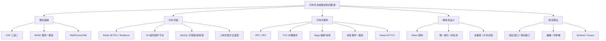

# 分布式系统面试指南

## 面试知识图谱

## 高频面试题汇总

### 🔥🔥🔥 必问题

#### Q1: 请解释 CAP 理论

**追问链路**：三要素含义 → 为什么三选二 → 实际系统的 CAP 选择 → Nacos 是 CP 还是 AP → BASE 理论

详见 [CAP & BASE 理论](./01-cap-base.md#常见面试题)

#### Q2: Redis 分布式锁如何实现？

**追问链路**：SETNX + 过期时间 → Lua 脚本解锁 → 锁过期问题 → Redisson Watch Dog → RedLock 争议 → 和 ZK 锁对比

详见 [分布式锁方案对比](./03-distributed-lock.md#常见面试题)

#### Q3: 分布式事务有哪些方案？

**追问链路**：2PC/TCC/Saga/消息一致性 → 各方案优缺点 → 选型建议 → Seata AT 原理 → TCC 空回滚和悬挂

详见 [分布式事务](./04-distributed-transaction.md#常见面试题)

#### Q4: 如何保证接口幂等性？

**追问链路**：幂等定义 → 六种方案 → Token 机制原子性 → MQ 消费去重 → 乐观锁失败处理

详见 [幂等性设计](./05-idempotent.md#常见面试题)

#### Q5: 令牌桶和漏桶的区别？

**追问链路**：两种算法原理 → 突发流量处理差异 → 滑动窗口 → Guava RateLimiter → Sentinel 限流

详见 [限流算法](./06-rate-limiting.md#常见面试题)

### 🔥🔥 常问题

#### Q6: Raft 算法的 Leader 选举过程？

**追问链路**：三种角色 → 选举超时 → 投票规则 → 日志复制 → 和 Paxos 区别

详见 [一致性算法](./02-consensus.md#常见面试题)

#### Q7: 如何保证消息最终一致性？

**标准答案**：通过本地消息表实现。业务操作和消息写入在同一个本地事务中完成，保证原子性。定时任务扫描未发送的消息，发送到 MQ。消费端做幂等处理。也可以使用 RocketMQ 的事务消息。

#### Q8: TCC 的空回滚和悬挂问题是什么？

**标准答案**：空回滚是指 Try 阶段因网络超时未执行，但 Cancel 阶段被调用了，此时 Cancel 不应该做任何回滚操作。悬挂是指 Cancel 先于 Try 执行（网络延迟导致），Try 到达时不应该再执行。解决方案：在事务控制表中记录事务状态，Cancel 前检查 Try 是否执行过，Try 前检查 Cancel 是否已执行。

### 🔥 偶尔问

#### Q9: 什么是脑裂？如何避免？

**标准答案**：脑裂是指分布式集群中由于网络分区，出现两个 Leader 同时工作的情况。Raft/ZAB 通过多数派机制避免脑裂——只有获得多数节点投票才能成为 Leader，网络分区后少数派一侧无法选出 Leader。旧 Leader 在少数派一侧也无法获得多数确认，会自动降级为 Follower。

#### Q10: 分布式 ID 生成方案有哪些？

**标准答案**：1）UUID——简单但无序、太长；2）数据库自增——简单但有单点瓶颈；3）Redis INCR——性能好但依赖 Redis；4）雪花算法（Snowflake）——64 位 ID = 时间戳 + 机器 ID + 序列号，有序且高性能，是最常用的方案；5）Leaf（美团）——支持号段模式和 Snowflake 模式。

## 面试答题技巧

1. **CAP 理论**是分布式面试的开场题，要能结合实际系统（ZK、Consul、Eureka、Nacos）说明选择
2. **分布式锁**要能说清三种方案的优缺点和选型依据，Redis 方案要提到 Redisson
3. **分布式事务**是重中之重，要能对比所有方案，推荐消息最终一致性和 Seata AT
4. **幂等性**要结合具体场景选方案，不要只说一种
5. 回答时先说结论，再展开细节，体现系统性思维
