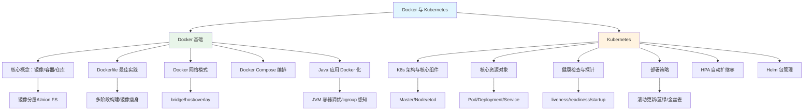

# Docker 与 Kubernetes 模块概述

## 概念说明

Docker 和 Kubernetes 是现代 Java 应用部署的核心技术栈。Docker 提供轻量级容器化能力，将应用及其依赖打包为标准化镜像；Kubernetes（K8s）则负责容器编排，实现自动化部署、扩缩容和故障恢复。对于 Java 后端开发者，掌握容器化部署和 K8s 编排是从开发走向 DevOps 的关键一步。

## 模块知识图谱

## 推荐学习顺序

| 序号 | 知识点 | 文档 | 建议时间 |
|------|--------|------|----------|
| 1 | Docker 核心概念 | [01-docker-basics](./01-docker-basics.md) | 30min |
| 2 | Dockerfile 最佳实践 | [02-dockerfile](./02-dockerfile.md) | 40min |
| 3 | Docker 网络模式 | [03-docker-network](./03-docker-network.md) | 30min |
| 4 | Docker Compose 编排 | [04-docker-compose](./04-docker-compose.md) | 35min |
| 5 | Java 应用 Docker 化 | [05-java-docker](./05-java-docker.md) | 40min |
| 6 | K8s 架构 | [06-k8s-architecture](./06-k8s-architecture.md) | 40min |
| 7 | K8s 核心资源对象 | [07-k8s-resources](./07-k8s-resources.md) | 45min |
| 8 | K8s 健康检查 | [08-k8s-health](./08-k8s-health.md) | 30min |
| 9 | K8s 部署策略 | [09-k8s-deploy](./09-k8s-deploy.md) | 35min |
| 10 | HPA 自动扩缩容 | [10-k8s-hpa](./10-k8s-hpa.md) | 30min |
| 11 | Helm 包管理 | [11-helm](./11-helm.md) | 30min |
| 12 | 命令速查表 | [12-cheatsheet](./12-cheatsheet.md) | 15min |
| 13 | 面试指南 | [99-interview](./99-interview.md) | 30min |

## 代码示例

本模块的代码示例位于 `code-examples/06-devops/docker-k8s-examples/`，包含：

- `Dockerfile` — Java 应用标准 Dockerfile
- `Dockerfile.multi-stage` — 多阶段构建示例
- `docker-compose.yml` — 多服务编排示例
- `k8s/deployment.yaml` — Deployment + Service
- `k8s/deployment-probes.yaml` — 带健康检查的 Deployment
- `k8s/hpa.yaml` — HPA 配置
- `k8s/ingress.yaml` — Ingress 配置

## 相关模块

- [Linux 运维基础](../6.4-linux/) — Linux 命令和运维基础
- [Spring Boot](../../2-framework/2.2-springboot/) — Spring Boot 应用开发
- [CI/CD](../6.2-cicd/) — 持续集成与持续部署
- [监控体系](../6.3-monitoring/) — Prometheus/Grafana 监控
