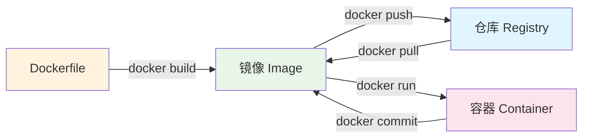
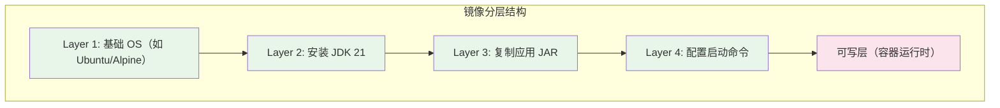
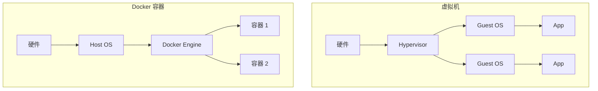

# Docker 核心概念

## 概念说明

Docker 是一个开源的容器化平台，通过将应用及其依赖打包到轻量级、可移植的容器中，解决了"在我机器上能跑"的经典问题。Docker 的三大核心概念是：镜像（Image）、容器（Container）和仓库（Registry）。

## 核心原理

### 镜像、容器与仓库的关系



| 概念 | 类比 | 说明 |
|------|------|------|
| 镜像 (Image) | 类 (Class) | 只读模板，包含运行应用所需的一切（代码、运行时、库、配置） |
| 容器 (Container) | 实例 (Object) | 镜像的运行实例，拥有独立的文件系统、网络和进程空间 |
| 仓库 (Registry) | Maven 仓库 | 存储和分发镜像的服务，如 Docker Hub、Harbor |

### 镜像分层原理

Docker 镜像采用分层存储（Union FS），每一层只存储与上一层的差异：



分层的好处：
- **共享基础层**：多个镜像可共享相同的基础层，节省磁盘空间
- **增量更新**：只需拉取变化的层，加速镜像分发
- **缓存构建**：构建时未变化的层直接使用缓存

### Docker vs 虚拟机



| 对比项 | Docker 容器 | 虚拟机 |
|--------|------------|--------|
| 启动速度 | 秒级 | 分钟级 |
| 资源占用 | MB 级 | GB 级 |
| 隔离级别 | 进程级（Namespace + Cgroup） | 硬件级 |
| 性能 | 接近原生 | 有虚拟化开销 |
| 镜像大小 | 通常 < 500MB | 通常 > 1GB |

### 核心技术：Namespace 与 Cgroup

Docker 利用 Linux 内核的两大特性实现容器隔离：

- **Namespace**：提供资源隔离（PID、Network、Mount、UTS、IPC、User）
- **Cgroup**：提供资源限制（CPU、内存、磁盘 I/O、网络带宽）

## 代码示例

### 基本 Docker 命令

```bash
# 拉取镜像
docker pull eclipse-temurin:21-jre-alpine

# 运行容器
docker run -d --name my-app -p 8080:8080 my-java-app:latest

# 查看运行中的容器
docker ps

# 查看容器日志
docker logs -f my-app

# 进入容器
docker exec -it my-app /bin/sh

# 停止并删除容器
docker stop my-app && docker rm my-app
```

> 💻 完整 Dockerfile 示例：[code-examples/06-devops/docker-k8s-examples/Dockerfile](../../../code-examples/06-devops/docker-k8s-examples/Dockerfile)

## 常见面试题

### Q1: Docker 镜像和容器的区别是什么？

**难度**：⭐⭐ | **频率**：🔥🔥🔥

**答题思路**：

1. 用类和实例的类比解释
2. 说明镜像是只读的，容器是可写的
3. 提到镜像分层和 Union FS

**标准答案**：

镜像是只读的模板，包含运行应用所需的所有文件和配置。容器是镜像的运行实例，在镜像的只读层之上添加了一个可写层。一个镜像可以创建多个容器，就像一个类可以创建多个对象。镜像采用分层存储（Union FS），多个镜像可以共享相同的基础层。

**深入追问**：

- Docker 镜像的分层原理是什么？Union FS 是如何工作的？
- 容器的可写层在容器删除后会怎样？

### Q2: Docker 和虚拟机有什么区别？

**难度**：⭐⭐ | **频率**：🔥🔥🔥

**标准答案**：

Docker 容器直接运行在宿主机内核上，通过 Namespace 实现资源隔离，通过 Cgroup 实现资源限制，启动速度快（秒级）、资源占用少（MB 级）。虚拟机通过 Hypervisor 模拟完整硬件，每个 VM 运行独立的 Guest OS，启动慢（分钟级）、资源占用大（GB 级），但隔离性更强。

## 参考资料

- [Docker 官方文档](https://docs.docker.com/)
- [Docker 从入门到实践](https://yeasy.gitbook.io/docker_practice/)
