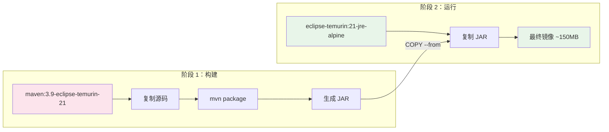
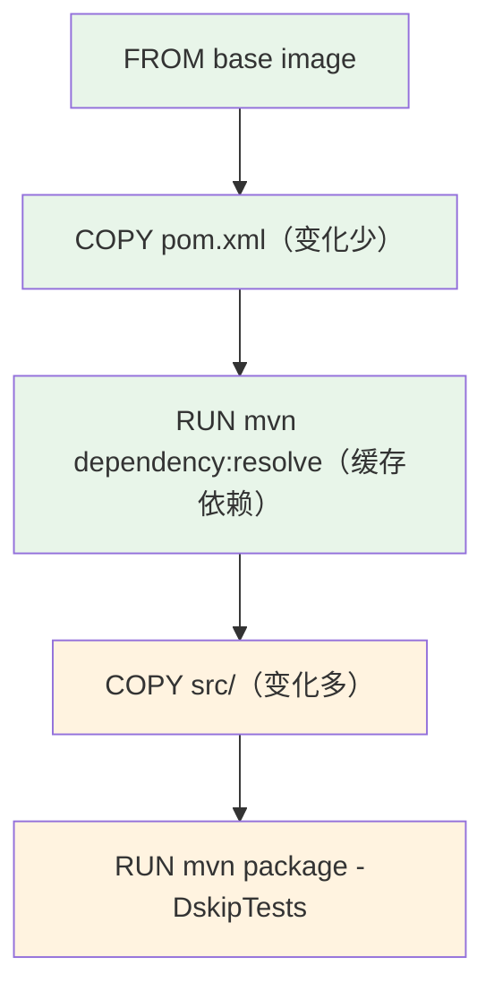

# Dockerfile 最佳实践

## 概念说明

Dockerfile 是构建 Docker 镜像的脚本文件，定义了从基础镜像到最终应用镜像的每一步操作。编写高质量的 Dockerfile 直接影响镜像大小、构建速度和安全性。

## 核心原理

### 多阶段构建

多阶段构建（Multi-stage Build）是优化 Java 应用镜像的关键技术，将构建环境和运行环境分离：



### 镜像瘦身策略

| 策略 | 效果 | 说明 |
|------|------|------|
| 使用 Alpine 基础镜像 | 减少 ~200MB | `eclipse-temurin:21-jre-alpine` 仅 ~80MB |
| 多阶段构建 | 减少 ~500MB | 最终镜像不包含 Maven/JDK 编译工具 |
| 只安装 JRE | 减少 ~200MB | 运行时不需要完整 JDK |
| 合并 RUN 指令 | 减少层数 | 减少中间层的文件残留 |
| .dockerignore | 减少构建上下文 | 排除 .git、target、node_modules 等 |

### 缓存优化原理

Docker 构建时按层缓存，变化频率低的层应放在前面：



## 代码示例

### 标准 Java 应用 Dockerfile

```dockerfile
# 多阶段构建：阶段 1 - 构建
FROM maven:3.9-eclipse-temurin-21 AS builder
WORKDIR /app

# 先复制 POM，利用缓存下载依赖
COPY pom.xml .
RUN mvn dependency:resolve

# 再复制源码，编译打包
COPY src/ src/
RUN mvn package -DskipTests

# 阶段 2 - 运行
FROM eclipse-temurin:21-jre-alpine
WORKDIR /app

# 创建非 root 用户
RUN addgroup -S appgroup && adduser -S appuser -G appgroup

# 复制 JAR
COPY --from=builder /app/target/*.jar app.jar

# 切换到非 root 用户
USER appuser

# JVM 容器参数
ENV JAVA_OPTS="-XX:MaxRAMPercentage=75.0 -XX:+UseG1GC"

EXPOSE 8080
ENTRYPOINT ["sh", "-c", "java $JAVA_OPTS -jar app.jar"]
```

### .dockerignore 示例

```
.git
.gitignore
.idea
*.iml
target/
node_modules/
*.md
docker-compose*.yml
```

> 💻 完整多阶段构建示例：[code-examples/06-devops/docker-k8s-examples/Dockerfile.multi-stage](../../../code-examples/06-devops/docker-k8s-examples/Dockerfile.multi-stage)

## 常见面试题

### Q1: 如何优化 Docker 镜像大小？

**难度**：⭐⭐⭐ | **频率**：🔥🔥🔥

**答题思路**：

1. 使用多阶段构建分离构建和运行环境
2. 选择 Alpine 等精简基础镜像
3. 合并 RUN 指令减少层数
4. 使用 .dockerignore 排除无关文件
5. 只安装运行时必要的依赖

**标准答案**：

优化 Docker 镜像大小的核心策略：①使用多阶段构建，构建阶段用完整 JDK + Maven，运行阶段只用 JRE-Alpine，可将镜像从 ~800MB 缩减到 ~150MB；②选择 Alpine 基础镜像；③合并 RUN 指令并在同一层清理缓存；④使用 .dockerignore 减少构建上下文；⑤利用缓存优化，将不常变化的层（如依赖下载）放在前面。

**深入追问**：

- 多阶段构建的原理是什么？
- Dockerfile 中 COPY 和 ADD 的区别？
- CMD 和 ENTRYPOINT 的区别？

### Q2: Dockerfile 中如何利用构建缓存？

**难度**：⭐⭐ | **频率**：🔥🔥

**标准答案**：

Docker 按层缓存，当某一层的指令或文件发生变化时，该层及其后续所有层的缓存都会失效。优化策略是将变化频率低的操作放在前面：先 COPY pom.xml 并下载依赖（变化少），再 COPY 源码并编译（变化多）。这样修改代码时只需重新编译，不需要重新下载依赖。

## 参考资料

- [Dockerfile 最佳实践](https://docs.docker.com/develop/develop-images/dockerfile_best-practices/)
- [多阶段构建](https://docs.docker.com/build/building/multi-stage/)
