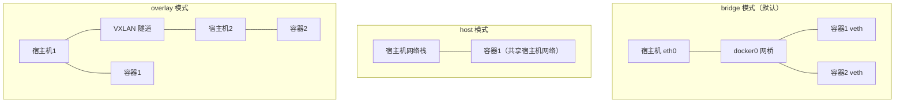
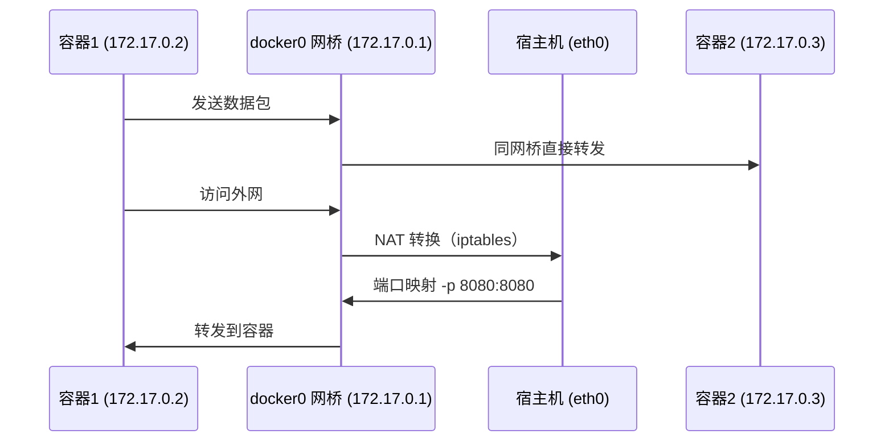

# Docker 网络模式

## 概念说明

Docker 提供多种网络驱动来满足不同场景的容器通信需求。理解网络模式是排查容器间通信问题和设计微服务部署方案的基础。

## 核心原理

### 五种网络模式对比



| 网络模式 | 隔离性 | 性能 | 适用场景 |
|----------|--------|------|----------|
| bridge | 高 | 有 NAT 开销 | 单机多容器（默认模式） |
| host | 无 | 最高（无网络虚拟化） | 对网络性能要求极高的场景 |
| none | 完全隔离 | — | 安全敏感、自定义网络 |
| overlay | 跨主机隔离 | VXLAN 封装开销 | Docker Swarm / 跨主机通信 |
| macvlan | 高 | 接近物理网络 | 需要容器拥有独立 MAC 地址 |

### bridge 模式详解

bridge 是 Docker 默认网络模式，通过 `docker0` 虚拟网桥连接容器：



### 自定义网络

```bash
# 创建自定义 bridge 网络
docker network create --driver bridge my-network

# 容器加入自定义网络（支持 DNS 服务发现）
docker run -d --name app --network my-network my-app
docker run -d --name db --network my-network mysql

# 在自定义网络中，容器可通过名称互相访问
# app 容器内可直接用 db:3306 连接数据库
```

> 自定义 bridge 网络比默认 bridge 多了 DNS 服务发现功能，推荐使用。

## 代码示例

```yaml
# docker-compose.yml 中的网络配置
services:
  app:
    image: my-java-app
    networks:
      - backend
  redis:
    image: redis:7-alpine
    networks:
      - backend

networks:
  backend:
    driver: bridge
```

> 💻 完整编排示例：[code-examples/06-devops/docker-k8s-examples/docker-compose.yml](https://github.com/skyhe58/guide-java/tree/main/code-examples/06-devops/docker-k8s-examples/docker-compose.yml)
> <!-- 本地路径：code-examples/06-devops/docker-k8s-examples/docker-compose.yml -->

## 常见面试题

### Q1: Docker 有哪些网络模式？分别适用什么场景？

**难度**：⭐⭐⭐ | **频率**：🔥🔥

**标准答案**：

Docker 有五种网络模式：①bridge（默认）：通过虚拟网桥连接容器，适合单机多容器通信；②host：容器直接使用宿主机网络栈，性能最高但无隔离；③none：无网络，适合安全敏感场景；④overlay：通过 VXLAN 实现跨主机容器通信，用于 Swarm/K8s；⑤macvlan：为容器分配独立 MAC 地址，适合需要直接接入物理网络的场景。

**深入追问**：

- bridge 模式下容器如何访问外网？（NAT + iptables）
- 自定义 bridge 网络和默认 bridge 有什么区别？（DNS 服务发现）

## 参考资料

- [Docker 网络概述](https://docs.docker.com/network/)
