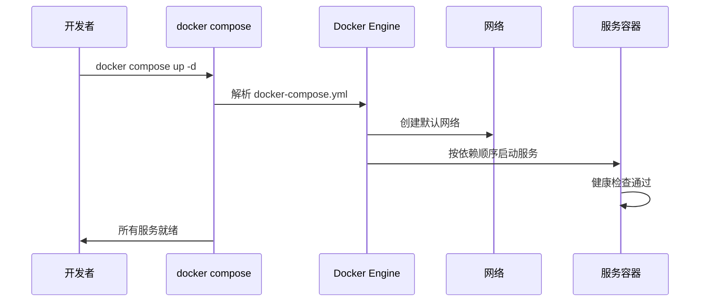

# Docker Compose 编排

## 概念说明

Docker Compose 是 Docker 官方的多容器编排工具，通过一个 YAML 文件定义和管理多个容器服务。对于 Java 微服务开发，Compose 是本地开发和测试环境的标配工具。

## 核心原理

### Compose 工作流程



### 核心配置项

| 配置项 | 说明 | 示例 |
|--------|------|------|
| `services` | 定义服务列表 | app、redis、mysql |
| `depends_on` | 服务依赖关系 | app 依赖 redis、mysql |
| `environment` | 环境变量 | SPRING_PROFILES_ACTIVE=docker |
| `ports` | 端口映射 | "8080:8080" |
| `volumes` | 数据卷挂载 | mysql-data:/var/lib/mysql |
| `networks` | 自定义网络 | backend、frontend |
| `healthcheck` | 健康检查 | curl http://localhost:8080/actuator/health |
| `restart` | 重启策略 | unless-stopped |

## 代码示例

### Java 微服务编排示例

```yaml
version: '3.8'

services:
  app:
    build:
      context: .
      dockerfile: Dockerfile
    ports:
      - "8080:8080"
    environment:
      - SPRING_PROFILES_ACTIVE=docker
      - SPRING_DATASOURCE_URL=jdbc:mysql://mysql:3306/demo
      - SPRING_REDIS_HOST=redis
    depends_on:
      mysql:
        condition: service_healthy
      redis:
        condition: service_healthy
    restart: unless-stopped
    healthcheck:
      test: ["CMD", "curl", "-f", "http://localhost:8080/actuator/health"]
      interval: 30s
      timeout: 10s
      retries: 3
      start_period: 40s

  mysql:
    image: mysql:8.0
    environment:
      MYSQL_ROOT_PASSWORD: root123
      MYSQL_DATABASE: demo
    ports:
      - "3306:3306"
    volumes:
      - mysql-data:/var/lib/mysql
    healthcheck:
      test: ["CMD", "mysqladmin", "ping", "-h", "localhost"]
      interval: 10s
      timeout: 5s
      retries: 5

  redis:
    image: redis:7-alpine
    ports:
      - "6379:6379"
    volumes:
      - redis-data:/data
    healthcheck:
      test: ["CMD", "redis-cli", "ping"]
      interval: 10s
      timeout: 5s
      retries: 5

volumes:
  mysql-data:
  redis-data:
```

> 💻 完整编排示例：[code-examples/06-devops/docker-k8s-examples/docker-compose.yml](../../../code-examples/06-devops/docker-k8s-examples/docker-compose.yml)

### 常用命令

```bash
# 启动所有服务（后台运行）
docker compose up -d

# 查看服务状态
docker compose ps

# 查看日志
docker compose logs -f app

# 停止并删除所有服务
docker compose down

# 停止并删除所有服务 + 数据卷
docker compose down -v

# 重新构建并启动
docker compose up -d --build
```

## 常见面试题

### Q1: Docker Compose 中 depends_on 能保证服务完全就绪吗？

**难度**：⭐⭐⭐ | **频率**：🔥🔥

**标准答案**：

`depends_on` 默认只保证容器启动顺序，不保证服务就绪。例如 MySQL 容器启动了但数据库还没初始化完成。解决方案：①使用 `depends_on` + `condition: service_healthy` 配合 `healthcheck`，等待服务健康检查通过后再启动依赖服务；②在应用层做重试机制（如 Spring Boot 的连接重试）。

**深入追问**：

- 如何编写有效的 healthcheck？
- 生产环境会用 Docker Compose 吗？（通常不会，用 K8s）

## 参考资料

- [Docker Compose 文档](https://docs.docker.com/compose/)
