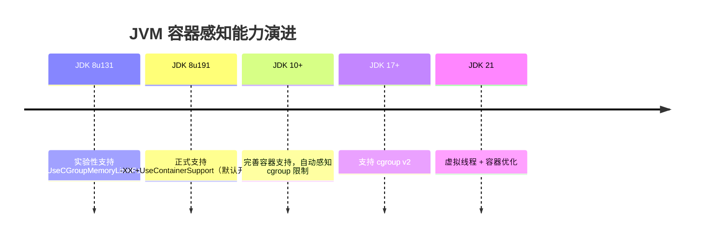
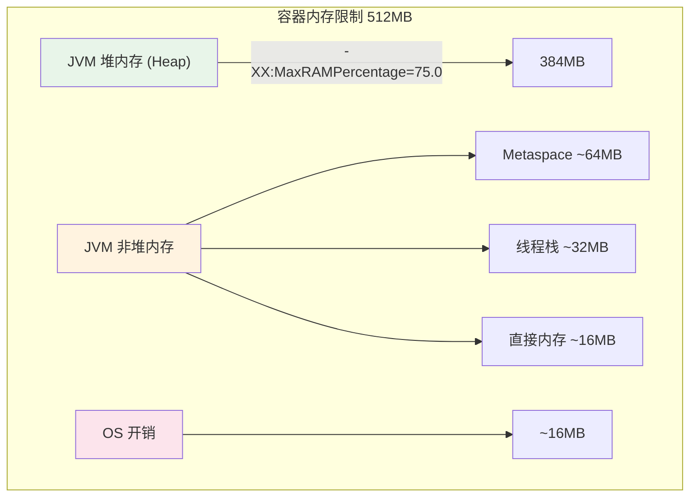

# Java 应用 Docker 化

## 概念说明

Java 应用在容器中运行时面临独特的挑战：JVM 的内存管理需要感知容器的资源限制（cgroup），否则可能因为超出容器内存限制而被 OOM Kill。本文聚焦 Java 应用容器化的最佳实践和 JVM 参数调优。

## 核心原理

### JVM 容器感知演进



### cgroup 内存限制与 JVM



### 关键 JVM 容器参数

| 参数 | 说明 | 推荐值 |
|------|------|--------|
| `-XX:MaxRAMPercentage` | 堆内存占容器内存的百分比 | 75.0（推荐） |
| `-XX:InitialRAMPercentage` | 初始堆内存百分比 | 50.0 |
| `-XX:+UseContainerSupport` | 启用容器感知（JDK 8u191+默认开启） | 默认 |
| `-XX:+UseG1GC` | 使用 G1 垃圾收集器 | 推荐 |
| `-XX:ActiveProcessorCount` | 手动指定 CPU 核数 | 按需设置 |

### 为什么用 MaxRAMPercentage 而不是 -Xmx

```
# ❌ 不推荐：硬编码堆大小，不同环境需要修改
java -Xmx512m -jar app.jar

# ✅ 推荐：按容器内存百分比自动计算
java -XX:MaxRAMPercentage=75.0 -jar app.jar
```

使用百分比的好处：
- 同一镜像可在不同内存限制的容器中运行
- K8s 调整 resources.limits.memory 时无需修改 JVM 参数
- 自动预留 25% 给非堆内存和 OS 开销

## 代码示例

### 生产级 Java Dockerfile

```dockerfile
FROM eclipse-temurin:21-jre-alpine
WORKDIR /app

# 安全：创建非 root 用户
RUN addgroup -S appgroup && adduser -S appuser -G appgroup

# 复制应用
COPY target/*.jar app.jar

# 切换用户
USER appuser

# JVM 容器优化参数
ENV JAVA_OPTS="\
  -XX:MaxRAMPercentage=75.0 \
  -XX:InitialRAMPercentage=50.0 \
  -XX:+UseG1GC \
  -XX:+UseContainerSupport \
  -Djava.security.egd=file:/dev/./urandom"

EXPOSE 8080

# 支持优雅停机
STOPSIGNAL SIGTERM

ENTRYPOINT ["sh", "-c", "java $JAVA_OPTS -jar app.jar"]
```

### 容器内存验证

```bash
# 启动容器，限制 512MB 内存
docker run -m 512m --name test-app my-java-app

# 进入容器查看 JVM 实际内存配置
docker exec test-app java -XX:MaxRAMPercentage=75.0 \
  -XX:+PrintFlagsFinal -version 2>&1 | grep -i heapsize
```

> 💻 完整 Dockerfile 示例：[code-examples/06-devops/docker-k8s-examples/Dockerfile](https://github.com/skyhe58/guide-java/tree/main/code-examples/06-devops/docker-k8s-examples/Dockerfile)
> <!-- 本地路径：code-examples/06-devops/docker-k8s-examples/Dockerfile -->

## 常见面试题

### Q1: Java 应用在 Docker 中运行需要注意什么？

**难度**：⭐⭐⭐ | **频率**：🔥🔥🔥

**答题思路**：

1. JVM 需要感知容器内存限制
2. 使用 MaxRAMPercentage 替代 -Xmx
3. 选择合适的基础镜像
4. 安全最佳实践

**标准答案**：

Java 应用容器化需要注意：①JVM 内存感知：JDK 8u191+ 默认开启 UseContainerSupport，能自动感知 cgroup 内存限制。推荐使用 `-XX:MaxRAMPercentage=75.0` 按比例分配堆内存，预留 25% 给非堆和 OS；②基础镜像选择：使用 JRE-Alpine 而非完整 JDK，减小镜像体积；③多阶段构建：分离构建和运行环境；④安全：使用非 root 用户运行；⑤优雅停机：配置 STOPSIGNAL SIGTERM，Spring Boot 配合 `server.shutdown=graceful`。

**深入追问**：

- 老版本 JDK（8u131 之前）在容器中会有什么问题？（无法感知 cgroup 限制，可能申请超出容器限制的内存导致 OOM Kill）
- MaxRAMPercentage 设置为 75% 的依据是什么？

### Q2: 容器中 JVM 被 OOM Kill 如何排查？

**难度**：⭐⭐⭐ | **频率**：🔥🔥

**标准答案**：

排查步骤：①`docker inspect` 查看容器退出码（137 = OOM Kill）；②`dmesg | grep -i oom` 查看内核 OOM 日志；③检查 JVM 参数是否正确感知容器内存限制；④检查是否有堆外内存泄漏（DirectByteBuffer、Metaspace）；⑤添加 `-XX:+HeapDumpOnOutOfMemoryError` 生成堆转储分析。

## 参考资料

- [JVM in Containers](https://developers.redhat.com/blog/2017/03/14/java-inside-docker)
- [Eclipse Temurin Docker Images](https://hub.docker.com/_/eclipse-temurin)
