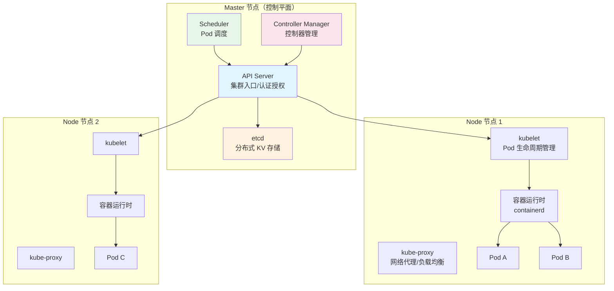
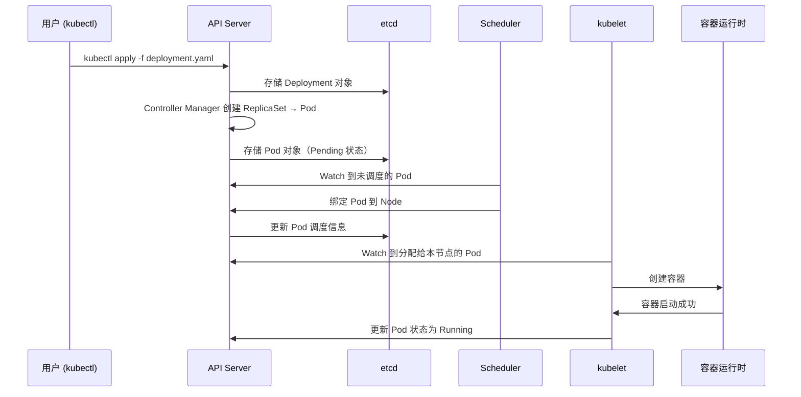

# Kubernetes 架构

## 概念说明

Kubernetes（K8s）是 Google 开源的容器编排平台，用于自动化部署、扩缩容和管理容器化应用。K8s 采用 Master-Node 架构，Master 负责集群管理和调度决策，Node 负责运行实际的容器工作负载。

## 核心原理

### K8s 整体架构



### 核心组件职责

| 组件 | 所在节点 | 职责 |
|------|----------|------|
| API Server | Master | 集群的统一入口，所有操作都通过 REST API 进行 |
| etcd | Master | 分布式键值存储，保存集群所有状态数据 |
| Scheduler | Master | 根据资源需求和约束，将 Pod 调度到合适的 Node |
| Controller Manager | Master | 运行各种控制器（Deployment、ReplicaSet、Node 等） |
| kubelet | Node | 管理 Pod 生命周期，向 API Server 汇报节点状态 |
| kube-proxy | Node | 维护网络规则，实现 Service 的负载均衡 |
| 容器运行时 | Node | 运行容器（containerd / CRI-O） |

### 请求处理流程



### etcd 的重要性

etcd 是 K8s 的"大脑"，存储所有集群状态：

- 所有资源对象的定义和状态
- 集群配置信息
- Service 的 Endpoints 信息
- Secret 和 ConfigMap 数据

> etcd 使用 Raft 一致性算法，生产环境建议部署 3 或 5 个节点的 etcd 集群。

## 代码示例

```bash
# 查看集群信息
kubectl cluster-info

# 查看节点状态
kubectl get nodes -o wide

# 查看所有命名空间的 Pod
kubectl get pods --all-namespaces

# 查看组件状态
kubectl get componentstatuses
```

> 💻 K8s 部署示例：[code-examples/06-devops/docker-k8s-examples/k8s/deployment.yaml](../../../code-examples/06-devops/docker-k8s-examples/k8s/deployment.yaml)

## 常见面试题

### Q1: 简述 Kubernetes 的架构和核心组件

**难度**：⭐⭐⭐ | **频率**：🔥🔥🔥

**标准答案**：

K8s 采用 Master-Node 架构。Master 节点包含：①API Server — 集群统一入口，处理所有 REST 请求；②etcd — 分布式 KV 存储，保存集群状态；③Scheduler — 根据资源和约束调度 Pod；④Controller Manager — 运行各种控制器确保期望状态。Node 节点包含：①kubelet — 管理 Pod 生命周期；②kube-proxy — 维护网络规则和负载均衡；③容器运行时 — 运行容器（containerd）。

**深入追问**：

- etcd 用的什么一致性算法？为什么选 etcd？
- API Server 如何保证高可用？
- Scheduler 的调度策略有哪些？

### Q2: 一个 Pod 从创建到运行经历了哪些步骤？

**难度**：⭐⭐⭐ | **频率**：🔥🔥

**标准答案**：

①用户通过 kubectl 提交 YAML 到 API Server；②API Server 验证后存储到 etcd；③Controller Manager 根据 Deployment 创建 ReplicaSet 和 Pod 对象；④Scheduler 监听到未调度的 Pod，根据资源需求选择合适的 Node 并绑定；⑤目标 Node 上的 kubelet 监听到分配给自己的 Pod，调用容器运行时创建容器；⑥kubelet 持续监控容器状态并上报给 API Server。

## 参考资料

- [Kubernetes 官方文档](https://kubernetes.io/zh-cn/docs/concepts/overview/)
- [Kubernetes 架构](https://kubernetes.io/zh-cn/docs/concepts/architecture/)
