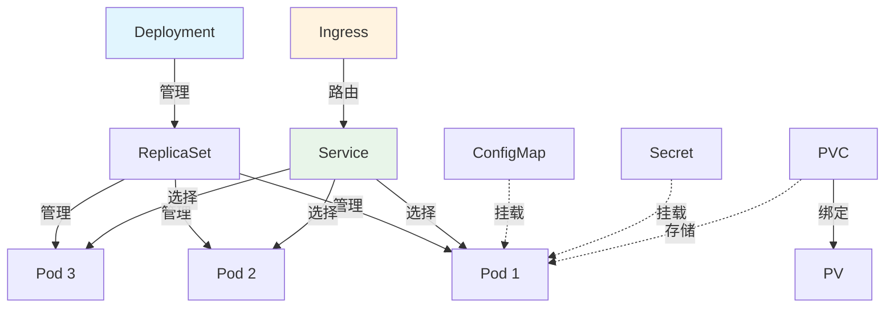
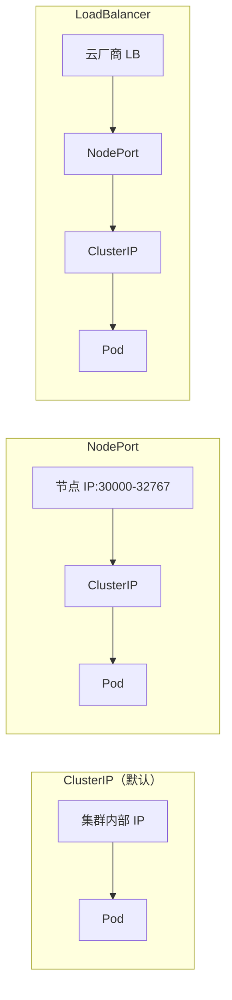

# Kubernetes 核心资源对象

## 概念说明

K8s 通过声明式 API 管理各种资源对象。理解核心资源对象是使用 K8s 的基础。本文覆盖最常用的资源：Pod、Deployment、Service、ConfigMap、Secret、Ingress、PV/PVC。

## 核心原理

### 资源对象关系图



### 核心资源对象一览

| 资源 | 缩写 | 说明 |
|------|------|------|
| Pod | po | 最小调度单元，包含一个或多个容器 |
| Deployment | deploy | 管理 Pod 的副本数和滚动更新 |
| ReplicaSet | rs | 确保指定数量的 Pod 副本运行 |
| Service | svc | 为 Pod 提供稳定的网络访问入口 |
| ConfigMap | cm | 存储非敏感配置数据 |
| Secret | — | 存储敏感数据（密码、Token） |
| Ingress | ing | HTTP/HTTPS 路由规则 |
| PersistentVolume | pv | 集群级别的存储资源 |
| PersistentVolumeClaim | pvc | Pod 对存储的请求 |

### Service 类型



| Service 类型 | 访问范围 | 适用场景 |
|-------------|----------|----------|
| ClusterIP | 集群内部 | 微服务间通信 |
| NodePort | 集群外部（通过节点端口） | 开发测试 |
| LoadBalancer | 集群外部（通过云 LB） | 生产环境对外暴露 |

## 代码示例

### Deployment + Service

```yaml
apiVersion: apps/v1
kind: Deployment
metadata:
  name: java-app
  labels:
    app: java-app
spec:
  replicas: 3
  selector:
    matchLabels:
      app: java-app
  template:
    metadata:
      labels:
        app: java-app
    spec:
      containers:
        - name: java-app
          image: my-java-app:1.0.0
          ports:
            - containerPort: 8080
          resources:
            requests:
              memory: "256Mi"
              cpu: "250m"
            limits:
              memory: "512Mi"
              cpu: "500m"
---
apiVersion: v1
kind: Service
metadata:
  name: java-app-svc
spec:
  selector:
    app: java-app
  ports:
    - port: 80
      targetPort: 8080
  type: ClusterIP
```

### ConfigMap 与 Secret

```yaml
apiVersion: v1
kind: ConfigMap
metadata:
  name: app-config
data:
  application.yml: |
    server:
      port: 8080
    spring:
      profiles:
        active: k8s
---
apiVersion: v1
kind: Secret
metadata:
  name: db-secret
type: Opaque
data:
  username: YWRtaW4=      # base64 编码
  password: cGFzc3dvcmQ=
```

> 💻 完整部署示例：[code-examples/06-devops/docker-k8s-examples/k8s/deployment.yaml](https://github.com/skyhe58/guide-java/tree/main/code-examples/06-devops/docker-k8s-examples/k8s/deployment.yaml)
> <!-- 本地路径：code-examples/06-devops/docker-k8s-examples/k8s/deployment.yaml -->

## 常见面试题

### Q1: Pod 和容器的关系是什么？为什么需要 Pod？

**难度**：⭐⭐⭐ | **频率**：🔥🔥🔥

**标准答案**：

Pod 是 K8s 最小的调度单元，一个 Pod 可以包含一个或多个容器。Pod 内的容器共享网络命名空间（同一 IP）和存储卷，可以通过 localhost 互相通信。需要 Pod 的原因：①有些应用需要紧密协作的多个进程（如日志收集 sidecar）；②Pod 提供了容器间共享资源的抽象；③K8s 以 Pod 为单位进行调度和管理。

**深入追问**：

- Pod 内多个容器如何通信？
- 什么是 Sidecar 模式？举个例子。

### Q2: Service 的几种类型有什么区别？

**难度**：⭐⭐ | **频率**：🔥🔥🔥

**标准答案**：

K8s Service 有三种主要类型：①ClusterIP（默认）：分配集群内部 IP，只能在集群内访问，适合微服务间通信；②NodePort：在每个节点上开放一个端口（30000-32767），外部可通过 `节点IP:端口` 访问，适合开发测试；③LoadBalancer：在 NodePort 基础上，通过云厂商的负载均衡器对外暴露，适合生产环境。三者是层层递进的关系。

## 参考资料

- [K8s 资源对象](https://kubernetes.io/zh-cn/docs/concepts/workloads/)
