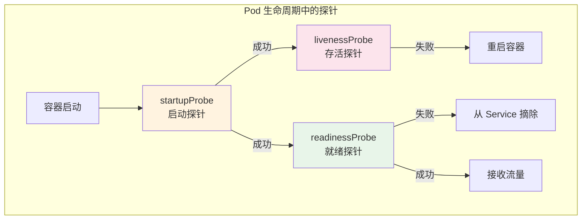
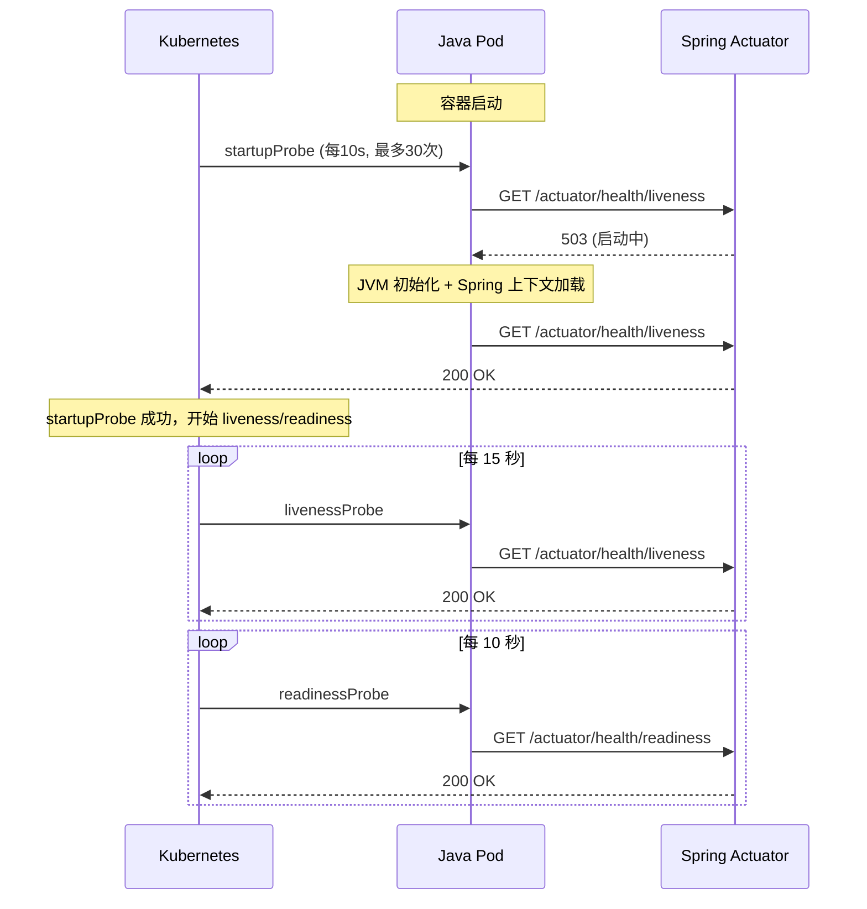

# Kubernetes 健康检查

## 概念说明

K8s 通过三种探针（Probe）来监控 Pod 中容器的健康状态，确保只有健康的 Pod 才能接收流量，不健康的 Pod 会被自动重启或从服务中摘除。

## 核心原理

### 三种探针对比



| 探针 | 作用 | 失败后果 | 适用场景 |
|------|------|----------|----------|
| startupProbe | 检测容器是否启动完成 | 重启容器 | 启动慢的应用（如 Java） |
| livenessProbe | 检测容器是否存活 | 重启容器 | 检测死锁、无响应 |
| readinessProbe | 检测容器是否就绪 | 从 Service 摘除 | 检测依赖服务是否可用 |

### 探针检测方式

| 方式 | 说明 | 适用场景 |
|------|------|----------|
| httpGet | 发送 HTTP GET 请求，2xx/3xx 为成功 | Web 应用（最常用） |
| tcpSocket | 尝试 TCP 连接，连接成功为成功 | 非 HTTP 服务 |
| exec | 在容器内执行命令，退出码 0 为成功 | 自定义检查逻辑 |

### Java 应用探针最佳实践



## 代码示例

### 带健康检查的 Deployment

```yaml
apiVersion: apps/v1
kind: Deployment
metadata:
  name: java-app
spec:
  replicas: 3
  selector:
    matchLabels:
      app: java-app
  template:
    metadata:
      labels:
        app: java-app
    spec:
      containers:
        - name: java-app
          image: my-java-app:1.0.0
          ports:
            - containerPort: 8080
          # 启动探针：Java 应用启动慢，给足时间
          startupProbe:
            httpGet:
              path: /actuator/health/liveness
              port: 8080
            initialDelaySeconds: 10
            periodSeconds: 10
            failureThreshold: 30    # 最多等 300 秒
          # 存活探针
          livenessProbe:
            httpGet:
              path: /actuator/health/liveness
              port: 8080
            periodSeconds: 15
            failureThreshold: 3
          # 就绪探针
          readinessProbe:
            httpGet:
              path: /actuator/health/readiness
              port: 8080
            periodSeconds: 10
            failureThreshold: 3
```

### Spring Boot Actuator 配置

```yaml
# application.yml
management:
  endpoints:
    web:
      exposure:
        include: health
  endpoint:
    health:
      probes:
        enabled: true    # 启用 K8s 探针端点
      show-details: always
  health:
    livenessState:
      enabled: true
    readinessState:
      enabled: true
```

> 💻 完整探针配置：[code-examples/06-devops/docker-k8s-examples/k8s/deployment-probes.yaml](https://github.com/skyhe58/guide-java/tree/main/code-examples/06-devops/docker-k8s-examples/k8s/deployment-probes.yaml)
> <!-- 本地路径：code-examples/06-devops/docker-k8s-examples/k8s/deployment-probes.yaml -->

## 常见面试题

### Q1: K8s 的三种探针有什么区别？

**难度**：⭐⭐⭐ | **频率**：🔥🔥🔥

**标准答案**：

K8s 有三种探针：①startupProbe（启动探针）：检测容器是否启动完成，在启动探针成功之前，其他探针不会执行。适合启动慢的 Java 应用；②livenessProbe（存活探针）：检测容器是否存活，失败后 K8s 会重启容器。用于检测死锁等异常；③readinessProbe（就绪探针）：检测容器是否准备好接收流量，失败后从 Service 的 Endpoints 中摘除。用于检测依赖服务是否可用。

**深入追问**：

- Java 应用为什么需要 startupProbe？（JVM 启动 + Spring 上下文加载耗时长）
- livenessProbe 和 readinessProbe 的端点应该一样吗？

## 参考资料

- [K8s 探针配置](https://kubernetes.io/zh-cn/docs/tasks/configure-pod-container/configure-liveness-readiness-startup-probes/)
