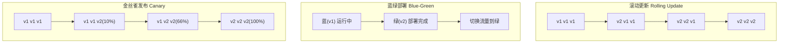
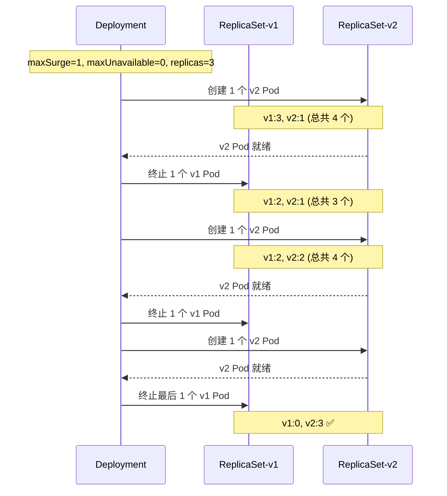

# Kubernetes 部署策略

## 概念说明

部署策略决定了应用新版本如何替换旧版本。选择合适的部署策略可以在保证服务可用性的同时，降低发布风险。K8s 原生支持滚动更新，蓝绿部署和金丝雀发布需要通过配置或工具实现。

## 核心原理

### 三种部署策略对比



| 策略 | 停机时间 | 回滚速度 | 资源开销 | 适用场景 |
|------|----------|----------|----------|----------|
| 滚动更新 | 零停机 | 较快 | 低（逐步替换） | 大多数场景（默认） |
| 蓝绿部署 | 零停机 | 最快（切换即回滚） | 高（双倍资源） | 对回滚速度要求极高 |
| 金丝雀发布 | 零停机 | 快 | 中等 | 需要灰度验证的场景 |

### 滚动更新详解



### maxSurge 与 maxUnavailable

| 参数 | 说明 | 示例 |
|------|------|------|
| maxSurge | 滚动更新时允许超出期望副本数的最大 Pod 数 | 1 或 25% |
| maxUnavailable | 滚动更新时允许不可用的最大 Pod 数 | 0 或 25% |

常见配置组合：
- `maxSurge=1, maxUnavailable=0`：最安全，先启新再停旧
- `maxSurge=0, maxUnavailable=1`：不增加资源，先停旧再启新
- `maxSurge=25%, maxUnavailable=25%`：K8s 默认值，平衡速度和安全

## 代码示例

### 滚动更新配置

```yaml
apiVersion: apps/v1
kind: Deployment
metadata:
  name: java-app
spec:
  replicas: 3
  strategy:
    type: RollingUpdate
    rollingUpdate:
      maxSurge: 1
      maxUnavailable: 0
  selector:
    matchLabels:
      app: java-app
  template:
    metadata:
      labels:
        app: java-app
    spec:
      containers:
        - name: java-app
          image: my-java-app:2.0.0
          ports:
            - containerPort: 8080
          readinessProbe:
            httpGet:
              path: /actuator/health/readiness
              port: 8080
            periodSeconds: 10
      # 优雅停机
      terminationGracePeriodSeconds: 60
```

### 蓝绿部署（通过 Service 切换）

```yaml
# 蓝环境（当前版本）
apiVersion: apps/v1
kind: Deployment
metadata:
  name: java-app-blue
spec:
  replicas: 3
  selector:
    matchLabels:
      app: java-app
      version: blue
  template:
    metadata:
      labels:
        app: java-app
        version: blue
    spec:
      containers:
        - name: java-app
          image: my-java-app:1.0.0
---
# Service 指向蓝环境，切换时改为 version: green
apiVersion: v1
kind: Service
metadata:
  name: java-app-svc
spec:
  selector:
    app: java-app
    version: blue    # 切换到 green 即完成蓝绿部署
  ports:
    - port: 80
      targetPort: 8080
```

> 💻 完整部署配置：[code-examples/06-devops/docker-k8s-examples/k8s/deployment.yaml](../../../code-examples/06-devops/docker-k8s-examples/k8s/deployment.yaml)

## 常见面试题

### Q1: K8s 有哪些部署策略？各自的优缺点？

**难度**：⭐⭐⭐ | **频率**：🔥🔥🔥

**标准答案**：

①滚动更新（K8s 默认）：逐步用新版本 Pod 替换旧版本，通过 maxSurge 和 maxUnavailable 控制节奏，零停机但回滚需要时间；②蓝绿部署：同时运行新旧两套环境，通过 Service 切换流量，回滚最快但需要双倍资源；③金丝雀发布：先将少量流量导向新版本，验证无问题后逐步扩大比例，风险最低但实现较复杂。

**深入追问**：

- maxSurge 和 maxUnavailable 分别设置为什么值最安全？
- 滚动更新过程中如何保证不丢请求？（readinessProbe + 优雅停机）

## 参考资料

- [K8s 部署策略](https://kubernetes.io/zh-cn/docs/concepts/workloads/controllers/deployment/)
