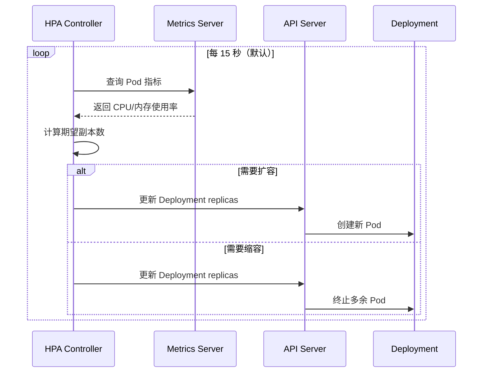

# HPA 自动扩缩容

## 概念说明

HPA（Horizontal Pod Autoscaler）根据 CPU、内存或自定义指标自动调整 Pod 副本数，实现应用的弹性伸缩。当负载增加时自动扩容，负载降低时自动缩容，既保证服务质量又节约资源。

## 核心原理

### HPA 工作流程



### 副本数计算公式

```
期望副本数 = ceil(当前副本数 × (当前指标值 / 目标指标值))
```

示例：当前 3 个 Pod，CPU 使用率 80%，目标 50%：
```
期望副本数 = ceil(3 × (80 / 50)) = ceil(4.8) = 5
```

### 支持的指标类型

| 指标类型 | 说明 | 示例 |
|----------|------|------|
| Resource | Pod 的 CPU/内存使用率 | CPU 利用率 > 50% |
| Pods | 每个 Pod 的自定义指标 | 每秒请求数 > 100 |
| Object | K8s 对象的指标 | Ingress 的 QPS |
| External | 外部系统指标 | 消息队列积压数 |

## 代码示例

### 基于 CPU 的 HPA

```yaml
apiVersion: autoscaling/v2
kind: HorizontalPodAutoscaler
metadata:
  name: java-app-hpa
spec:
  scaleTargetRef:
    apiVersion: apps/v1
    kind: Deployment
    name: java-app
  minReplicas: 2
  maxReplicas: 10
  metrics:
    - type: Resource
      resource:
        name: cpu
        target:
          type: Utilization
          averageUtilization: 50
    - type: Resource
      resource:
        name: memory
        target:
          type: Utilization
          averageUtilization: 70
  behavior:
    scaleUp:
      stabilizationWindowSeconds: 60
      policies:
        - type: Pods
          value: 2
          periodSeconds: 60
    scaleDown:
      stabilizationWindowSeconds: 300
      policies:
        - type: Percent
          value: 10
          periodSeconds: 60
```

> 注意：HPA 要求 Deployment 的 Pod 必须设置 `resources.requests`，否则无法计算利用率。

### 查看 HPA 状态

```bash
# 查看 HPA 状态
kubectl get hpa

# 查看详细信息
kubectl describe hpa java-app-hpa

# 手动测试扩容（压测）
kubectl run -i --tty load-generator --rm --image=busybox -- /bin/sh
# wget -q -O- http://java-app-svc/api/test
```

> 💻 完整 HPA 配置：[code-examples/06-devops/docker-k8s-examples/k8s/hpa.yaml](https://github.com/skyhe58/guide-java/tree/main/code-examples/06-devops/docker-k8s-examples/k8s/hpa.yaml)
> <!-- 本地路径：code-examples/06-devops/docker-k8s-examples/k8s/hpa.yaml -->

## 常见面试题

### Q1: HPA 是如何工作的？

**难度**：⭐⭐⭐ | **频率**：🔥🔥

**标准答案**：

HPA Controller 每 15 秒从 Metrics Server 获取 Pod 的资源使用指标，根据公式 `期望副本数 = ceil(当前副本数 × 当前指标值/目标值)` 计算期望副本数，然后通过修改 Deployment 的 replicas 字段实现扩缩容。HPA 支持基于 CPU、内存和自定义指标的扩缩容，还可以通过 behavior 字段配置扩缩容的速率和稳定窗口，避免频繁抖动。

**深入追问**：

- HPA 缩容时如何避免频繁抖动？（stabilizationWindowSeconds）
- HPA 和 VPA 的区别？（水平扩缩 vs 垂直扩缩）

## 参考资料

- [K8s HPA](https://kubernetes.io/zh-cn/docs/tasks/run-application/horizontal-pod-autoscale/)
