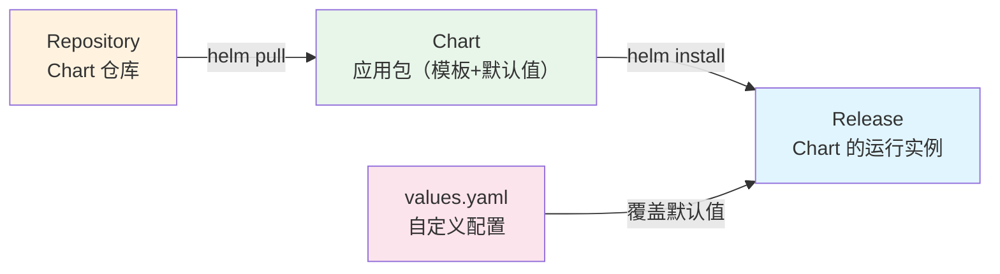

# Helm 包管理

## 概念说明

Helm 是 Kubernetes 的包管理工具，类似于 Java 的 Maven 或 Node.js 的 npm。Helm 通过 Chart（包）来定义、安装和升级 K8s 应用，将复杂的 K8s YAML 配置模板化和参数化。

## 核心原理

### Helm 核心概念



| 概念 | 类比 | 说明 |
|------|------|------|
| Chart | Maven Artifact | 一组 K8s 资源的打包，包含模板和默认配置 |
| Release | 部署实例 | Chart 安装到集群后的运行实例 |
| Repository | Maven Repository | 存储和分发 Chart 的仓库 |
| values.yaml | application.yml | Chart 的配置参数文件 |

### Chart 目录结构

```
my-java-app/
├── Chart.yaml          # Chart 元信息（名称、版本、描述）
├── values.yaml         # 默认配置值
├── templates/          # K8s 资源模板
│   ├── deployment.yaml
│   ├── service.yaml
│   ├── ingress.yaml
│   ├── hpa.yaml
│   ├── configmap.yaml
│   └── _helpers.tpl    # 模板辅助函数
└── charts/             # 依赖的子 Chart
```

### Helm 模板语法

::: v-pre
```yaml
# templates/deployment.yaml
apiVersion: apps/v1
kind: Deployment
metadata:
  name: {{ include "my-app.fullname" . }}
  labels:
    {{- include "my-app.labels" . | nindent 4 }}
spec:
  replicas: {{ .Values.replicaCount }}
  selector:
    matchLabels:
      {{- include "my-app.selectorLabels" . | nindent 6 }}
  template:
    spec:
      containers:
        - name: {{ .Chart.Name }}
          image: "{{ .Values.image.repository }}:{{ .Values.image.tag }}"
          resources:
            {{- toYaml .Values.resources | nindent 12 }}
```
:::

```yaml
# values.yaml
replicaCount: 3
image:
  repository: my-java-app
  tag: "1.0.0"
resources:
  requests:
    memory: "256Mi"
    cpu: "250m"
  limits:
    memory: "512Mi"
    cpu: "500m"
```

## 代码示例

### 常用 Helm 命令

```bash
# 添加仓库
helm repo add bitnami https://charts.bitnami.com/bitnami
helm repo update

# 搜索 Chart
helm search repo redis

# 安装 Chart
helm install my-redis bitnami/redis -f custom-values.yaml

# 查看已安装的 Release
helm list

# 升级 Release
helm upgrade my-redis bitnami/redis -f custom-values.yaml

# 回滚到上一个版本
helm rollback my-redis 1

# 卸载 Release
helm uninstall my-redis

# 渲染模板（不安装，用于调试）
helm template my-app ./my-java-app -f values-prod.yaml
```

### 多环境配置

```bash
# 开发环境
helm install my-app ./chart -f values-dev.yaml

# 生产环境
helm install my-app ./chart -f values-prod.yaml

# 命令行覆盖单个值
helm install my-app ./chart --set replicaCount=5
```

## 常见面试题

### Q1: Helm 是什么？解决了什么问题？

**难度**：⭐⭐ | **频率**：🔥🔥

**标准答案**：

Helm 是 K8s 的包管理工具，解决了以下问题：①K8s 应用通常由多个 YAML 文件组成（Deployment、Service、ConfigMap 等），Helm 将它们打包为 Chart 统一管理；②通过模板语法和 values.yaml 实现配置参数化，同一个 Chart 可以部署到不同环境；③支持版本管理和一键回滚；④通过 Repository 实现 Chart 的共享和复用。

**深入追问**：

- Helm 2 和 Helm 3 的主要区别？（移除了 Tiller）
- 如何管理 Helm Chart 的依赖？

## 参考资料

- [Helm 官方文档](https://helm.sh/zh/docs/)
