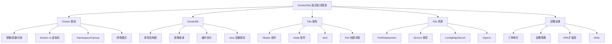
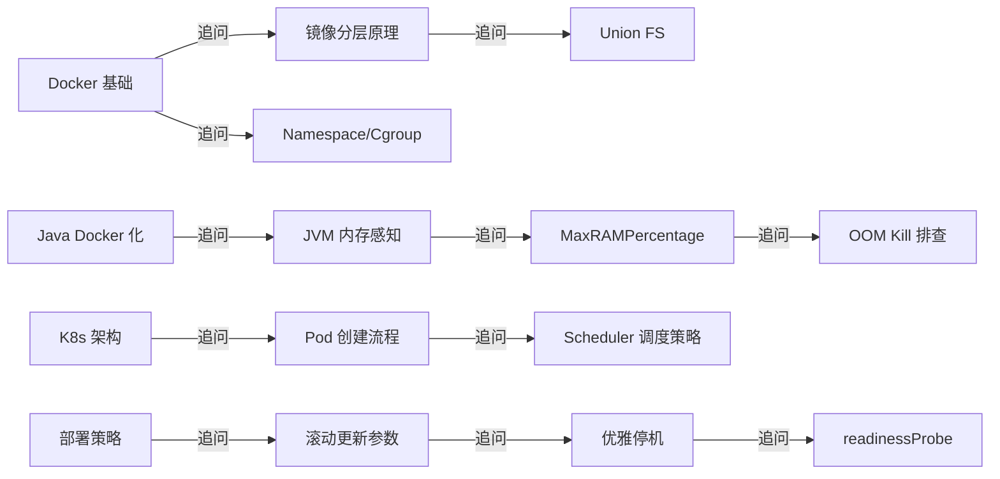

# Docker/K8s 面试指南

## 面试知识图谱

## 高频面试题汇总

### 🔥🔥🔥 必问题

#### Q1: Docker 和虚拟机有什么区别？

详见 [Docker 核心概念](./01-docker-basics.md)

**核心要点**：Docker 容器直接运行在宿主机内核上（Namespace 隔离 + Cgroup 限制），启动秒级、MB 级资源占用；虚拟机通过 Hypervisor 模拟硬件，运行独立 Guest OS，启动分钟级、GB 级资源占用。

#### Q2: 如何优化 Docker 镜像大小？

详见 [Dockerfile 最佳实践](./02-dockerfile.md)

**核心要点**：多阶段构建、Alpine 基础镜像、只安装 JRE、合并 RUN 指令、.dockerignore。

#### Q3: Java 应用在 Docker 中运行需要注意什么？

详见 [Java 应用 Docker 化](./05-java-docker.md)

**核心要点**：JVM 容器感知（UseContainerSupport）、MaxRAMPercentage=75.0、非 root 用户、优雅停机。

#### Q4: K8s 的架构和核心组件？

详见 [K8s 架构](./06-k8s-architecture.md)

**核心要点**：Master（API Server + etcd + Scheduler + Controller Manager）+ Node（kubelet + kube-proxy + 容器运行时）。

#### Q5: K8s 的三种探针有什么区别？

详见 [K8s 健康检查](./08-k8s-health.md)

**核心要点**：startupProbe（启动检测）、livenessProbe（存活检测，失败重启）、readinessProbe（就绪检测，失败摘除流量）。

#### Q6: K8s 有哪些部署策略？

详见 [K8s 部署策略](./09-k8s-deploy.md)

**核心要点**：滚动更新（默认，maxSurge/maxUnavailable）、蓝绿部署（双环境切换）、金丝雀发布（灰度验证）。

### 🔥🔥 常问题

#### Q7: Pod 和容器的关系？

详见 [K8s 核心资源对象](./07-k8s-resources.md)

**核心要点**：Pod 是最小调度单元，可包含多个容器，共享网络和存储。

#### Q8: Service 的几种类型？

详见 [K8s 核心资源对象](./07-k8s-resources.md)

**核心要点**：ClusterIP（集群内部）、NodePort（节点端口）、LoadBalancer（云 LB）。

#### Q9: HPA 是如何工作的？

详见 [HPA 自动扩缩容](./10-k8s-hpa.md)

**核心要点**：定期查询 Metrics Server，根据指标计算期望副本数，自动调整 Deployment replicas。

#### Q10: Helm 是什么？解决了什么问题？

详见 [Helm 包管理](./11-helm.md)

**核心要点**：K8s 包管理工具，Chart 打包 + 模板参数化 + 版本管理 + 一键回滚。

### 🔥 偶尔问

#### Q11: Docker 网络模式有哪些？

详见 [Docker 网络模式](./03-docker-network.md)

#### Q12: Docker Compose 中 depends_on 能保证服务就绪吗？

详见 [Docker Compose 编排](./04-docker-compose.md)

## 面试追问链路

## 参考资料

- [Docker 官方文档](https://docs.docker.com/)
- [Kubernetes 官方文档](https://kubernetes.io/zh-cn/docs/)
- [Helm 官方文档](https://helm.sh/zh/docs/)
