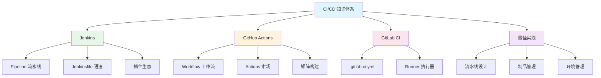

# CI/CD 模块概述

## 概念说明

CI/CD（持续集成/持续交付/持续部署）是现代软件开发的核心实践。CI 确保代码频繁集成并自动验证，CD 确保代码能快速、安全地交付到生产环境。对于 Java 后端开发者，掌握 CI/CD 是从"写代码"到"交付产品"的关键能力。

- **CI（Continuous Integration）**：代码提交后自动编译、测试、代码检查
- **CD（Continuous Delivery）**：自动构建制品，随时可部署到生产环境
- **CD（Continuous Deployment）**：自动部署到生产环境，无需人工干预

## 模块知识图谱

## 推荐学习顺序

| 序号 | 知识点 | 文档 | 建议时间 |
|------|--------|------|----------|
| 1 | Jenkins Pipeline | [01-jenkins](./01-jenkins.md) | 45min |
| 2 | GitHub Actions | [02-github-actions](./02-github-actions.md) | 40min |
| 3 | GitLab CI/CD | [03-gitlab-ci](./03-gitlab-ci.md) | 35min |
| 4 | CI/CD 最佳实践 | [04-best-practices](./04-best-practices.md) | 30min |
| 5 | 面试指南 | [99-interview](./99-interview.md) | 20min |

## CI/CD 工具对比

| 维度 | Jenkins | GitHub Actions | GitLab CI |
|------|---------|---------------|-----------|
| 部署方式 | 自托管 | 云托管 | 自托管/云托管 |
| 配置方式 | Jenkinsfile | YAML | YAML |
| 生态 | 插件丰富 | Actions 市场 | 内置功能 |
| 学习成本 | 较高 | 低 | 中等 |
| 适用场景 | 企业级 | 开源/中小团队 | GitLab 用户 |

## 代码示例

> 💻 完整可运行代码：[code-examples/06-devops/cicd-examples/](https://github.com/skyhe58/guide-java/tree/main/code-examples/06-devops/cicd-examples/)
> <!-- 本地路径：code-examples/06-devops/cicd-examples/ -->

## 相关模块

- [Docker 与 K8s](../6.1-docker-k8s/00-index.md) — 容器化部署
- [监控体系](../6.3-monitoring/00-index.md) — 部署后的监控
