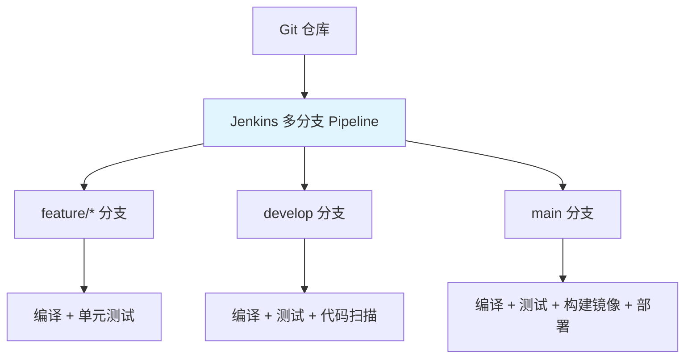

# Jenkins Pipeline 与 Jenkinsfile

## 概念说明

Jenkins 是最流行的开源 CI/CD 服务器，通过 Pipeline（流水线）定义构建、测试、部署的完整流程。Jenkinsfile 是 Pipeline 的代码化定义，支持版本控制。

## 核心原理

### Pipeline 架构


### Jenkinsfile 语法

Jenkins Pipeline 有两种语法：**声明式（Declarative）**和**脚本式（Scripted）**。推荐使用声明式。

```groovy
// 声明式 Pipeline
pipeline {
    agent any

    environment {
        DOCKER_REGISTRY = 'registry.example.com'
        APP_NAME = 'my-java-app'
    }

    tools {
        maven 'Maven-3.9'
        jdk 'JDK-21'
    }

    stages {
        stage('Checkout') {
            steps {
                checkout scm
            }
        }

        stage('Build') {
            steps {
                sh 'mvn clean compile -DskipTests'
            }
        }

        stage('Test') {
            steps {
                sh 'mvn test'
            }
            post {
                always {
                    junit '**/target/surefire-reports/*.xml'
                }
            }
        }

        stage('SonarQube Analysis') {
            steps {
                withSonarQubeEnv('SonarQube') {
                    sh 'mvn sonar:sonar'
                }
            }
        }

        stage('Docker Build & Push') {
            when {
                branch 'main'
            }
            steps {
                script {
                    def image = docker.build("${DOCKER_REGISTRY}/${APP_NAME}:${BUILD_NUMBER}")
                    docker.withRegistry("https://${DOCKER_REGISTRY}", 'docker-credentials') {
                        image.push()
                        image.push('latest')
                    }
                }
            }
        }

        stage('Deploy') {
            when {
                branch 'main'
            }
            steps {
                sh "kubectl set image deployment/${APP_NAME} ${APP_NAME}=${DOCKER_REGISTRY}/${APP_NAME}:${BUILD_NUMBER}"
            }
        }
    }

    post {
        success {
            slackSend channel: '#deployments', message: "部署成功: ${APP_NAME} #${BUILD_NUMBER}"
        }
        failure {
            slackSend channel: '#deployments', color: 'danger', message: "构建失败: ${APP_NAME} #${BUILD_NUMBER}"
        }
    }
}
```

### 多分支流水线



### 常用 Jenkins 插件

| 插件 | 用途 |
|------|------|
| Pipeline | 流水线核心 |
| Git | Git 集成 |
| Docker Pipeline | Docker 构建 |
| SonarQube Scanner | 代码质量扫描 |
| JUnit | 测试报告 |
| Slack Notification | 通知 |
| Credentials | 凭证管理 |

## 代码示例

> 💻 完整 Jenkinsfile 示例：[code-examples/06-devops/cicd-examples/](../../../code-examples/06-devops/cicd-examples/)

## 常见面试题

### Q1: Jenkins 的声明式和脚本式 Pipeline 有什么区别？

**难度**：⭐⭐ | **频率**：🔥🔥

**标准答案**：

声明式 Pipeline 使用 `pipeline {}` 块，结构固定（agent/stages/post），语法简洁，有内置的错误检查，推荐使用。脚本式 Pipeline 使用 `node {}` 块，基于 Groovy 脚本，灵活性更高但可读性差。声明式可以通过 `script {}` 块嵌入脚本式代码。

### Q2: Jenkins 如何实现流水线的并行执行？

**难度**：⭐⭐ | **频率**：🔥🔥

**标准答案**：

使用 `parallel` 关键字实现阶段并行执行。例如单元测试和集成测试可以并行运行，减少总构建时间。并行阶段中任一失败，整个 parallel 块标记为失败。可以通过 `failFast true` 控制快速失败行为。

### Q3: 如何管理 Jenkins 中的敏感信息？

**难度**：⭐⭐ | **频率**：🔥🔥

**标准答案**：

使用 Jenkins Credentials 插件管理敏感信息（密码、Token、SSH 密钥）。在 Pipeline 中通过 `withCredentials` 或 `credentials()` 方法引用。凭证加密存储在 Jenkins 主目录中，日志中自动脱敏。建议使用 Vault 等外部密钥管理系统集成。

## 参考资料

- [Jenkins Pipeline 文档](https://www.jenkins.io/doc/book/pipeline/)
