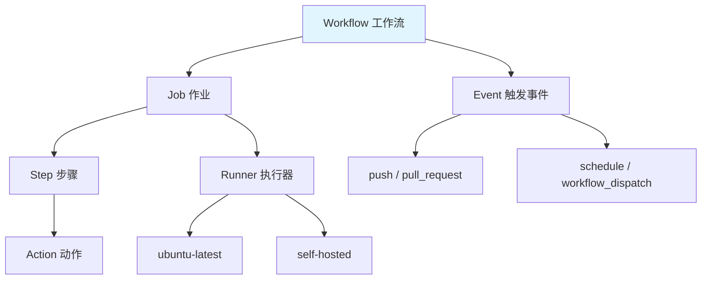

# GitHub Actions 工作流

## 概念说明

GitHub Actions 是 GitHub 内置的 CI/CD 平台，通过 YAML 文件定义工作流（Workflow），在代码推送、PR 创建等事件触发时自动执行。对于开源项目和中小团队，GitHub Actions 是最便捷的 CI/CD 方案。

## 核心原理

### 核心概念



| 概念 | 说明 |
|------|------|
| Workflow | 自动化流程，定义在 `.github/workflows/*.yml` |
| Event | 触发工作流的事件（push/PR/定时等） |
| Job | 工作流中的一组步骤，可并行执行 |
| Step | Job 中的单个操作 |
| Action | 可复用的操作单元（来自 Actions 市场） |
| Runner | 执行 Job 的服务器（GitHub 托管或自托管） |

### Java 项目 CI/CD 示例

::: v-pre
```yaml
name: Java CI/CD

on:
  push:
    branches: [main, develop]
  pull_request:
    branches: [main]

jobs:
  build:
    runs-on: ubuntu-latest

    steps:
      - uses: actions/checkout@v4

      - name: Set up JDK 21
        uses: actions/setup-java@v4
        with:
          java-version: '21'
          distribution: 'temurin'
          cache: maven

      - name: Build with Maven
        run: mvn clean compile -DskipTests

      - name: Run Tests
        run: mvn test

      - name: Upload Test Reports
        if: always()
        uses: actions/upload-artifact@v4
        with:
          name: test-reports
          path: '**/target/surefire-reports/'

  docker:
    needs: build
    if: github.ref == 'refs/heads/main'
    runs-on: ubuntu-latest

    steps:
      - uses: actions/checkout@v4

      - name: Login to Docker Registry
        uses: docker/login-action@v3
        with:
          registry: ghcr.io
          username: ${{ github.actor }}
          password: ${{ secrets.GITHUB_TOKEN }}

      - name: Build and Push Docker Image
        uses: docker/build-push-action@v5
        with:
          push: true
          tags: ghcr.io/${{ github.repository }}:${{ github.sha }}

  deploy:
    needs: docker
    runs-on: ubuntu-latest
    environment: production

    steps:
      - name: Deploy to K8s
        run: |
          kubectl set image deployment/my-app \
            my-app=ghcr.io/${{ github.repository }}:${{ github.sha }}
```
:::

### 矩阵构建

::: v-pre
```yaml
jobs:
  test:
    runs-on: ${{ matrix.os }}
    strategy:
      matrix:
        os: [ubuntu-latest, macos-latest]
        java: [17, 21]
    steps:
      - uses: actions/setup-java@v4
        with:
          java-version: ${{ matrix.java }}
          distribution: 'temurin'
      - run: mvn test
```
:::

## 常见面试题

### Q1: GitHub Actions 和 Jenkins 如何选择？

**难度**：⭐⭐ | **频率**：🔥🔥

**标准答案**：

GitHub Actions 适合：开源项目（免费额度充足）、中小团队、GitHub 托管的项目、简单到中等复杂度的流水线。Jenkins 适合：企业级项目、需要自托管、复杂的流水线逻辑、需要丰富插件生态。GitHub Actions 的优势是零运维、与 GitHub 深度集成；Jenkins 的优势是灵活性高、插件丰富、完全可控。

### Q2: GitHub Actions 如何管理 Secrets？

**难度**：⭐⭐ | **频率**：🔥🔥

**标准答案**：

在仓库 Settings → Secrets and variables → Actions 中配置。Secrets 加密存储，在日志中自动脱敏。支持仓库级、环境级和组织级 Secrets。在 YAML 中通过 <code v-pre>${{ secrets.SECRET_NAME }}</code> 引用。Environment Secrets 可以配合审批流程，实现生产环境部署的人工确认。

## 参考资料

- [GitHub Actions 文档](https://docs.github.com/en/actions)
