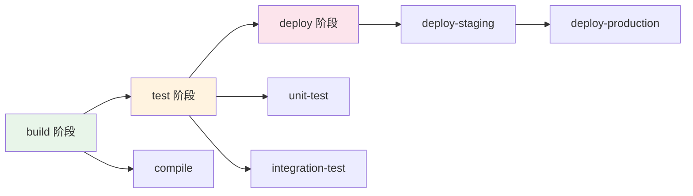

# GitLab CI/CD 配置

## 概念说明

GitLab CI/CD 是 GitLab 内置的持续集成和持续部署工具，通过 `.gitlab-ci.yml` 文件定义流水线。它与 GitLab 深度集成，提供从代码管理到部署的一站式 DevOps 体验。

## 核心原理

### 核心概念

| 概念 | 说明 |
|------|------|
| Pipeline | 流水线，由多个 Stage 组成 |
| Stage | 阶段，同一阶段的 Job 并行执行 |
| Job | 具体的任务，定义执行脚本 |
| Runner | 执行 Job 的代理（Shared/Specific/Group） |
| Artifact | 构建产物，可在 Job 间传递 |
| Cache | 缓存，加速构建（如 Maven 依赖） |

### 流水线执行流程



### Java 项目配置示例

```yaml
# .gitlab-ci.yml
image: maven:3.9-eclipse-temurin-21

variables:
  MAVEN_OPTS: "-Dmaven.repo.local=$CI_PROJECT_DIR/.m2/repository"

cache:
  paths:
    - .m2/repository/

stages:
  - build
  - test
  - docker
  - deploy

compile:
  stage: build
  script:
    - mvn clean compile -DskipTests
  artifacts:
    paths:
      - target/

unit-test:
  stage: test
  script:
    - mvn test
  artifacts:
    reports:
      junit: target/surefire-reports/TEST-*.xml

docker-build:
  stage: docker
  image: docker:24
  services:
    - docker:24-dind
  only:
    - main
  script:
    - docker build -t $CI_REGISTRY_IMAGE:$CI_COMMIT_SHA .
    - docker push $CI_REGISTRY_IMAGE:$CI_COMMIT_SHA

deploy-production:
  stage: deploy
  only:
    - main
  when: manual  # 手动触发
  environment:
    name: production
    url: https://app.example.com
  script:
    - kubectl set image deployment/my-app my-app=$CI_REGISTRY_IMAGE:$CI_COMMIT_SHA
```

### Runner 类型

| 类型 | 说明 | 适用场景 |
|------|------|----------|
| Shared Runner | GitLab 提供的共享执行器 | 小项目/开源 |
| Specific Runner | 项目专用执行器 | 特殊环境需求 |
| Group Runner | 组级别共享 | 团队项目 |

## 常见面试题

### Q1: GitLab CI 的 cache 和 artifact 有什么区别？

**难度**：⭐⭐ | **频率**：🔥🔥

**标准答案**：

Cache 用于加速构建，在同一 Pipeline 或不同 Pipeline 的 Job 间共享（如 Maven 依赖缓存），不保证可用性。Artifact 是构建产物，在同一 Pipeline 的 Job 间传递（如编译产物传给测试阶段），有明确的生命周期和过期时间。Cache 用于依赖缓存，Artifact 用于构建产物传递。

### Q2: GitLab CI 如何实现环境隔离和审批？

**难度**：⭐⭐ | **频率**：🔥🔥

**标准答案**：

通过 `environment` 关键字定义部署环境（staging/production），配合 `when: manual` 实现手动审批。可以在 GitLab 项目设置中为不同环境配置保护规则，限制谁可以触发部署。还可以使用 `rules` 关键字根据分支、标签等条件控制 Job 执行。

## 参考资料

- [GitLab CI/CD 文档](https://docs.gitlab.com/ee/ci/)
