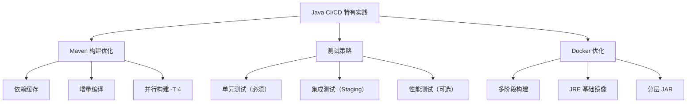

# CI/CD 最佳实践与流水线设计

## 概念说明

良好的 CI/CD 流水线设计能显著提升团队的交付效率和代码质量。本节总结 Java 项目 CI/CD 的最佳实践。

## 核心原理

### 标准流水线设计

### 分支策略与流水线

| 分支 | 触发条件 | 流水线内容 |
|------|----------|-----------|
| feature/* | Push/PR | 编译 + 单元测试 |
| develop | Merge | 编译 + 测试 + 代码扫描 + 部署 Dev |
| release/* | Tag | 编译 + 测试 + 构建镜像 + 部署 Staging |
| main | Merge | 全流程 + 部署 Production |
| hotfix/* | Push | 编译 + 测试 + 快速部署 |

### 核心最佳实践

**1. 快速反馈**
- 流水线总时长控制在 10 分钟以内
- 单元测试并行执行
- 使用缓存加速构建（Maven 依赖、Docker 层缓存）

**2. 制品管理**
- 构建一次，部署多次（同一镜像部署到不同环境）
- 使用语义化版本号标记镜像
- 制品仓库统一管理（Nexus/Harbor）

**3. 环境一致性**
- 使用 Docker 保证构建环境一致
- 配置外部化（环境变量/配置中心）
- Infrastructure as Code（Terraform/Ansible）

**4. 安全实践**
- Secrets 加密存储，不硬编码
- 依赖漏洞扫描（OWASP Dependency Check）
- 镜像安全扫描（Trivy）
- 最小权限原则

### Java 项目特有实践

## 常见面试题

### Q1: 如何设计一个好的 CI/CD 流水线？

**难度**：⭐⭐⭐ | **频率**：🔥🔥🔥

**标准答案**：

好的流水线遵循以下原则：1）快速反馈（10 分钟内完成）；2）构建一次部署多次（同一制品）；3）环境一致性（Docker 化）；4）渐进式验证（单元测试→集成测试→性能测试）；5）安全左移（代码扫描、依赖检查前置）；6）生产部署需要人工审批。标准阶段：编译→测试→代码扫描→构建镜像→部署 Staging→集成测试→审批→部署 Production。

### Q2: CI/CD 中如何处理数据库变更？

**难度**：⭐⭐⭐ | **频率**：🔥🔥

**标准答案**：

使用数据库迁移工具（Flyway/Liquibase）管理 Schema 变更。迁移脚本纳入版本控制，在部署流水线中自动执行。关键原则：只增不删（向后兼容）、先迁移后部署、支持回滚。大表变更使用 Online DDL 或 gh-ost 工具避免锁表。

### Q3: 如何实现零停机部署？

**难度**：⭐⭐⭐ | **频率**：🔥🔥🔥

**标准答案**：

三种方案：1）滚动更新（K8s 默认）：逐步替换旧 Pod，配合健康检查和优雅停机；2）蓝绿部署：同时运行新旧版本，切换流量；3）金丝雀发布：先将少量流量导向新版本，验证后逐步扩大。关键配合：应用支持优雅停机（处理完当前请求再退出）、数据库变更向后兼容、健康检查就绪后才接收流量。

## 参考资料

- [Continuous Delivery - Jez Humble](https://continuousdelivery.com/)
