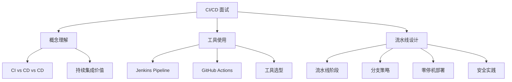

# CI/CD 面试指南

## 面试知识图谱

## 高频面试题汇总

### 🔥🔥🔥 必问题

#### Q1: 什么是 CI/CD？CI 和 CD 的区别？

**标准答案**：

CI（持续集成）：开发者频繁将代码合并到主干，每次合并自动触发编译和测试，快速发现集成问题。CD 有两层含义：持续交付（Continuous Delivery）是自动构建可部署的制品，但部署到生产需要人工审批；持续部署（Continuous Deployment）是自动部署到生产环境，无需人工干预。大多数企业实践的是持续交付。

#### Q2: 如何设计 CI/CD 流水线？

详见 [最佳实践](./04-best-practices.md#常见面试题)

#### Q3: 如何实现零停机部署？

详见 [最佳实践](./04-best-practices.md#常见面试题)

### 🔥🔥 常问题

#### Q4: Jenkins、GitHub Actions、GitLab CI 如何选型？

**标准答案**：

Jenkins：企业级首选，插件丰富，完全自主可控，但运维成本高。GitHub Actions：开源项目和中小团队首选，零运维，与 GitHub 深度集成。GitLab CI：GitLab 用户首选，一站式 DevOps 体验。选型考虑：团队规模、代码托管平台、运维能力、流水线复杂度。

#### Q5: CI/CD 中如何保证安全？

**标准答案**：

安全左移策略：1）代码扫描（SonarQube 静态分析）；2）依赖漏洞扫描（OWASP Dependency Check）；3）镜像安全扫描（Trivy）；4）Secrets 加密管理（不硬编码）；5）最小权限原则（Runner 权限控制）；6）审计日志（记录所有部署操作）。

### 🔥 偶尔问

#### Q6: 如何加速 CI/CD 流水线？

**标准答案**：

1）缓存依赖（Maven/npm 缓存）；2）并行执行（测试并行、矩阵构建）；3）增量构建（只构建变更的模块）；4）Docker 层缓存；5）使用更快的 Runner（SSD、更多 CPU）；6）优化测试（单元测试快速执行，集成测试按需运行）。目标是将流水线控制在 10 分钟以内。

## 面试答题技巧

1. CI/CD 概念题要区分 **CI、持续交付、持续部署** 三个层次
2. 流水线设计要提到 **快速反馈、构建一次部署多次、安全左移**
3. 零停机部署要能说出 **滚动更新、蓝绿、金丝雀** 三种方案
4. 工具选型要结合 **团队规模和实际场景** 回答
