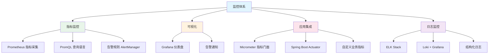

# 监控体系模块概述

## 概念说明

完善的监控体系是保障系统稳定运行的基石。Java 后端监控通常包括**指标监控**（Prometheus + Grafana）、**日志监控**（ELK/Loki）和**链路追踪**（SkyWalking/Zipkin）三大支柱。

## 模块知识图谱

## 推荐学习顺序

| 序号 | 知识点 | 文档 | 建议时间 |
|------|--------|------|----------|
| 1 | Prometheus 指标采集 | [01-prometheus](./01-prometheus.md) | 40min |
| 2 | Grafana 仪表盘 | [02-grafana](./02-grafana.md) | 35min |
| 3 | Micrometer 集成 | [03-micrometer](./03-micrometer.md) | 40min |
| 4 | 日志监控方案 | [04-log-monitoring](./04-log-monitoring.md) | 35min |
| 5 | 面试指南 | [99-interview](./99-interview.md) | 20min |

## 监控三大支柱

| 支柱 | 工具 | 关注点 |
|------|------|--------|
| 指标（Metrics） | Prometheus + Grafana | CPU/内存/QPS/延迟/错误率 |
| 日志（Logging） | ELK / Loki | 错误日志/业务日志/审计日志 |
| 链路追踪（Tracing） | SkyWalking / Zipkin | 请求链路/耗时分析/瓶颈定位 |

## 代码示例

> 💻 完整可运行代码：[code-examples/06-devops/monitoring-examples/](../../../code-examples/06-devops/monitoring-examples/)

## 相关模块

- [Spring Boot Actuator](../../2-framework/2.2-springboot/13-actuator.md) — 应用健康检查与指标暴露
- [Docker 与 K8s](../6.1-docker-k8s/00-index.md) — 容器监控
- [CI/CD](../6.2-cicd/00-index.md) — 部署后的监控
