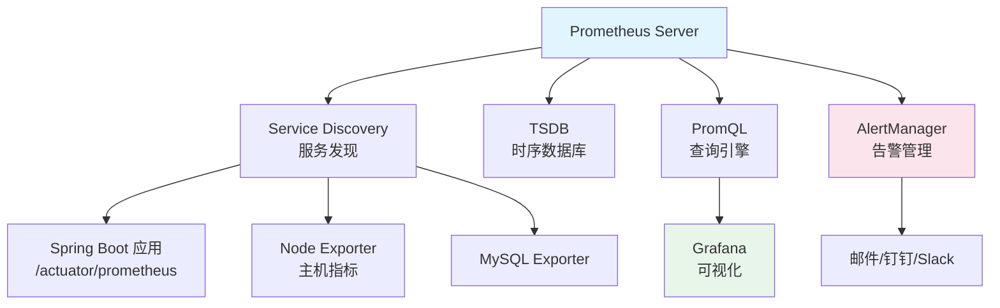

# Prometheus 指标采集与 PromQL

## 概念说明

Prometheus 是一个开源的系统监控和告警工具包，采用**拉取（Pull）模式**从目标服务采集指标数据，使用时序数据库存储，并提供强大的 PromQL 查询语言。

## 核心原理

### Prometheus 架构



### 指标类型

| 类型 | 说明 | 示例 |
|------|------|------|
| Counter | 只增不减的计数器 | 请求总数、错误总数 |
| Gauge | 可增可减的仪表盘 | CPU 使用率、内存使用量 |
| Histogram | 直方图（分桶统计） | 请求延迟分布 |
| Summary | 摘要（分位数统计） | P99 延迟 |

### PromQL 常用查询

```promql
# 查询当前 CPU 使用率
process_cpu_usage

# 查询过去 5 分钟的请求速率（QPS）
rate(http_server_requests_seconds_count[5m])

# 查询 P99 延迟
histogram_quantile(0.99, rate(http_server_requests_seconds_bucket[5m]))

# 查询错误率
sum(rate(http_server_requests_seconds_count{status=~"5.."}[5m]))
/ sum(rate(http_server_requests_seconds_count[5m]))

# 按接口分组的 QPS
sum by (uri) (rate(http_server_requests_seconds_count[5m]))

# JVM 堆内存使用
jvm_memory_used_bytes{area="heap"}
```

### 告警规则

```yaml
# prometheus-rules.yml
groups:
  - name: java-app-alerts
    rules:
      - alert: HighErrorRate
        expr: sum(rate(http_server_requests_seconds_count{status=~"5.."}[5m])) / sum(rate(http_server_requests_seconds_count[5m])) > 0.05
        for: 5m
        labels:
          severity: critical
        annotations:
          summary: "错误率超过 5%"

      - alert: HighLatency
        expr: histogram_quantile(0.99, rate(http_server_requests_seconds_bucket[5m])) > 2
        for: 5m
        labels:
          severity: warning
        annotations:
          summary: "P99 延迟超过 2 秒"
```

### Docker 部署

```yaml
# docker-compose.yml
services:
  prometheus:
    image: prom/prometheus:v2.50.0
    ports:
      - "9090:9090"
    volumes:
      - ./prometheus.yml:/etc/prometheus/prometheus.yml
    command:
      - '--config.file=/etc/prometheus/prometheus.yml'
      - '--storage.tsdb.retention.time=15d'
```

```yaml
# prometheus.yml
global:
  scrape_interval: 15s

scrape_configs:
  - job_name: 'spring-boot-app'
    metrics_path: '/actuator/prometheus'
    static_configs:
      - targets: ['app:8080']
```

## 常见面试题

### Q1: Prometheus 的 Pull 模式和 Push 模式有什么区别？

**难度**：⭐⭐ | **频率**：🔥🔥

**标准答案**：

Pull 模式：Prometheus 主动从目标拉取指标，优点是 Prometheus 控制采集频率，目标服务无需知道 Prometheus 存在，便于服务发现。Push 模式（通过 Pushgateway）：目标主动推送指标，适合短生命周期的 Job（如批处理任务）。Prometheus 默认使用 Pull 模式，Push 模式是补充方案。

### Q2: Prometheus 的四种指标类型分别适用什么场景？

**难度**：⭐⭐ | **频率**：🔥🔥🔥

**标准答案**：

Counter（计数器）：只增不减，适合请求总数、错误总数、处理字节数。Gauge（仪表盘）：可增可减，适合 CPU 使用率、内存使用量、在线用户数。Histogram（直方图）：分桶统计，适合请求延迟分布、响应大小分布，可计算分位数。Summary（摘要）：客户端计算分位数，适合精确的 P99/P95 统计，但不支持聚合。

### Q3: 如何用 PromQL 计算接口的 QPS 和 P99 延迟？

**难度**：⭐⭐⭐ | **频率**：🔥🔥

**标准答案**：

QPS：`rate(http_server_requests_seconds_count[5m])`，rate 函数计算 Counter 的每秒增长率。P99 延迟：`histogram_quantile(0.99, rate(http_server_requests_seconds_bucket[5m]))`，histogram_quantile 从 Histogram 的桶数据计算分位数。

## 参考资料

- [Prometheus 官方文档](https://prometheus.io/docs/)
