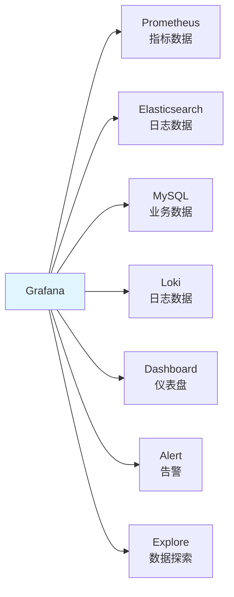
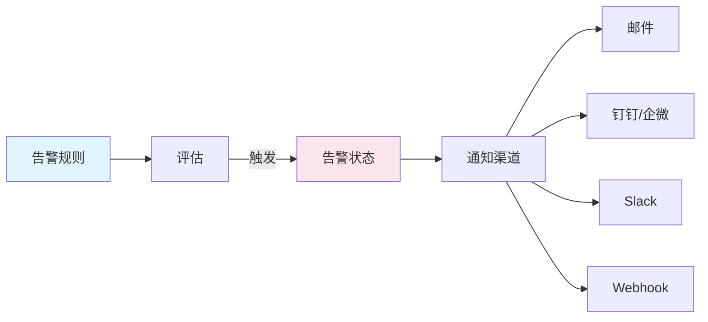

# Grafana 仪表盘与告警配置

## 概念说明

Grafana 是一个开源的数据可视化平台，支持多种数据源（Prometheus、Elasticsearch、MySQL 等），通过丰富的图表类型构建监控仪表盘。

## 核心原理

### Grafana 架构



### Java 应用监控仪表盘

推荐的 Java 应用监控面板包含以下指标：

| 分类 | 指标 | PromQL |
|------|------|--------|
| 应用层 | QPS | `rate(http_server_requests_seconds_count[5m])` |
| 应用层 | P99 延迟 | `histogram_quantile(0.99, ...)` |
| 应用层 | 错误率 | `rate(errors[5m]) / rate(total[5m])` |
| JVM | 堆内存 | `jvm_memory_used_bytes{area="heap"}` |
| JVM | GC 次数 | `rate(jvm_gc_pause_seconds_count[5m])` |
| JVM | 线程数 | `jvm_threads_live_threads` |
| 系统 | CPU 使用率 | `process_cpu_usage` |
| 连接池 | 活跃连接 | `hikaricp_connections_active` |

### 告警配置



### Docker 部署

```yaml
services:
  grafana:
    image: grafana/grafana:10.3.0
    ports:
      - "3000:3000"
    environment:
      - GF_SECURITY_ADMIN_PASSWORD=admin
    volumes:
      - grafana-data:/var/lib/grafana
```

## 常见面试题

### Q1: 如何设计 Java 应用的监控仪表盘？

**难度**：⭐⭐ | **频率**：🔥🔥

**标准答案**：

分层设计：1）应用层：QPS、P99/P95 延迟、错误率、接口 Top N；2）JVM 层：堆内存使用、GC 频率和耗时、线程数、类加载数；3）中间件层：数据库连接池、Redis 连接、消息队列积压；4）系统层：CPU、内存、磁盘、网络。推荐使用 Grafana 社区的 Spring Boot 仪表盘模板（ID: 12900）。

### Q2: Grafana 告警如何配置？

**难度**：⭐⭐ | **频率**：🔥

**标准答案**：

Grafana 8+ 使用统一告警（Unified Alerting）：1）创建告警规则，定义 PromQL 查询和阈值；2）设置评估间隔和持续时间（避免瞬时波动触发）；3）配置通知渠道（邮件/钉钉/Webhook）；4）设置告警分组和静默规则。也可以使用 Prometheus AlertManager 管理告警，Grafana 只做可视化。

## 参考资料

- [Grafana 官方文档](https://grafana.com/docs/grafana/latest/)
