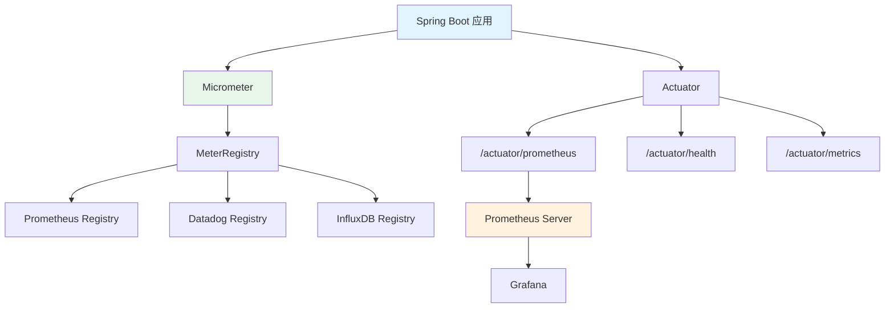

# Micrometer 与 Spring Boot Actuator

## 概念说明

Micrometer 是 Java 应用的**指标门面（Metrics Facade）**，类似于 SLF4J 之于日志。它提供统一的指标 API，支持多种监控系统后端（Prometheus、Datadog、InfluxDB 等）。Spring Boot Actuator 内置了 Micrometer 集成。

## 核心原理

### 集成架构



### 依赖配置

```xml
<dependency>
    <groupId>org.springframework.boot</groupId>
    <artifactId>spring-boot-starter-actuator</artifactId>
</dependency>
<dependency>
    <groupId>io.micrometer</groupId>
    <artifactId>micrometer-registry-prometheus</artifactId>
</dependency>
```

```yaml
# application.yml
management:
  endpoints:
    web:
      exposure:
        include: health,info,prometheus,metrics
  metrics:
    tags:
      application: ${spring.application.name}
```

### 自定义业务指标

```java
@Service
public class OrderService {

    private final Counter orderCounter;
    private final Timer orderTimer;
    private final AtomicInteger activeOrders;

    public OrderService(MeterRegistry registry) {
        // Counter — 订单总数
        this.orderCounter = Counter.builder("order.created.total")
            .description("创建订单总数")
            .tag("type", "normal")
            .register(registry);

        // Timer — 订单处理耗时
        this.orderTimer = Timer.builder("order.process.duration")
            .description("订单处理耗时")
            .publishPercentiles(0.5, 0.95, 0.99)
            .register(registry);

        // Gauge — 当前活跃订单数
        this.activeOrders = new AtomicInteger(0);
        Gauge.builder("order.active.count", activeOrders, AtomicInteger::get)
            .description("当前活跃订单数")
            .register(registry);
    }

    public Order createOrder(OrderRequest request) {
        return orderTimer.record(() -> {
            orderCounter.increment();
            activeOrders.incrementAndGet();
            try {
                // 业务逻辑
                return processOrder(request);
            } finally {
                activeOrders.decrementAndGet();
            }
        });
    }
}
```

### Micrometer 指标类型

| 类型 | Micrometer API | Prometheus 类型 | 用途 |
|------|---------------|----------------|------|
| Counter | `Counter.builder()` | counter | 累计计数 |
| Gauge | `Gauge.builder()` | gauge | 当前值 |
| Timer | `Timer.builder()` | histogram | 耗时统计 |
| DistributionSummary | `DistributionSummary.builder()` | histogram | 值分布 |

### 自动采集的指标

Spring Boot Actuator + Micrometer 自动采集：

| 分类 | 指标前缀 | 说明 |
|------|----------|------|
| JVM | `jvm_memory_*` | 内存使用 |
| JVM | `jvm_gc_*` | GC 统计 |
| JVM | `jvm_threads_*` | 线程统计 |
| HTTP | `http_server_requests_*` | HTTP 请求统计 |
| 数据库 | `hikaricp_*` | 连接池统计 |
| 缓存 | `cache_*` | 缓存命中率 |
| 系统 | `process_cpu_*` | CPU 使用 |
| 系统 | `system_cpu_*` | 系统 CPU |

## 代码示例

```java
// Micrometer 指标概念演示
public static void micrometerDemo() {
    System.out.println("=== Micrometer 指标门面 ===");
    System.out.println("Counter: 只增计数器（请求数、错误数）");
    System.out.println("Gauge:   当前值（活跃连接、队列大小）");
    System.out.println("Timer:   耗时统计（接口延迟、处理时间）");
    System.out.println("Summary: 值分布（响应大小、批处理数量）");
}
```

> 💻 完整可运行代码：[MonitoringDemo.java](https://github.com/skyhe58/guide-java/tree/main/code-examples/06-devops/monitoring-examples/src/main/java/com/example/monitoring/MonitoringDemo.java)
> <!-- 本地路径：code-examples/06-devops/monitoring-examples/src/main/java/com/example/monitoring/MonitoringDemo.java -->

## 常见面试题

### Q1: Micrometer 和 Prometheus 是什么关系？

**难度**：⭐⭐ | **频率**：🔥🔥

**标准答案**：

Micrometer 是 Java 应用的指标门面（类似 SLF4J），提供统一的指标 API。Prometheus 是监控系统，负责采集和存储指标。Micrometer 通过 `micrometer-registry-prometheus` 将指标转换为 Prometheus 格式暴露在 `/actuator/prometheus` 端点。Micrometer 还支持其他后端（Datadog、InfluxDB 等），切换后端只需更换 Registry 依赖。

### Q2: 如何在 Spring Boot 中自定义业务指标？

**难度**：⭐⭐ | **频率**：🔥🔥🔥

**标准答案**：

注入 `MeterRegistry`，使用 Micrometer API 创建指标。Counter 用于计数（如订单数）、Timer 用于耗时统计（如接口延迟）、Gauge 用于当前值（如队列大小）。通过 `tag` 添加维度标签，便于按维度聚合查询。也可以使用 `@Timed` 注解自动统计方法耗时。

### Q3: Spring Boot Actuator 暴露了哪些监控端点？如何保证安全？

**难度**：⭐⭐ | **频率**：🔥🔥

**标准答案**：

常用端点：`/health`（健康检查）、`/metrics`（指标列表）、`/prometheus`（Prometheus 格式指标）、`/info`（应用信息）、`/env`（环境变量）。安全措施：1）只暴露必要的端点（`management.endpoints.web.exposure.include`）；2）使用独立端口（`management.server.port`）；3）配合 Spring Security 做认证；4）生产环境禁止暴露 `/env`、`/configprops` 等敏感端点。

## 参考资料

- [Micrometer 官方文档](https://micrometer.io/docs)
- [Spring Boot Actuator](https://docs.spring.io/spring-boot/docs/current/reference/html/actuator.html)
