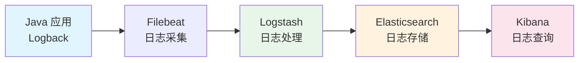
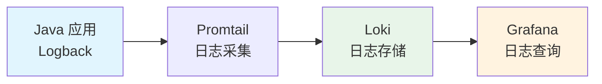

# ELK/Loki 日志监控方案

## 概念说明

日志监控是可观测性三大支柱之一。ELK Stack（Elasticsearch + Logstash + Kibana）和 Grafana Loki 是两种主流的日志监控方案。

## 核心原理

### ELK Stack 架构



### Grafana Loki 架构



### ELK vs Loki

| 维度 | ELK Stack | Grafana Loki |
|------|-----------|-------------|
| 索引方式 | 全文索引 | 只索引标签 |
| 存储成本 | 高（全文索引） | 低（压缩存储） |
| 查询能力 | 强（全文搜索） | 中等（标签+正则） |
| 运维复杂度 | 高 | 低 |
| 与 Grafana 集成 | 需要 Kibana | 原生集成 |
| 适用场景 | 大规模日志分析 | 中小规模/已用 Grafana |

### 结构化日志

```java
// 使用 JSON 格式输出日志（便于 ELK 解析）
// logback-spring.xml
<appender name="JSON" class="ch.qos.logback.core.ConsoleAppender">
    <encoder class="net.logstash.logback.encoder.LogstashEncoder">
        <customFields>{"app":"my-service"}</customFields>
    </encoder>
</appender>

// 输出示例:
// {"@timestamp":"2024-01-15T10:30:00","level":"INFO","logger":"OrderService",
//  "message":"订单创建成功","orderId":"ORD001","userId":"U001","app":"my-service"}
```

### MDC 链路追踪

```java
// 在日志中添加 TraceId，便于追踪请求链路
@Component
public class TraceFilter implements Filter {
    @Override
    public void doFilter(ServletRequest req, ServletResponse resp, FilterChain chain) {
        String traceId = UUID.randomUUID().toString().replace("-", "");
        MDC.put("traceId", traceId);
        try {
            chain.doFilter(req, resp);
        } finally {
            MDC.clear();
        }
    }
}

// logback 配置: %X{traceId}
// 输出: 2024-01-15 10:30:00 [traceId=abc123] INFO OrderService - 订单创建成功
```

## 常见面试题

### Q1: ELK 和 Loki 如何选择？

**难度**：⭐⭐ | **频率**：🔥🔥

**标准答案**：

ELK 适合大规模日志分析场景，全文索引查询能力强，但存储成本高、运维复杂。Loki 适合中小规模场景，只索引标签不索引内容，存储成本低，与 Grafana 原生集成。如果团队已经使用 Prometheus + Grafana，推荐 Loki（统一监控平台）；如果需要强大的日志搜索和分析能力，选择 ELK。

### Q2: 如何实现分布式日志追踪？

**难度**：⭐⭐⭐ | **频率**：🔥🔥🔥

**标准答案**：

通过 TraceId 串联请求链路：1）入口服务生成 TraceId，放入 MDC；2）服务间调用时通过 HTTP Header 传递 TraceId；3）日志格式中包含 TraceId；4）在 ELK/Loki 中按 TraceId 搜索即可查看完整链路。Spring Cloud Sleuth / Micrometer Tracing 可以自动完成 TraceId 的生成和传递。

### Q3: 日志级别如何设计？生产环境用什么级别？

**难度**：⭐⭐ | **频率**：🔥🔥

**标准答案**：

日志级别：TRACE < DEBUG < INFO < WARN < ERROR。生产环境默认 INFO 级别，关键业务模块可以设为 DEBUG（通过配置中心动态调整）。ERROR 用于需要立即处理的异常，WARN 用于可恢复的异常，INFO 用于关键业务流程，DEBUG 用于调试信息。避免在循环中打印日志，避免日志中包含敏感信息。

## 参考资料

- [Grafana Loki 文档](https://grafana.com/docs/loki/latest/)
