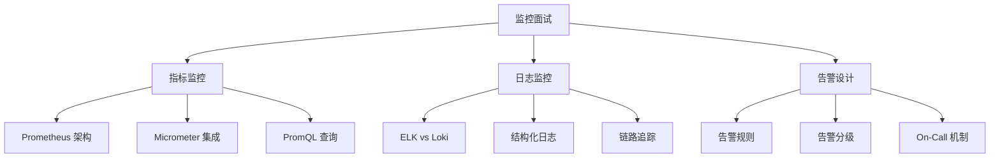

# 监控体系面试指南

## 面试知识图谱

## 高频面试题汇总

### 🔥🔥🔥 必问题

#### Q1: 你们项目的监控体系是怎么搭建的？

**标准答案**：

三大支柱：1）指标监控：Spring Boot Actuator + Micrometer 暴露指标，Prometheus 采集，Grafana 可视化。监控 QPS、P99 延迟、错误率、JVM 内存、GC、连接池等。2）日志监控：Logback 输出 JSON 格式日志，Filebeat 采集，ELK/Loki 存储和查询。通过 MDC 添加 TraceId 实现链路追踪。3）告警：Prometheus AlertManager 配置告警规则，通过钉钉/邮件通知。关键告警：错误率 > 5%、P99 > 2s、JVM 内存 > 80%。

#### Q2: 如何定位线上接口慢的问题？

**标准答案**：

分层排查：1）Grafana 看接口 P99 延迟趋势，确认是否全局性问题；2）按接口维度看 QPS 和延迟，定位具体慢接口；3）查看 JVM 指标（GC 频率、线程数）排除 JVM 问题；4）查看中间件指标（数据库连接池、Redis 延迟）排除依赖问题；5）通过 TraceId 查看具体请求的链路日志，定位耗时环节；6）如果是数据库慢查询，查看慢查询日志和 EXPLAIN。

#### Q3: Prometheus 的指标类型和 PromQL？

详见 [Prometheus](./01-prometheus.md#常见面试题)

### 🔥🔥 常问题

#### Q4: 如何设计告警规则？避免告警风暴？

**标准答案**：

告警分级：P0（立即处理：服务不可用）、P1（尽快处理：错误率高）、P2（工作时间处理：性能下降）。避免告警风暴：1）设置合理的持续时间（for: 5m），避免瞬时波动触发；2）告警分组（按服务/团队）；3）告警抑制（高级别告警抑制低级别）；4）告警静默（维护窗口期）。

#### Q5: 如何自定义业务指标？

详见 [Micrometer](./03-micrometer.md#常见面试题)

### 🔥 偶尔问

#### Q6: 可观测性（Observability）的三大支柱是什么？

**标准答案**：

指标（Metrics）：量化的数值数据，如 QPS、延迟、错误率，用于发现问题。日志（Logging）：离散的事件记录，用于定位问题。链路追踪（Tracing）：请求在分布式系统中的完整路径，用于分析问题。三者互补：指标发现异常 → 链路追踪定位服务 → 日志查看详情。

## 面试答题技巧

1. 监控体系要从 **指标、日志、链路追踪** 三个维度回答
2. 线上问题排查要展示 **分层排查** 的思路
3. 提到 Micrometer 时强调它是 **指标门面**（类似 SLF4J）
4. 告警设计要提到 **分级、分组、抑制、静默** 四个机制
