# Linux 运维基础模块概述

## 概念说明

Linux 是 Java 后端开发者必须掌握的操作系统。无论是日常开发、线上问题排查还是面试，Linux 命令和运维知识都是高频考点。本模块聚焦于 Java 开发者最常用的 Linux 技能：常用命令、Shell 脚本、性能排查、日志分析和 JVM 线上问题排查。

## 模块知识图谱

```mermaid
graph TD
    A["Linux 运维基础"] --> B["常用命令速查"]
    A --> C["Shell 脚本基础"]
    A --> D["性能排查工具"]
    A --> E["日志分析"]
    A --> F["JVM 线上问题排查"]

    B --> B1["文件操作 ls/cp/mv/find"]
    B --> B2["进程管理 ps/top/kill"]
    B --> B3["网络诊断 netstat/ss/curl"]
    B --> B4["磁盘管理 df/du/lsblk"]
    B --> B5["用户权限 chmod/chown"]

    C --> C1["变量/条件/循环"]
    C --> C2["函数/参数处理"]
    C --> C3["常用脚本模板"]

    D --> D1["top / htop"]
    D --> D2["vmstat / iostat"]
    D --> D3["netstat / ss"]
    D --> D4["sar 综合监控"]

    E --> E1["grep / awk / sed"]
    E --> E2["日志切割 logrotate"]
    E --> E3["常用日志分析组合"]

    F --> F1["CPU 飙高排查"]
    F --> F2["OOM 排查"]
    F --> F3["线程死锁排查"]
    F --> F4["Arthas 诊断"]

    style A fill:#e1f5fe
    style B fill:#e8f5e9
    style C fill:#fff3e0
    style D fill:#fce4ec
    style E fill:#f3e5f5
    style F fill:#e0f2f1
```

## 推荐学习顺序

| 序号 | 知识点 | 文档 | 建议时间 |
|------|--------|------|----------|
| 1 | 常用命令速查 | [01-commands](./01-commands.md) | 45min |
| 2 | Shell 脚本基础 | [02-shell](./02-shell.md) | 45min |
| 3 | 性能排查工具 | [03-performance](./03-performance.md) | 45min |
| 4 | 日志分析 | [04-log-analysis](./04-log-analysis.md) | 30min |
| 5 | JVM 线上问题排查 | [05-jvm-troubleshooting](./05-jvm-troubleshooting.md) | 60min |
| 6 | Linux 面试指南 | [99-interview](./99-interview.md) | 30min |

## 说明

本模块无独立代码子模块，Shell 脚本示例内嵌在文档中。JVM 排查部分与 [JVM 模块](../../1-java-core/1.4-jvm/06-diagnostic.md) 呼应，侧重从 Linux 命令行角度进行排查。

## 相关模块

- [JVM 深入](../../1-java-core/1.4-jvm/06-diagnostic.md) — JVM 诊断工具详解
- [Docker 与 K8s](../6.1-docker-k8s/) — 容器化环境下的运维
- [监控体系](../6.3-monitoring/) — Prometheus/Grafana 监控方案
