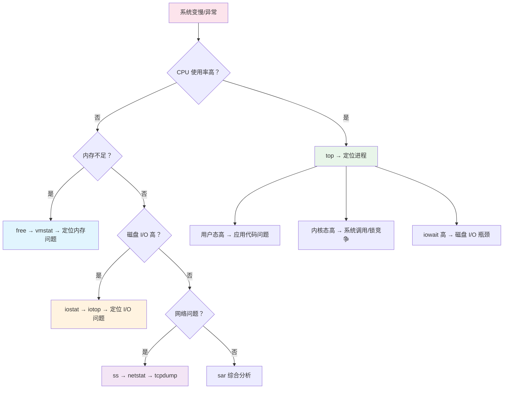
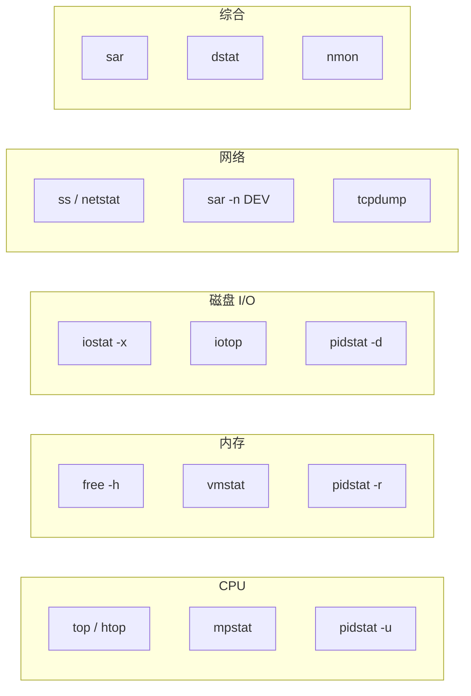

# 性能排查工具

## 概念说明

Linux 提供了丰富的性能排查工具，覆盖 CPU、内存、磁盘 I/O 和网络四大维度。掌握这些工具是定位线上性能问题的基础。

## 核心原理

### 一、性能排查思路



### 二、top — CPU 和进程监控

```bash
top
```

#### top 输出解读

```
top - 14:30:00 up 30 days, 3:20, 2 users, load average: 2.50, 1.80, 1.20
Tasks: 200 total,   2 running, 198 sleeping,   0 stopped,   0 zombie
%Cpu(s): 45.2 us,  5.3 sy,  0.0 ni, 48.5 id,  0.8 wa,  0.0 hi,  0.2 si,  0.0 st
MiB Mem :  16384.0 total,   2048.0 free,  12288.0 used,   2048.0 buff/cache
MiB Swap:   4096.0 total,   3800.0 free,    296.0 used.   3584.0 avail Mem

  PID USER      PR  NI    VIRT    RES    SHR S  %CPU %MEM     TIME+ COMMAND
 1234 appuser   20   0 8192000 4096000  12000 S  85.0 25.0  120:30.50 java
 5678 mysql     20   0 2048000 1024000   8000 S  10.0  6.3   45:20.10 mysqld
```

| 字段 | 含义 | 关注点 |
|------|------|--------|
| `load average` | 1/5/15 分钟平均负载 | 超过 CPU 核心数说明过载 |
| `us` | 用户态 CPU | 高 → 应用代码消耗 CPU |
| `sy` | 内核态 CPU | 高 → 系统调用频繁/锁竞争 |
| `wa` | I/O 等待 | 高 → 磁盘 I/O 瓶颈 |
| `id` | 空闲 | 低 → CPU 繁忙 |
| `RES` | 进程实际使用内存 | 关注 Java 进程的内存占用 |
| `%CPU` | 进程 CPU 使用率 | 定位 CPU 消耗最高的进程 |

#### top 常用快捷键

```bash
# 在 top 界面中：
P    # 按 CPU 排序
M    # 按内存排序
1    # 显示每个 CPU 核心的使用率
H    # 显示线程（对应 Java 线程）
c    # 显示完整命令行
q    # 退出
```

### 三、vmstat — 虚拟内存统计

```bash
vmstat 1 5    # 每秒刷新，共 5 次
```

#### vmstat 输出解读

```
procs -----------memory---------- ---swap-- -----io---- -system-- ------cpu-----
 r  b   swpd   free   buff  cache   si   so    bi    bo   in   cs us sy id wa st
 2  0  29696 184064 341264 3941692    0    0     0    16  500 1200 45  5 49  1  0
```

| 字段 | 含义 | 关注点 |
|------|------|--------|
| `r` | 运行队列中的进程数 | 大于 CPU 核心数说明 CPU 不够用 |
| `b` | 不可中断睡眠的进程数 | 大于 0 通常是 I/O 等待 |
| `swpd` | 使用的 swap 大小 | 大于 0 说明内存不足 |
| `si/so` | swap in/out | 频繁交换说明内存严重不足 |
| `bi/bo` | 块设备读/写（块/秒） | 高 → 磁盘 I/O 繁忙 |
| `in` | 每秒中断数 | — |
| `cs` | 每秒上下文切换数 | 过高说明线程竞争激烈 |
| `us/sy/id/wa` | CPU 使用率分布 | 同 top |

### 四、iostat — 磁盘 I/O 统计

```bash
iostat -x 1 5    # 扩展模式，每秒刷新，共 5 次
```

#### iostat 输出解读

```
Device  r/s    w/s   rkB/s   wkB/s  rrqm/s  wrqm/s  %rrqm  %wrqm  r_await  w_await  aqu-sz  rareq-sz  wareq-sz  svctm  %util
sda     5.00  50.00  20.00  400.00    0.00   10.00   0.00   16.67    1.00     5.00    0.25     4.00      8.00    0.50   2.75
```

| 字段 | 含义 | 关注点 |
|------|------|--------|
| `r/s` / `w/s` | 每秒读/写次数 | I/O 请求频率 |
| `rkB/s` / `wkB/s` | 每秒读/写 KB | I/O 吞吐量 |
| `r_await` / `w_await` | 读/写平均等待时间（ms） | 超过 10ms 需关注 |
| `%util` | 设备利用率 | 接近 100% 说明磁盘饱和 |

### 五、netstat / ss — 网络连接

```bash
# ss 比 netstat 更快（推荐）
ss -tlnp                          # 查看 TCP 监听端口
ss -ant                           # 查看所有 TCP 连接
ss -s                             # 连接统计摘要

# 统计 TCP 连接状态分布
ss -ant | awk '{print $1}' | sort | uniq -c | sort -rn
```

#### TCP 连接状态说明

| 状态 | 说明 | 关注点 |
|------|------|--------|
| `ESTABLISHED` | 已建立连接 | 正常，数量过多可能是连接泄漏 |
| `TIME_WAIT` | 等待关闭 | 大量 TIME_WAIT 说明短连接过多 |
| `CLOSE_WAIT` | 等待关闭 | 大量 CLOSE_WAIT 说明应用没有正确关闭连接 |
| `SYN_SENT` | 发送 SYN 等待响应 | 大量说明对端不可达 |
| `LISTEN` | 监听中 | 正常 |

### 六、sar — 综合系统活动报告

```bash
# CPU 使用率（每秒，共 5 次）
sar -u 1 5

# 内存使用率
sar -r 1 5

# 磁盘 I/O
sar -d 1 5

# 网络流量
sar -n DEV 1 5

# 查看历史数据（昨天的 CPU 使用率）
sar -u -f /var/log/sa/sa$(date -d yesterday +%d)
```

### 七、排查工具速查表



## 常见面试题

### Q1: 线上服务器 CPU 使用率很高，如何排查？

**难度**：⭐⭐⭐ | **频率**：🔥🔥🔥

**标准答案**：

```bash
# 1. top 查看 CPU 使用率最高的进程
top -c

# 2. 确认是用户态(us)高还是内核态(sy)高还是 iowait(wa)高
#    us 高 → 应用代码问题
#    sy 高 → 系统调用/锁竞争
#    wa 高 → 磁盘 I/O 瓶颈

# 3. 如果是 Java 进程，进一步排查（见 JVM 排查章节）
#    top -Hp <pid>  查看线程级 CPU
#    jstack <pid>   查看线程堆栈
```

详见 [JVM 线上问题排查](./05-jvm-troubleshooting.md)

### Q2: 如何判断系统内存是否不足？

**难度**：⭐⭐ | **频率**：🔥🔥

**标准答案**：

```bash
# 1. free -h 查看内存
free -h
# 关注 available 列（可用内存），而不是 free 列
# Linux 会把空闲内存用作 buff/cache，available 才是真正可用的

# 2. vmstat 查看 swap 使用
vmstat 1 5
# si/so 频繁交换说明内存严重不足

# 3. 查看 OOM Killer 日志
dmesg | grep -i "out of memory"
```

## 参考资料

- [Linux Performance Analysis in 60 Seconds](https://netflixtechblog.com/linux-performance-analysis-in-60-000-milliseconds-accc10403c55)
- [Brendan Gregg's Linux Performance Tools](https://www.brendangregg.com/linuxperf.html)
