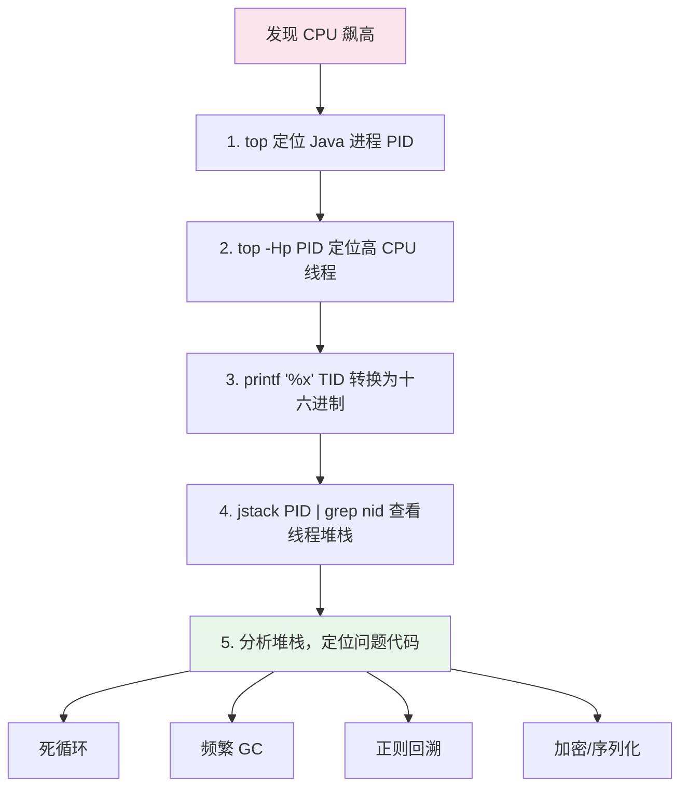
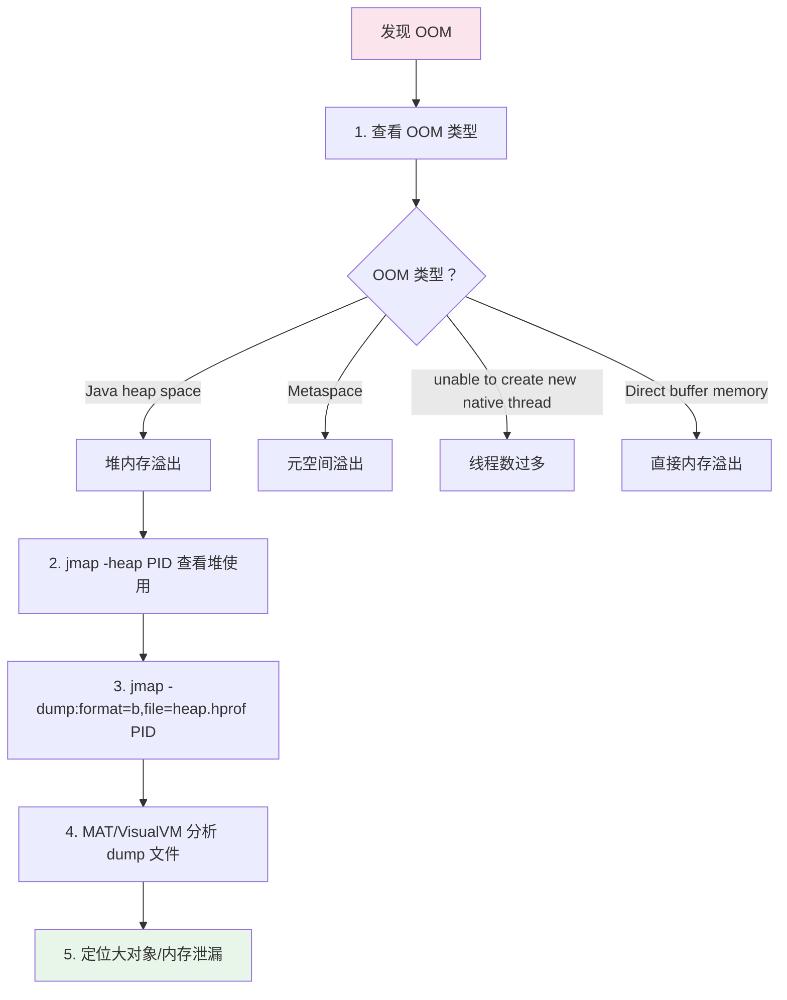
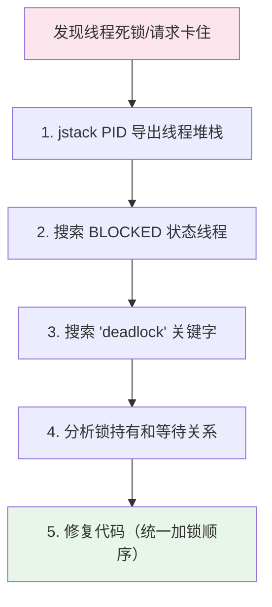
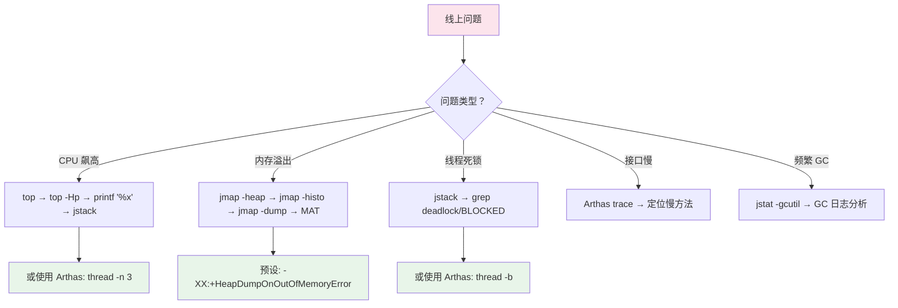

# JVM 线上问题排查

## 概念说明

JVM 线上问题排查是 Java 后端面试的高频考点，也是日常工作中的必备技能。本文从 Linux 命令行角度，给出 CPU 飙高、OOM、线程死锁三大场景的完整排查流程，并介绍 Arthas 诊断工具。

## 核心原理

### 一、CPU 飙高排查流程

这是面试最高频的排查场景，必须熟练掌握完整命令序列。



#### 完整命令序列

```bash
# 第一步：top 找到 CPU 最高的 Java 进程
top -c
# 假设找到 PID = 12345

# 第二步：查看该进程中 CPU 最高的线程
top -Hp 12345
# 假设找到线程 TID = 12378

# 第三步：将线程 ID 转换为十六进制
printf '%x\n' 12378
# 输出：305a

# 第四步：jstack 导出线程堆栈，搜索该线程
jstack 12345 | grep '0x305a' -A 30
# 或者导出到文件分析
jstack 12345 > /tmp/thread_dump.txt
grep '0x305a' -A 30 /tmp/thread_dump.txt
```

#### 输出示例

```
"http-nio-8080-exec-1" #25 daemon prio=5 os_prio=0 tid=0x00007f... nid=0x305a runnable [0x00007f...]
   java.lang.Thread.State: RUNNABLE
        at com.example.service.OrderService.calculatePrice(OrderService.java:85)
        at com.example.controller.OrderController.createOrder(OrderController.java:42)
        ...
```

**常见原因**：
- 死循环或无限递归
- 频繁 Full GC（用 `jstat -gcutil PID 1000` 确认）
- 正则表达式回溯（灾难性回溯）
- 大量加密/序列化操作

### 二、OOM（内存溢出）排查流程



#### 完整命令序列

```bash
# 第一步：确认 OOM 类型
# 查看应用日志
grep "OutOfMemoryError" app.log
# 或查看系统日志
dmesg | grep -i "out of memory"

# 第二步：查看堆内存使用情况
jmap -heap 12345

# 第三步：查看对象统计（哪些对象占用最多内存）
jmap -histo 12345 | head -20
# 或只看存活对象（会触发 Full GC）
jmap -histo:live 12345 | head -20

# 第四步：导出堆转储文件
jmap -dump:format=b,file=/tmp/heap.hprof 12345
# 注意：dump 文件可能很大，确保磁盘空间足够

# 第五步：使用 MAT（Memory Analyzer Tool）分析
# 下载 MAT：https://www.eclipse.org/mat/
# 打开 heap.hprof，查看 Leak Suspects Report

# 推荐：JVM 启动参数中预设 OOM 自动 dump
# -XX:+HeapDumpOnOutOfMemoryError
# -XX:HeapDumpPath=/opt/app/logs/
```

#### 使用 jstat 监控 GC

```bash
# 每秒输出 GC 统计
jstat -gcutil 12345 1000

# 输出示例：
#   S0     S1     E      O      M     CCS    YGC     YGCT    FGC    FGCT     GCT
#   0.00  45.23  78.56  92.34  95.12  91.45   150    2.345    12    8.567   10.912

# 关注点：
# O（Old 区使用率）持续接近 100% → 可能内存泄漏
# FGC（Full GC 次数）频繁增长 → 内存不足
# FGCT（Full GC 总耗时）过长 → GC 参数需要调优
```

#### 常见 OOM 类型和原因

| OOM 类型 | 常见原因 | 解决方案 |
|----------|---------|---------|
| Java heap space | 大对象、内存泄漏、堆太小 | 增大堆/修复泄漏 |
| Metaspace | 动态生成类过多（CGLIB/反射） | 增大 Metaspace |
| unable to create new native thread | 线程数超过系统限制 | 减少线程/调大 ulimit |
| Direct buffer memory | NIO 直接内存不足 | 增大 MaxDirectMemorySize |
| GC overhead limit exceeded | GC 耗时超过 98% 但回收不到 2% 内存 | 同 heap space |

### 三、线程死锁排查流程



#### 完整命令序列

```bash
# 第一步：导出线程堆栈
jstack 12345 > /tmp/thread_dump.txt

# 第二步：搜索死锁信息（jstack 会自动检测死锁）
grep -A 20 "Found one Java-level deadlock" /tmp/thread_dump.txt

# 第三步：搜索 BLOCKED 状态的线程
grep -A 10 "BLOCKED" /tmp/thread_dump.txt

# 第四步：统计线程状态分布
grep "java.lang.Thread.State" /tmp/thread_dump.txt | sort | uniq -c | sort -rn
# 输出示例：
#  150 java.lang.Thread.State: WAITING (parking)
#   50 java.lang.Thread.State: RUNNABLE
#   20 java.lang.Thread.State: TIMED_WAITING (sleeping)
#    5 java.lang.Thread.State: BLOCKED (on object monitor)
```

#### jstack 死锁输出示例

```
Found one Java-level deadlock:
=============================
"Thread-1":
  waiting to lock monitor 0x00007f... (object 0x00000..., a java.lang.Object),
  which is held by "Thread-2"
"Thread-2":
  waiting to lock monitor 0x00007f... (object 0x00000..., a java.lang.Object),
  which is held by "Thread-1"

Java stack information for the threads listed above:
===================================================
"Thread-1":
        at com.example.DeadlockDemo.method1(DeadlockDemo.java:20)
        - waiting to lock <0x00000...> (a java.lang.Object)
        - locked <0x00000...> (a java.lang.Object)
"Thread-2":
        at com.example.DeadlockDemo.method2(DeadlockDemo.java:30)
        - waiting to lock <0x00000...> (a java.lang.Object)
        - locked <0x00000...> (a java.lang.Object)
```

### 四、Arthas 常用命令

[Arthas](https://arthas.aliyun.com/) 是阿里开源的 Java 诊断工具，无需重启应用即可在线诊断。

```bash
# 安装和启动
curl -O https://arthas.aliyun.com/arthas-boot.jar
java -jar arthas-boot.jar
# 选择要 attach 的 Java 进程
```

#### 常用命令速查

```bash
# ===== 基础信息 =====
dashboard                          # 实时面板（CPU、内存、线程、GC）
jvm                                # JVM 信息
sysenv                             # 系统环境变量
sysprop                            # 系统属性

# ===== 线程排查 =====
thread                             # 所有线程信息
thread -n 3                        # CPU 使用率 Top 3 的线程
thread -b                          # 查找死锁线程
thread <id>                        # 查看指定线程堆栈

# ===== 方法监控 =====
watch com.example.OrderService createOrder returnObj
# 监控方法返回值

watch com.example.OrderService createOrder '{params, returnObj, throwExp}' -x 2
# 监控参数、返回值、异常

trace com.example.OrderService createOrder
# 方法调用链路追踪（含耗时）

monitor com.example.OrderService createOrder -c 5
# 方法调用统计（每 5 秒）

# ===== 类和方法 =====
sc com.example.OrderService        # 搜索类
sm com.example.OrderService        # 搜索方法
jad com.example.OrderService       # 反编译类

# ===== 热修复（慎用）=====
redefine /tmp/OrderService.class   # 热替换类文件

# ===== 退出 =====
quit                               # 退出 Arthas（不影响应用）
stop                               # 停止 Arthas 并 detach
```

#### Arthas 排查 CPU 飙高

```bash
# 进入 Arthas 后
thread -n 3
# 直接显示 CPU 使用率最高的 3 个线程及其堆栈
# 比 top + jstack 的方式更方便
```

### 五、排查流程总结



## 常见面试题

### Q1: 线上 Java 应用 CPU 飙高，如何排查？

**难度**：⭐⭐⭐ | **频率**：🔥🔥🔥

**答题思路**：

1. 说出完整的命令序列
2. 解释每一步的作用
3. 列举常见原因

**标准答案**：

四步排查法：1）`top -c` 找到 CPU 最高的 Java 进程 PID；2）`top -Hp PID` 找到 CPU 最高的线程 TID；3）`printf '%x' TID` 将线程 ID 转为十六进制；4）`jstack PID | grep nid=0x十六进制TID -A 30` 查看该线程的堆栈，定位问题代码。常见原因包括死循环、频繁 Full GC、正则回溯、大量计算。也可以用 Arthas 的 `thread -n 3` 命令一步到位。

**深入追问**：

- 如果是频繁 GC 导致的 CPU 高怎么办？（jstat -gcutil 确认，分析 GC 日志）
- 如何区分用户态和内核态 CPU 高？（top 看 us 和 sy）
- 线上不方便用 jstack 怎么办？（Arthas 或 `kill -3 PID` 输出到标准错误）

**易错点**：

- 忘记将线程 ID 转为十六进制（jstack 中的 nid 是十六进制）
- 只说了 top 没说 `top -Hp` 查看线程级别

### Q2: 线上 Java 应用发生 OOM，如何排查？

**难度**：⭐⭐⭐ | **频率**：🔥🔥🔥

**标准答案**：

首先确认 OOM 类型（heap space/Metaspace/native thread）。对于堆内存溢出：1）`jmap -heap PID` 查看堆使用情况；2）`jmap -histo PID | head -20` 查看占用最多的对象；3）`jmap -dump:format=b,file=heap.hprof PID` 导出堆转储；4）用 MAT 分析 dump 文件，查看 Leak Suspects。最佳实践是在 JVM 启动参数中预设 `-XX:+HeapDumpOnOutOfMemoryError -XX:HeapDumpPath=/opt/app/logs/`，OOM 时自动生成 dump 文件。

### Q3: 如何排查线程死锁？

**难度**：⭐⭐⭐ | **频率**：🔥🔥

**标准答案**：

`jstack PID` 导出线程堆栈，jstack 会自动检测死锁并在输出末尾显示 "Found one Java-level deadlock" 信息，包括死锁线程、持有的锁和等待的锁。也可以用 Arthas 的 `thread -b` 命令直接查找死锁线程。解决方案：统一加锁顺序、使用 tryLock 设置超时、减小锁粒度。

## 参考资料

- [Arthas 官方文档](https://arthas.aliyun.com/doc/)
- [JVM 诊断工具](../../1-java-core/1.4-jvm/06-diagnostic.md) — JVM 模块中的详细诊断工具说明
